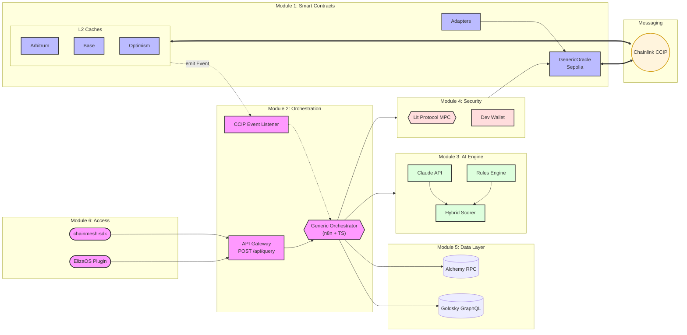

# ChainMesh

Generic cross-chain orchestration infrastructure for AI agents, built on Chainlink CCIP.

ChainMesh is not an application -- it is a reusable infrastructure layer. Any AI agent can use it to store, query and distribute data across EVM blockchains without dealing with cross-chain messaging complexity. The system is schema-agnostic: adding a new data type (reputation, price, governance, custom) only requires a new adapter and workflow configuration, without modifying the core infrastructure.



---

## How it works

A user on a consumer chain (Arbitrum, Base, ...) requests data through the GenericCache contract. If the data is cached and fresh (TTL 24h), it is returned instantly. Otherwise, a CCIP message is sent to the GenericOracle on Sepolia, which emits a `QueryReceived` event.

The off-chain orchestrator (Module 2) picks up the event, delegates data collection to the Data Layer (Module 5), optionally runs analysis through the AI Engine (Module 3), then signs the payload via Lit Protocol MPC (Module 4). The signed result is written back to the Oracle and a CCIP response is sent to the originating Cache.

The same pipeline is also accessible via HTTP API (`POST /api/query`) for agents that do not need the on-chain CCIP trigger. Module 6 (SDK) will provide a developer-friendly TypeScript interface over this API.

---

## Architecture -- 6 Modules

### Module 1 -- Smart Contracts

Solidity contracts deployed with Foundry. Handles on-chain storage, cross-chain messaging, and schema-based data encoding.

GenericOracle (Sepolia) stores key-value pairs identified by a `bytes32 key` and a `bytes32 schemaHash`. It receives CCIP queries from consumer chains, emits events for the off-chain orchestrator, and sends CCIP responses back. Access is controlled via OpenZeppelin roles (UPDATER_ROLE for writes, ADMIN for configuration).

GenericCache is deployed on each consumer chain. It provides a 24h TTL cache with 1 req/h/key rate-limiting. On cache miss, it sends a CCIP request to the Oracle and returns a default value immediately so the user is never blocked.

Adapters are stateless encoder/decoders implementing `IDataAdapter`. ReputationAdapter handles `(uint8 score, bytes32 evidenceHash)`, PriceAdapter handles `(uint256 value, uint8 decimals)`. Adding a new data type means creating a new adapter -- no change to Oracle or Cache.

Security: ReentrancyGuard, AccessControl, chain whitelisting, replay protection, optional strict mode. 123 tests, coverage >80% (Oracle 97%, Cache 96%).

Documentation: [Architecture](module1-blockchain/docs/MODULE1_ARCHITECTURE.md) | [Specification](module1-blockchain/docs/SPEC_Module1_Blockchain.md)

### Module 2 -- Orchestration

TypeScript modules coordinated by n8n workflows. This is the central nervous system that receives triggers and delegates work to Modules 3, 4, and 5.

The WorkflowOrchestrator executes a sequential pipeline: validate input (Zod schemas), check rate limit (PostgreSQL), fetch data (Module 5), analyze (Module 3, optional), encode payload, sign (Module 4), update Oracle, send CCIP response. Each step records its status, duration, and metadata in an execution context for end-to-end tracing.

Three n8n workflows define the entry points and coordination: API_Gateway (webhook), CCIP_EventListener (30s polling), and GenericOrchestrator (reusable sub-workflow). The orchestrator is schema-agnostic -- a router matches the schemaHash to determine which sub-workflows to invoke.

Resilience: CircuitBreaker (3 failures, 60s cooldown), RetryPolicy (exponential backoff 1s/2s/4s). Persistence: PostgreSQL (rate limits, executions, circuit breaker state, event idempotency). Logging: Winston structured JSON.

Documentation: [Architecture](module2-orchestration/docs/MODULE2_ARCHITECTURE.md) | [Specification](module2-orchestration/docs/SPEC_Module2_Orchestration.md)

### Module 3 -- AI Engine

Behavioral analysis via Claude API with a deterministic rules fallback. The HybridAnalyzer combines both: `finalScore = (AI x 0.6) + (Rules x 0.4)`.

ClaudeAnalyzer sends normalized data to Claude with a structured prompt and validates the output against the raw data (anti-hallucination layer). RulesAnalyzer applies deterministic heuristics (base score 50, bonuses for wallet age, transaction count, DeFi activity, penalties for liquidations).

If the AI and rules scores disagree strongly (delta > 30 points), confidence is lowered. If Claude is unavailable, the system falls back to rules-only scoring transparently.

Currently implemented as TypeScript classes within Module 2's codebase (ClaudeAnalyzer, RulesAnalyzer, HybridAnalyzer).

### Module 4 -- Security (Lit Protocol)

MPC signing via Lit Protocol PKP -- no single private key exists. The orchestrator prepares an unsigned payload, sends it to Lit's network (~100 nodes), 67 of which must collaborate to produce a valid ECDSA signature. Latency is ~300ms.

On testnet, if Lit is unavailable, a DevWalletSigner provides a fallback using a local ethers.Wallet. This fallback is disabled in production.

Currently implemented as TypeScript classes within Module 2's codebase (LitSigner, DevWalletSigner, SignerFactory).

### Module 5 -- Data Layer

Multi-chain data collection with provider fallback cascade: Goldsky (GraphQL, primary) then Alchemy (RPC, fallback). Each provider has its own circuit breaker. Queries run in parallel across chains with a 10s per-provider timeout and 30s total timeout.

If fewer than 50% of chains succeed, the pipeline fails. Otherwise, partial data is accepted with a warning flag.

Currently implemented as TypeScript classes within Module 2's codebase (GoldskyProvider, AlchemyProvider, ProviderFactory).

### Module 6 -- SDK & Plugin (Planned)

TypeScript npm package (`chainmesh-sdk`) exposing a cache-aware API with automatic provider fallback. ElizaOS plugin (`@elizaos/plugin-chainmesh`) enabling AI agents to query ChainMesh through natural language.

Not yet implemented. Interfaces are defined in [Module_Interfaces_ChainMesh.md](docs/Module_Interfaces_ChainMesh.md).

---

## Extending with new workflows

ChainMesh separates infrastructure from business logic. The Oracle, Cache, orchestrator, signing, and data layers are generic. To add a new use case:

**On-chain:** Create a new adapter implementing `IDataAdapter` (two functions). No changes to Oracle or Cache.

**Off-chain:** Create a new analyzer if custom analysis is needed, or use the existing rules engine. Configure the orchestrator's router to map the new schemaHash to the appropriate sub-workflows. The data collection, signing, and oracle update steps remain unchanged.

Example use cases beyond reputation: price feeds, arbitrage detection, portfolio analysis, DAO governance scoring, credit risk assessment.

---

## Project structure

```
chainmesh/
  module1-blockchain/contracts/    Solidity (Oracle, Cache, Adapters)
  module2-orchestration/
    src/providers/                  Module 5: Goldsky, Alchemy, ProviderFactory
    src/analyzers/                  Module 3: Claude, Rules, HybridAnalyzer
    src/signers/                    Module 4: Lit, DevWallet, SignerFactory
    src/orchestrator/               Module 2: WorkflowOrchestrator, RateLimiter
    src/validators/                 Zod schemas (input/output)
    src/utils/                      CircuitBreaker, RetryPolicy, Logger
    workflows/                      n8n JSON definitions
    tests/                          Vitest unit tests
  docs/                             PRD, TADs, module interfaces
```

---

## Technology stack

| Layer | Technologies |
|---|---|
| Smart contracts (Module 1) | Solidity 0.8.20, Foundry, Chainlink CCIP, OpenZeppelin |
| Orchestration (Module 2) | TypeScript strict, Node.js v24, n8n, Vitest, Zod v4 |
| AI Engine (Module 3) | Claude API (Anthropic), axios |
| Security (Module 4) | Lit Protocol MPC, ethers v6 |
| Data Layer (Module 5) | Goldsky (GraphQL), Alchemy (RPC) |
| Persistence | PostgreSQL |
| Logging | Winston (structured JSON) |

---

## Current status

| Module | Status |
|---|---|
| Module 1 -- Smart Contracts | Completed (testnet). 123 tests, >80% coverage. |
| Module 2 -- Orchestration | Completed (testnet). Pipeline, workflows, resilience. |
| Module 3 -- AI Engine | Implemented within Module 2 (analyzers). |
| Module 4 -- Security | Implemented within Module 2 (signers). |
| Module 5 -- Data Layer | Implemented within Module 2 (providers). |
| Module 6 -- SDK & Plugin | Planned. Interfaces defined. |

Supported chains (testnet): Sepolia, Arbitrum Sepolia, Base Sepolia, Optimism Sepolia.

---

## Documentation

| Document | Scope |
|---|---|
| [PRD](docs/ChainMesh_PRD_v1.3.md) | Product requirements, roadmap, risks |
| [Module Interfaces](docs/Module_Interfaces_ChainMesh.md) | Strict boundaries between the 6 modules |
| [Module 1 Architecture](module1-blockchain/docs/MODULE1_ARCHITECTURE.md) | Contract hierarchy, data flows, security, storage |
| [Module 2 Architecture](module2-orchestration/docs/MODULE2_ARCHITECTURE.md) | Components, pipeline, resilience patterns |
| [Module 2 Specification](module2-orchestration/docs/SPEC_Module2_Orchestration.md) | Functional specification |
| [TAD Part 1](docs/01_TAD_Part1_Introduction_Architecture_Contracts.md) | Architecture overview, contracts |
| [TAD Part 2](docs/02_TAD_Part2_OffChain_Data_AI.md) | Off-chain, data sources, AI engine |
| [TAD Part 3](docs/03_TAD_Part3_Security_Infrastructure_Config.md) | Security, infrastructure, configuration |

---

## License

MIT
