# ChainMesh - Technical Architecture Document (TAD)
# Part 1: Introduction, Architecture & Smart Contracts

**Version:** 1.0  
**Date:** 30 janvier 2026  
**Auteur:** Felix  
**Statut:** Ready for Implementation  
**Documents Liés:**
- [PRD v1.1](ChainMesh_PRD.md)
- [Guide Bonnes Pratiques v1.1](ChainMesh_DevGuide_v1.1.md)

---

## Table des Matières - Part 1

1. [Introduction & Overview](#1-introduction--overview)
2. [System Architecture](#2-system-architecture)
3. [Smart Contracts Architecture](#3-smart-contracts-architecture)

---

# 1. Introduction & Overview

## 1.1 Objectif du Document

Ce document fournit les spécifications techniques complètes pour l'implémentation de ChainMesh, une infrastructure CCIP-native permettant aux AI agents de query et agir sur des données multi-chain.

**Audience:**
- Developers (Felix + futurs contributeurs)
- Claude Code (AI pair programmer)
- Architectes techniques évaluant le projet
- Auditeurs sécurité

## 1.2 Portée Technique

**Inclus dans ce TAD (Part 1):**
- Architecture système complète (5 layers)
- Spécifications smart contracts (Solidity)
- Deployment topology
- Data flows CCIP

**Voir Part 2 pour:**
- n8n workflows, SDK, ElizaOS plugin
- Data layer (Goldsky, schemas)
- AI Integration (Claude API)

**Voir Part 3 pour:**
- Security (Lit Protocol, RBAC)
- Infrastructure & DevOps
- Configuration Management

## 1.3 Conventions & Terminologie

**Terminologie:**
- **Oracle Chain:** Sepolia (chaîne hébergeant le contrat Oracle principal)
- **Consumer Chains:** Arbitrum Sepolia, Base Sepolia, Optimism Sepolia
- **CCIP:** Chainlink Cross-Chain Interoperability Protocol
- **PKP:** Programmable Key Pair (Lit Protocol)
- **DON:** Decentralized Oracle Network (Chainlink)

**Diagrammes:**
- Mermaid pour sequence diagrams et flowcharts
- Code samples en Solidity 0.8.20+, TypeScript, JavaScript

---

# 2. System Architecture

## 2.1 High-Level Architecture


## 2.2 Layer Breakdown

### Layer 1: Application Layer
**Responsabilité:** AI agents consommant les données cross-chain

**Composants:**
- Custom agents développés par third-parties
- ElizaOS agents utilisant le plugin ChainMesh
- dApps utilisant le SDK directement

**Technologies:** TypeScript, Python, ElizaOS framework

**Analogie SOA:** C'est l'équivalent de tes applications métier qui consomment les services ESB.

---

### Layer 2: SDK & Plugin Layer
**Responsabilité:** Abstraction de la complexité CCIP/multi-chain

**Composants:**
- `chainmesh-sdk` (npm package) : API simple pour query reputation
- `@elizaos/plugin-chainmesh` (ElizaOS plugin) : Actions pour agents

**Technologies:** TypeScript, ethers.js v6

**Analogie SOA:** Équivalent à tes clients SOAP/REST qui wrappent les appels ESB.

---

### Layer 3: Orchestration Layer
**Responsabilité:** Coordination des scans, aggregation, AI analysis, signing

**Composants:**
- n8n workflows (5+ workflows principaux)
- API Gateway (webhook trigger)
- Sub-workflows réutilisables

**Technologies:** n8n (self-hosted), Node.js

**Analogie SOA:** C'est ton ESB ! n8n = TIBCO BusinessWorks. Workflows = Process Definitions.

---

### Layer 4: Blockchain Layer
**Responsabilité:** Storage on-chain, CCIP messaging, state management

**Composants:**
- ChainMeshOracle.sol (Sepolia) : Contract principal
- ChainMeshCache.sol (Arbitrum, Base, Optimism) : Caches locaux
- CCIP Router contracts (Chainlink) : Message routing

**Technologies:** Solidity 0.8.20+, Foundry, Hardhat

**Analogie SOA:** Database layer + Message Queue. Contracts = Tables, CCIP = MQ (ActiveMQ/RabbitMQ).

---

### Layer 5: Data Sources
**Responsabilité:** Fournir données blockchain et AI analysis

**Composants:**
- Goldsky (unified indexer) : Primary data source
- Etherscan APIs (fallback) : Backup data
- The Graph (DeFi subgraphs) : Specialized queries
- Claude API (AI analysis) : Behavioral scoring
- Lit Protocol (distributed signing) : MPC security

**Technologies:** GraphQL, REST APIs, MPC

**Analogie SOA:** Backend systems (CRM, ERP, Legacy). Adaptateurs = Providers.

---

## 2.3 Deployment Architecture


**Infrastructure Costs (16 semaines = ~4 mois):**
- VPS n8n (DigitalOcean): 6 USD/mois × 4 = 24 USD
- Domain optionnel: 12 USD/an ÷ 3 = 4 USD
- APIs: Tous en free tier = 0 USD
- Testnet gas: Faucets gratuits = 0 USD
- **Total: ~28 USD** (bien en dessous du budget 54 USD)

---

## 2.4 Data Flow: End-to-End Reputation Query

```mermaid
sequenceDiagram
    autonumber
    participant User on Arbitrum
    participant CacheArbitrum
    participant CCIPNetwork
    participant OracleSepolia
    participant n8n
    participant Goldsky
    participant Claude
    participant Lit
    
    Note over User on Arbitrum,Lit: Total time: 15-20 minutes (testnet)
    
    User on Arbitrum->>CacheArbitrum: requestReputation("0xAlice")
    CacheArbitrum->>CacheArbitrum: Check local cache
    
    alt Cache Hit (Fresh < 24h)
        CacheArbitrum-->>User on Arbitrum: Score: 87 (instant < 1s)
        Note over User on Arbitrum: ✅ Done!
    else Cache Miss or Stale
        CacheArbitrum-->>User on Arbitrum: Default Score: 60 (instant)
        Note over User on Arbitrum: Conservative score while fetching
        
        CacheArbitrum->>CCIPNetwork: Send CCIP query message
        Note over CCIPNetwork: ⏱️ 5-10 minutes (testnet)
        
        CCIPNetwork->>OracleSepolia: _ccipReceive(message)
        OracleSepolia->>OracleSepolia: ✓ Authenticate sender
        OracleSepolia->>OracleSepolia: ✓ Emit QueryReceived event
        
        OracleSepolia->>n8n: Webhook trigger (event detected)
        
        Note over n8n,Lit: ⏱️ Off-chain processing: 2-3 minutes
        
        n8n->>Goldsky: GraphQL: Get wallet data (3 chains)
        Goldsky-->>n8n: Aggregated data (800ms)
        
        n8n->>Claude: Analyze behavioral patterns
        Claude-->>n8n: Score + insights + confidence (20s)
        
        n8n->>n8n: Validate AI output (anti-hallucination)
        n8n->>n8n: Hybrid scoring: AI 60% + Rules 40%
        
        n8n->>Lit: Sign payload with PKP
        Lit-->>n8n: MPC Signature (300ms)
        
        n8n->>OracleSepolia: updateReputation(data, signature)
        OracleSepolia->>OracleSepolia: ✓ Verify signature
        OracleSepolia->>OracleSepolia: ✓ Store reputation data
        
        OracleSepolia->>CCIPNetwork: Send CCIP response message
        Note over CCIPNetwork: ⏱️ 5-10 minutes (testnet)
        
        CCIPNetwork->>CacheArbitrum: _ccipReceive(response)
        CacheArbitrum->>CacheArbitrum: ✓ Update cache (TTL: 24h)
        CacheArbitrum->>CacheArbitrum: ✓ Emit ReputationUpdated event
        
        Note over User on Arbitrum: ✅ Next query = instant cache hit!
    end
```



**Timing Breakdown:**
- Cache hit: **< 1 seconde** ✅
- Cache miss (first query): **15-20 minutes** (testnet CCIP latency)
- Subsequent queries: **< 1 seconde** (cached for 24h)

**Analogie SOA:** 
- Cache hit = réponse depuis cache local (Redis)
- Cache miss = appel synchrone ESB qui fait appels async aux backends
- CCIP = ton MQ asynchrone (JMS) avec latency élevée

---

## 2.5 Architecture Patterns

### Pattern 1: Cache-First avec Async Update

```
Query arrives
    ↓
Check local cache
    ↓
    ├─ CACHE HIT (fresh) → Return score instantly (0ms)
    │
    ├─ CACHE MISS → Return default score (60/100)
    │                + Trigger CCIP query in background
    │                + User gets conservative score immediately
    │
    └─ CACHE HIT (stale) → Return cached score
                           + Trigger refresh in background
```

**Pourquoi ce pattern ?**
- CCIP latency (5-15 min) inacceptable pour UX synchrone
- Default score = fallback sûr et transparent
- Cache TTL (24h) = bon compromis fraîcheur/coût

**Analogie SOA:** Pattern "Read-Through Cache" que tu connais de TIBCO.

---

### Pattern 2: Hybrid Scoring (AI + Rules)

```
Raw blockchain data
    ↓
    ├─ AI Analysis (Claude) → Score AI (0-100)
    │   ↓
    │   Validation layer (anti-hallucination)
    │
    └─ Rules-based scoring → Score Rules (0-100)
        ↓
Weighted average: (AI × 0.6) + (Rules × 0.4)
    ↓
Final Score + Confidence
```

**Pourquoi ce pattern ?**
- AI seul peut halluciner (inventer des patterns)
- Rules seuls = pas assez sophistiqués
- Hybrid = meilleur des deux mondes + détection désaccords

---

### Pattern 3: Circuit Breaker pour Data Sources

```
API Call (Goldsky)
    ↓
Circuit open? (3+ failures récents)
    ├─ YES → Skip, use fallback (Alchemy)
    └─ NO → Try call
            ↓
            ├─ SUCCESS → Record success, reset failures
            └─ FAILURE → Increment failures
                         ↓
                         Failures >= 3? → Open circuit (1 min cooldown)
```

**Pourquoi ce pattern ?**
- Évite cascading failures
- Goldsky down → fallback automatique Alchemy
- Cooldown period permet recovery

**Analogie SOA:** Circuit Breaker = pattern classique SOA (Hystrix).

---

# 3. Smart Contracts Architecture

## 3.1 Contract Overview

### Contracts Hierarchy

```
ChainMesh Contracts
│
├── Core Contracts
│   ├── ChainMeshOracle.sol (Sepolia)
│   └── ChainMeshCache.sol (Arbitrum, Base, Optimism)
│
├── Interfaces
│   ├── IChainMeshOracle.sol
│   ├── IChainMeshCache.sol
│   └── ICallback.sol
│
├── Libraries
│   ├── CCIPHelper.sol
│   └── ReputationLib.sol
│
└── Mocks (for testing)
    ├── MockCCIPRouter.sol
    └── MockOracle.sol
```

### Contract Responsibilities

| Contract | Chain | Rôle | Storage |
|----------|-------|------|---------|
| **ChainMeshOracle** | Sepolia | Receive CCIP queries, store reputation data, send CCIP responses | Reputation mapping, query tracking |
| **ChainMeshCache** | Arbitrum, Base, Optimism | Cache local reputation, send CCIP queries, receive CCIP responses | Cache mapping, request tracking |
| **CCIP Router** | All chains | Route cross-chain messages (Chainlink-provided) | N/A (Chainlink) |

---

## 3.2 ChainMeshOracle Contract (Sepolia)

**Fichier:** `contracts/src/ChainMeshOracle.sol`

### Responsabilités

1. ✅ Recevoir queries CCIP depuis consumer chains
2. ✅ Authentifier les messages CCIP (chain + sender verification)
3. ✅ Stocker reputation data on-chain
4. ✅ Envoyer responses CCIP vers consumer chains
5. ✅ Gérer access control (roles: ADMIN, UPDATER, PAUSER)

### Architecture Complète

```solidity
// SPDX-License-Identifier: MIT
pragma solidity ^0.8.20;

import {CCIPReceiver} from "@chainlink/contracts-ccip/src/v0.8/ccip/applications/CCIPReceiver.sol";
import {Client} from "@chainlink/contracts-ccip/src/v0.8/ccip/libraries/Client.sol";
import {IRouterClient} from "@chainlink/contracts-ccip/src/v0.8/ccip/interfaces/IRouterClient.sol";
import {AccessControl} from "@openzeppelin/contracts/access/AccessControl.sol";
import {ReentrancyGuard} from "@openzeppelin/contracts/security/ReentrancyGuard.sol";

/// @title ChainMesh Oracle Contract
/// @author Felix
/// @notice Main oracle for cross-chain reputation queries
/// @dev Implements CCIP receiver pattern with access control
/// @custom:security-contact security@chainmesh.dev
contract ChainMeshOracle is CCIPReceiver, AccessControl, ReentrancyGuard {
    
    // ========================================
    // STATE VARIABLES
    // ========================================
    
    /// @notice Roles for access control
    bytes32 public constant UPDATER_ROLE = keccak256("UPDATER_ROLE");
    bytes32 public constant PAUSER_ROLE = keccak256("PAUSER_ROLE");
    
    /// @notice Reputation data structure
    /// @dev Packed to 2 storage slots for gas optimization
    struct Reputation {
        uint8 score;              // 0-100 reputation score (1 byte)
        uint32 timestamp;         // When score was updated (4 bytes)
        bytes32 evidenceHash;     // IPFS hash of supporting evidence (32 bytes)
        bool isValid;             // Whether this entry is valid (1 byte)
        // SLOT 1: 6 bytes used, 26 bytes free
        // SLOT 2: 32 bytes (evidenceHash)
        // Total: 2 slots = 40,000 gas vs 80,000 gas (4 slots)
    }
    
    /// @notice Query request tracking
    struct QueryRequest {
        address requester;        // Who requested the query (20 bytes)
        uint64 sourceChain;       // Source chain selector (8 bytes)
        uint32 requestedAt;       // Timestamp of request (4 bytes)
        bool processed;           // Whether query was processed (1 byte)
        // Total: 33 bytes → 2 slots
    }
    
    /// @notice Mapping: wallet address => reputation data
    mapping(address => Reputation) public reputations;
    
    /// @notice Mapping: message ID => query request
    mapping(bytes32 => QueryRequest) public queryRequests;
    
    /// @notice Mapping: message ID => processed flag (replay protection)
    mapping(bytes32 => bool) public processedMessages;
    
    /// @notice Whitelisted destination chains (for responses)
    mapping(uint64 => bool) public allowedDestinationChains;
    
    /// @notice Paused state
    bool public paused;
    
    // ========================================
    // EVENTS
    // ========================================
    
    /// @notice Emitted when a query is received via CCIP
    /// @param messageId The CCIP message ID
    /// @param wallet The wallet address being queried
    /// @param sourceChain The chain selector where query originated
    /// @param requester The address that requested the query
    event QueryReceived(
        bytes32 indexed messageId,
        address indexed wallet,
        uint64 sourceChain,
        address requester
    );
    
    /// @notice Emitted when a reputation score is updated
    /// @param wallet The wallet address
    /// @param score The new reputation score (0-100)
    /// @param evidenceHash IPFS hash of supporting evidence
    /// @param timestamp When the update occurred
    event ReputationUpdated(
        address indexed wallet,
        uint8 score,
        bytes32 evidenceHash,
        uint256 timestamp
    );
    
    /// @notice Emitted when a response is sent via CCIP
    /// @param messageId The CCIP message ID
    /// @param destinationChain The destination chain selector
    /// @param wallet The wallet address
    /// @param score The reputation score sent
    event ResponseSent(
        bytes32 indexed messageId,
        uint64 destinationChain,
        address wallet,
        uint8 score
    );
    
    /// @notice Emitted when a chain is whitelisted/blacklisted
    event ChainWhitelisted(
        uint64 indexed chainSelector,
        bool allowed
    );
    
    /// @notice Emitted when contract is paused
    event ContractPaused(address indexed by);
    
    /// @notice Emitted when contract is unpaused
    event ContractUnpaused(address indexed by);
    
    // ========================================
    // ERRORS (Custom errors save gas vs require strings)
    // ========================================
    
    error InvalidScore(uint8 provided, uint8 max);
    error ZeroAddress();
    error MessageAlreadyProcessed(bytes32 messageId);
    error InvalidSourceChain(uint64 chainSelector);
    error ContractPaused();
    error InsufficientBalance(uint256 required, uint256 available);
    error QueryNotFound(bytes32 messageId);
    error QueryAlreadyProcessed(bytes32 messageId);
    
    // ========================================
    // CONSTRUCTOR
    // ========================================
    
    /// @notice Initialize the oracle contract
    /// @param _ccipRouter Address of the CCIP Router contract
    constructor(
        address _ccipRouter
    ) CCIPReceiver(_ccipRouter) {
        // Grant all roles to deployer initially
        _grantRole(DEFAULT_ADMIN_ROLE, msg.sender);
        _grantRole(UPDATER_ROLE, msg.sender);
        _grantRole(PAUSER_ROLE, msg.sender);
    }
    
    // ========================================
    // CCIP RECEIVER
    // ========================================
    
    /// @notice Handle incoming CCIP messages (queries)
    /// @dev Internal function called by CCIPReceiver base contract
    /// @param message The CCIP message containing query data
    function _ccipReceive(
        Client.Any2EVMMessage memory message
    ) internal override {
        if (paused) revert ContractPaused();
        
        // Replay protection
        bytes32 messageHash = keccak256(abi.encodePacked(
            message.messageId,
            message.sourceChainSelector,
            message.sender
        ));
        
        if (processedMessages[messageHash]) {
            revert MessageAlreadyProcessed(message.messageId);
        }
        
        processedMessages[messageHash] = true;
        
        // Decode query request
        (address wallet, address requester) = abi.decode(
            message.data,
            (address, address)
        );
        
        // Validate
        if (wallet == address(0)) revert ZeroAddress();
        
        // Store query request
        queryRequests[message.messageId] = QueryRequest({
            requester: requester,
            sourceChain: message.sourceChainSelector,
            requestedAt: uint32(block.timestamp),
            processed: false
        });
        
        emit QueryReceived(
            message.messageId,
            wallet,
            message.sourceChainSelector,
            requester
        );
        
        // Note: Actual processing happens off-chain (n8n)
        // Oracle will call updateReputation() after AI analysis
    }
    
    // ========================================
    // UPDATER FUNCTIONS
    // ========================================
    
    /// @notice Update reputation score for a wallet
    /// @dev Only callable by UPDATER_ROLE (n8n workflow with Lit signature)
    /// @param wallet The wallet address
    /// @param score Reputation score (0-100)
    /// @param evidenceHash IPFS hash of supporting data
    function updateReputation(
        address wallet,
        uint8 score,
        bytes32 evidenceHash
    ) external onlyRole(UPDATER_ROLE) nonReentrant {
        if (paused) revert ContractPaused();
        if (wallet == address(0)) revert ZeroAddress();
        if (score > 100) revert InvalidScore(score, 100);
        
        reputations[wallet] = Reputation({
            score: score,
            timestamp: uint32(block.timestamp),
            evidenceHash: evidenceHash,
            isValid: true
        });
        
        emit ReputationUpdated(
            wallet,
            score,
            evidenceHash,
            block.timestamp
        );
    }
    
    /// @notice Send reputation response back to requesting chain
    /// @dev Called by UPDATER_ROLE after reputation is updated
    /// @param messageId The original query message ID
    /// @param wallet The wallet that was queried
    /// @return responseMessageId The CCIP message ID of the response
    function sendResponse(
        bytes32 messageId,
        address wallet
    ) external onlyRole(UPDATER_ROLE) nonReentrant returns (bytes32 responseMessageId) {
        if (paused) revert ContractPaused();
        
        QueryRequest storage query = queryRequests[messageId];
        if (query.requester == address(0)) revert QueryNotFound(messageId);
        if (query.processed) revert QueryAlreadyProcessed(messageId);
        
        Reputation memory rep = reputations[wallet];
        require(rep.isValid, "No reputation data");
        
        // Mark as processed
        query.processed = true;
        
        // Build CCIP message
        Client.EVM2AnyMessage memory ccipMessage = Client.EVM2AnyMessage({
            receiver: abi.encode(query.requester),
            data: abi.encode(wallet, rep.score, rep.timestamp, rep.evidenceHash),
            tokenAmounts: new Client.EVMTokenAmount[](0),
            extraArgs: Client._argsToBytes(
                Client.EVMExtraArgsV1({gasLimit: 200_000})
            ),
            feeToken: address(0) // Pay in native token
        });
        
        // Get fee
        uint256 fees = IRouterClient(getRouter()).getFee(
            query.sourceChain,
            ccipMessage
        );
        
        if (address(this).balance < fees) {
            revert InsufficientBalance(fees, address(this).balance);
        }
        
        // Send CCIP message
        responseMessageId = IRouterClient(getRouter()).ccipSend{value: fees}(
            query.sourceChain,
            ccipMessage
        );
        
        emit ResponseSent(
            responseMessageId,
            query.sourceChain,
            wallet,
            rep.score
        );
        
        return responseMessageId;
    }
    
    // ========================================
    // VIEW FUNCTIONS
    // ========================================
    
    /// @notice Get reputation for a wallet
    /// @param wallet The wallet address to query
    /// @return score The reputation score (0-100)
    /// @return timestamp When the score was last updated
    /// @return evidenceHash IPFS hash of supporting evidence
    /// @return isValid Whether the reputation data is valid
    function getReputation(address wallet) 
        external 
        view 
        returns (
            uint8 score,
            uint256 timestamp,
            bytes32 evidenceHash,
            bool isValid
        ) 
    {
        Reputation memory rep = reputations[wallet];
        return (rep.score, rep.timestamp, rep.evidenceHash, rep.isValid);
    }
    
    /// @notice Get query request details
    /// @param messageId The CCIP message ID
    function getQueryRequest(bytes32 messageId)
        external
        view
        returns (
            address requester,
            uint64 sourceChain,
            uint256 requestedAt,
            bool processed
        )
    {
        QueryRequest memory query = queryRequests[messageId];
        return (query.requester, query.sourceChain, query.requestedAt, query.processed);
    }
    
    // ========================================
    // ADMIN FUNCTIONS
    // ========================================
    
    /// @notice Pause contract (emergency stop)
    /// @dev Only callable by PAUSER_ROLE
    function pause() external onlyRole(PAUSER_ROLE) {
        paused = true;
        emit ContractPaused(msg.sender);
    }
    
    /// @notice Unpause contract
    /// @dev Only callable by PAUSER_ROLE
    function unpause() external onlyRole(PAUSER_ROLE) {
        paused = false;
        emit ContractUnpaused(msg.sender);
    }
    
    /// @notice Whitelist a destination chain
    /// @dev Only callable by DEFAULT_ADMIN_ROLE
    /// @param chainSelector The chain selector to whitelist
    /// @param allowed Whether the chain is allowed
    function whitelistChain(uint64 chainSelector, bool allowed) 
        external 
        onlyRole(DEFAULT_ADMIN_ROLE) 
    {
        allowedDestinationChains[chainSelector] = allowed;
        emit ChainWhitelisted(chainSelector, allowed);
    }
    
    /// @notice Withdraw contract balance (for gas refunds)
    /// @dev Only callable by DEFAULT_ADMIN_ROLE
    /// @param to Address to send funds to
    /// @param amount Amount to withdraw
    function withdraw(address payable to, uint256 amount) 
        external 
        onlyRole(DEFAULT_ADMIN_ROLE) 
    {
        require(address(this).balance >= amount, "Insufficient balance");
        (bool success, ) = to.call{value: amount}("");
        require(success, "Transfer failed");
    }
    
    /// @notice Allow contract to receive native tokens
    receive() external payable {}
}
```

---

## 3.3 ChainMeshCache Contract (Consumer Chains)

**Fichier:** `contracts/src/ChainMeshCache.sol`

### Responsabilités

1. ✅ Stocker reputation cache localement (TTL: 24h)
2. ✅ Fournir default score (60/100) si cache miss
3. ✅ Envoyer CCIP queries vers Oracle
4. ✅ Recevoir CCIP responses et update cache
5. ✅ Exposer API simple pour consumers (dApps, agents)

### Architecture Complète

```solidity
// SPDX-License-Identifier: MIT
pragma solidity ^0.8.20;

import {CCIPReceiver} from "@chainlink/contracts-ccip/src/v0.8/ccip/applications/CCIPReceiver.sol";
import {Client} from "@chainlink/contracts-ccip/src/v0.8/ccip/libraries/Client.sol";
import {IRouterClient} from "@chainlink/contracts-ccip/src/v0.8/ccip/interfaces/IRouterClient.sol";
import {Ownable} from "@openzeppelin/contracts/access/Ownable.sol";

/// @title ChainMesh Cache Contract
/// @author Felix
/// @notice Local reputation cache with CCIP query capability
/// @dev Deployed on each consumer chain (Arbitrum, Base, Optimism)
/// @custom:security-contact security@chainmesh.dev
contract ChainMeshCache is CCIPReceiver, Ownable {
    
    // ========================================
    // STATE VARIABLES (Immutable for gas savings)
    // ========================================
    
    /// @notice Oracle contract address on Sepolia (immutable = no storage slot)
    address public immutable ORACLE_ADDRESS;
    
    /// @notice Oracle chain selector (Sepolia)
    uint64 public immutable ORACLE_CHAIN_SELECTOR;
    
    /// @notice Default score for cache miss
    uint8 public constant DEFAULT_SCORE = 60;
    
    /// @notice Cache TTL (Time To Live)
    uint256 public constant CACHE_TTL = 24 hours;
    
    /// @notice Minimum interval between requests per user (anti-spam)
    uint256 public constant MIN_REQUEST_INTERVAL = 1 hours;
    
    // ========================================
    // STRUCTS
    // ========================================
    
    /// @notice Cached reputation data
    struct CachedReputation {
        uint8 score;              // Reputation score (1 byte)
        uint32 timestamp;         // When cached (4 bytes)
        uint32 expiryTime;        // When cache expires (4 bytes)
        bytes32 evidenceHash;     // IPFS hash (32 bytes)
        bool isValid;             // Whether valid (1 byte)
        // SLOT 1: 10 bytes + padding
        // SLOT 2: 32 bytes (evidenceHash)
    }
    
    /// @notice Mapping: wallet => cached reputation
    mapping(address => CachedReputation) public cache;
    
    /// @notice Mapping: request ID => wallet address
    mapping(bytes32 => address) public pendingRequests;
    
    /// @notice Rate limiting: user => last request time
    mapping(address => uint256) public lastRequestTime;
    
    // ========================================
    // EVENTS
    // ========================================
    
    /// @notice Emitted when a reputation query is sent via CCIP
    event ReputationQueried(
        address indexed wallet,
        address indexed requester,
        bytes32 messageId
    );
    
    /// @notice Emitted when reputation is cached
    event ReputationCached(
        address indexed wallet,
        uint8 score,
        bytes32 evidenceHash,
        uint256 expiryTime
    );
    
    /// @notice Emitted on cache hit
    event CacheHit(
        address indexed wallet,
        uint8 score,
        bool isFresh
    );
    
    /// @notice Emitted on cache miss
    event CacheMiss(
        address indexed wallet,
        uint8 defaultScore
    );
    
    // ========================================
    // ERRORS
    // ========================================
    
    error RateLimitExceeded(uint256 timeUntilNext);
    error InvalidSourceChain(uint64 chainSelector);
    error UnauthorizedSender(address sender);
    error InsufficientFees(uint256 required, uint256 provided);
    
    // ========================================
    // CONSTRUCTOR
    // ========================================
    
    /// @notice Initialize the cache contract
    /// @param _ccipRouter Address of the CCIP Router on this chain
    /// @param _oracleAddress Address of the Oracle contract on Sepolia
    /// @param _oracleChainSelector Chain selector for Sepolia
    constructor(
        address _ccipRouter,
        address _oracleAddress,
        uint64 _oracleChainSelector
    ) CCIPReceiver(_ccipRouter) {
        ORACLE_ADDRESS = _oracleAddress;
        ORACLE_CHAIN_SELECTOR = _oracleChainSelector;
    }
    
    // ========================================
    // PUBLIC FUNCTIONS
    // ========================================
    
    /// @notice Get reputation with automatic cache handling
    /// @dev Returns cached score or default score if miss
    /// @param wallet The wallet to query
    /// @return score The reputation score
    /// @return isFromCache Whether score is from cache
    /// @return needsUpdate Whether a CCIP query should be triggered
    function getReputation(address wallet) 
        external 
        view 
        returns (
            uint8 score,
            bool isFromCache,
            bool needsUpdate
        ) 
    {
        CachedReputation memory cached = cache[wallet];
        
        // Cache hit (fresh)
        if (cached.isValid && block.timestamp <= cached.expiryTime) {
            emit CacheHit(wallet, cached.score, true);
            return (cached.score, true, false);
        }
        
        // Cache miss or expired
        emit CacheMiss(wallet, DEFAULT_SCORE);
        return (DEFAULT_SCORE, false, true);
    }
    
    /// @notice Request reputation update via CCIP
    /// @dev Sends query to Oracle on Sepolia
    /// @param wallet The wallet to query
    /// @return messageId The CCIP message ID
    function requestReputation(address wallet) 
        external 
        payable 
        returns (bytes32 messageId) 
    {
        // Rate limiting (anti-spam)
        uint256 timeSinceLastRequest = block.timestamp - lastRequestTime[msg.sender];
        if (timeSinceLastRequest < MIN_REQUEST_INTERVAL) {
            revert RateLimitExceeded(MIN_REQUEST_INTERVAL - timeSinceLastRequest);
        }
        
        lastRequestTime[msg.sender] = block.timestamp;
        
        // Build CCIP message
        Client.EVM2AnyMessage memory ccipMessage = Client.EVM2AnyMessage({
            receiver: abi.encode(ORACLE_ADDRESS),
            data: abi.encode(wallet, msg.sender), // wallet + requester
            tokenAmounts: new Client.EVMTokenAmount[](0),
            extraArgs: Client._argsToBytes(
                Client.EVMExtraArgsV1({gasLimit: 200_000})
            ),
            feeToken: address(0) // Pay in native token
        });
        
        // Get fee
        uint256 fees = IRouterClient(getRouter()).getFee(
            ORACLE_CHAIN_SELECTOR,
            ccipMessage
        );
        
        if (msg.value < fees) {
            revert InsufficientFees(fees, msg.value);
        }
        
        // Send CCIP message
        messageId = IRouterClient(getRouter()).ccipSend{value: fees}(
            ORACLE_CHAIN_SELECTOR,
            ccipMessage
        );
        
        // Track pending request
        pendingRequests[messageId] = wallet;
        
        emit ReputationQueried(wallet, msg.sender, messageId);
        
        // Refund excess ETH
        if (msg.value > fees) {
            (bool success, ) = msg.sender.call{value: msg.value - fees}("");
            require(success, "Refund failed");
        }
        
        return messageId;
    }
    
    // ========================================
    // CCIP RECEIVER
    // ========================================
    
    /// @notice Handle incoming CCIP response from Oracle
    /// @dev Internal function called by CCIPReceiver
    /// @param message The CCIP message containing reputation data
    function _ccipReceive(
        Client.Any2EVMMessage memory message
    ) internal override {
        // 1. Verify source chain
        if (message.sourceChainSelector != ORACLE_CHAIN_SELECTOR) {
            revert InvalidSourceChain(message.sourceChainSelector);
        }
        
        // 2. Verify sender address
        address sender = abi.decode(message.sender, (address));
        if (sender != ORACLE_ADDRESS) {
            revert UnauthorizedSender(sender);
        }
        
        // 3. Decode response
        (
            address wallet,
            uint8 score,
            uint32 timestamp,
            bytes32 evidenceHash
        ) = abi.decode(message.data, (address, uint8, uint32, bytes32));
        
        // 4. Update cache
        uint256 expiryTime = block.timestamp + CACHE_TTL;
        
        cache[wallet] = CachedReputation({
            score: score,
            timestamp: timestamp,
            expiryTime: uint32(expiryTime),
            evidenceHash: evidenceHash,
            isValid: true
        });
        
        emit ReputationCached(wallet, score, evidenceHash, expiryTime);
    }
    
    // ========================================
    // ADMIN FUNCTIONS
    // ========================================
    
    /// @notice Manually invalidate cache for a wallet
    /// @dev Only callable by owner (emergency use)
    /// @param wallet The wallet to invalidate
    function invalidateCache(address wallet) external onlyOwner {
        cache[wallet].isValid = false;
    }
    
    /// @notice Withdraw contract balance
    /// @dev Only callable by owner
    /// @param to Address to send funds to
    /// @param amount Amount to withdraw
    function withdraw(address payable to, uint256 amount) external onlyOwner {
        require(address(this).balance >= amount, "Insufficient balance");
        (bool success, ) = to.call{value: amount}("");
        require(success, "Transfer failed");
    }
    
    /// @notice Allow contract to receive native tokens
    receive() external payable {}
}
```

---

## 3.4 Storage Layout & Gas Optimization

### Struct Packing Examples

```solidity
// ✅ OPTIMIZED - 2 storage slots
struct Reputation {
    uint8 score;              // 1 byte
    uint32 timestamp;         // 4 bytes
    bool isValid;             // 1 byte
    // SLOT 1: 6 bytes used, 26 bytes padding
    
    bytes32 evidenceHash;     // 32 bytes
    // SLOT 2: 32 bytes used
}
// Total: 2 slots × 20,000 gas = 40,000 gas to write

// ❌ NOT OPTIMIZED - 4 storage slots
struct ReputationBad {
    uint256 score;            // 32 bytes - SLOT 1 (wastes 31 bytes!)
    uint256 timestamp;        // 32 bytes - SLOT 2 (wastes 28 bytes!)
    bool isValid;             // 1 byte  - SLOT 3 (wastes 31 bytes!)
    bytes32 evidenceHash;     // 32 bytes - SLOT 4
}
// Total: 4 slots × 20,000 gas = 80,000 gas to write
// 2x more expensive! ❌
```

**Règle d'or:** Pack variables < 32 bytes dans le même slot.

---

### Immutable Variables

```solidity
// ✅ Use immutable for constants set at construction
address public immutable ORACLE_ADDRESS;
uint64 public immutable ORACLE_CHAIN_SELECTOR;

// Why immutable?
// - Set once in constructor
// - Stored in contract bytecode (not storage)
// - Reading costs 3 gas (vs 2,100 gas for storage SLOAD)
// - Huge savings for frequently read values

// ❌ Don't use regular state variables for constants
address public ORACLE_ADDRESS; // Costs 2,100 gas per read!
```

---

### Custom Errors (Solidity 0.8.4+)

```solidity
// ✅ Custom errors (cheap)
error InvalidScore(uint8 provided, uint8 max);
error InsufficientBalance(uint256 required, uint256 available);

function updateScore(uint8 score) external {
    if (score > 100) revert InvalidScore(score, 100);
}
// Cost: ~50 gas per revert

// ❌ require with string (expensive)
function updateScore(uint8 score) external {
    require(score <= 100, "Score must be <= 100");
}
// Cost: ~150 gas per revert (3x more expensive!)
```

**Économie:** 100 gas × 1,000 calls = 100,000 gas saved = ~0.002 ETH @ 20 gwei

---

## 3.5 Deployment Scripts

**Fichier:** `contracts/script/Deploy.s.sol`

```solidity
// SPDX-License-Identifier: MIT
pragma solidity ^0.8.20;

import "forge-std/Script.sol";
import "../src/ChainMeshOracle.sol";
import "../src/ChainMeshCache.sol";

/// @title Deployment script for ChainMesh contracts
/// @notice Deploys Oracle on Sepolia, Cache on consumer chains
contract DeployScript is Script {
    
    function run() external {
        uint256 deployerPrivateKey = vm.envUint("PRIVATE_KEY");
        vm.startBroadcast(deployerPrivateKey);
        
        // Get chain-specific config from env
        address ccipRouter = vm.envAddress("CCIP_ROUTER");
        uint256 chainId = block.chainid;
        
        if (chainId == 11155111) {
            // Sepolia - Deploy Oracle
            deployOracle(ccipRouter);
        } else if (chainId == 421614) {
            // Arbitrum Sepolia - Deploy Cache
            deployCache(ccipRouter);
        } else if (chainId == 84532) {
            // Base Sepolia - Deploy Cache
            deployCache(ccipRouter);
        } else if (chainId == 11155420) {
            // Optimism Sepolia - Deploy Cache
            deployCache(ccipRouter);
        } else {
            revert("Unsupported chain");
        }
        
        vm.stopBroadcast();
    }
    
    function deployOracle(address ccipRouter) internal {
        console.log("Deploying ChainMeshOracle on Sepolia...");
        console.log("CCIP Router:", ccipRouter);
        
        ChainMeshOracle oracle = new ChainMeshOracle(ccipRouter);
        
        console.log("Oracle deployed at:", address(oracle));
        
        // Save deployment address
        string memory output = string(abi.encodePacked(
            '{"oracle":"', vm.toString(address(oracle)), '"}'
        ));
        
        vm.writeFile("deployments/sepolia.json", output);
        console.log("Deployment saved to deployments/sepolia.json");
    }
    
    function deployCache(address ccipRouter) internal {
        console.log("Deploying ChainMeshCache...");
        
        address oracleAddress = vm.envAddress("ORACLE_CONTRACT_SEPOLIA");
        uint64 oracleChainSelector = uint64(vm.envUint("SEPOLIA_CHAIN_SELECTOR"));
        
        console.log("Oracle Address:", oracleAddress);
        console.log("Oracle Chain Selector:", oracleChainSelector);
        console.log("CCIP Router:", ccipRouter);
        
        ChainMeshCache cache = new ChainMeshCache(
            ccipRouter,
            oracleAddress,
            oracleChainSelector
        );
        
        console.log("Cache deployed at:", address(cache));
        
        // Save deployment
        string memory chainName = getChainName(block.chainid);
        string memory filename = string(abi.encodePacked(
            "deployments/", chainName, ".json"
        ));
        
        string memory output = string(abi.encodePacked(
            '{"cache":"', vm.toString(address(cache)), '"}'
        ));
        
        vm.writeFile(filename, output);
        console.log("Deployment saved to", filename);
    }
    
    function getChainName(uint256 chainId) internal pure returns (string memory) {
        if (chainId == 421614) return "arbitrum-sepolia";
        if (chainId == 84532) return "base-sepolia";
        if (chainId == 11155420) return "optimism-sepolia";
        return "unknown";
    }
}
```

### Deployment Commands

```bash
# 1. Deploy Oracle on Sepolia
forge script script/Deploy.s.sol \
    --rpc-url $SEPOLIA_RPC \
    --private-key $DEPLOYER_PRIVATE_KEY \
    --broadcast \
    --verify \
    --etherscan-api-key $ETHERSCAN_KEY

# 2. Update .env with Oracle address
ORACLE_ADDRESS=$(jq -r '.oracle' deployments/sepolia.json)
echo "ORACLE_CONTRACT_SEPOLIA=$ORACLE_ADDRESS" >> .env

# 3. Deploy Cache on Arbitrum Sepolia
forge script script/Deploy.s.sol \
    --rpc-url $ARB_SEPOLIA_RPC \
    --private-key $DEPLOYER_PRIVATE_KEY \
    --broadcast \
    --verify \
    --etherscan-api-key $ARBISCAN_KEY

# 4. Deploy Cache on Base Sepolia
forge script script/Deploy.s.sol \
    --rpc-url $BASE_SEPOLIA_RPC \
    --private-key $DEPLOYER_PRIVATE_KEY \
    --broadcast \
    --verify \
    --etherscan-api-key $BASESCAN_KEY

# 5. Fund contracts with testnet ETH (for CCIP fees)
cast send $ORACLE_ADDRESS \
    --value 0.1ether \
    --rpc-url $SEPOLIA_RPC \
    --private-key $DEPLOYER_PRIVATE_KEY

# 6. Grant UPDATER_ROLE to n8n wallet
N8N_WALLET=$(grep N8N_WALLET_ADDRESS .env | cut -d '=' -f2)

cast send $ORACLE_ADDRESS \
    "grantRole(bytes32,address)" \
    $(cast keccak "UPDATER_ROLE") \
    $N8N_WALLET \
    --rpc-url $SEPOLIA_RPC \
    --private-key $DEPLOYER_PRIVATE_KEY

echo "✅ Deployment complete!"
```

---

## 3.6 Testing Strategy

### Unit Tests (Foundry)

**Fichier:** `contracts/test/ChainMeshOracle.t.sol`

```solidity
// SPDX-License-Identifier: MIT
pragma solidity ^0.8.20;

import "forge-std/Test.sol";
import "../src/ChainMeshOracle.sol";
import "../src/mocks/MockCCIPRouter.sol";

contract ChainMeshOracleTest is Test {
    ChainMeshOracle public oracle;
    MockCCIPRouter public mockRouter;
    
    address public owner = address(this);
    address public updater = address(0x1);
    address public alice = address(0x2);
    
    function setUp() public {
        mockRouter = new MockCCIPRouter();
        oracle = new ChainMeshOracle(address(mockRouter));
        
        // Grant UPDATER_ROLE
        oracle.grantRole(oracle.UPDATER_ROLE(), updater);
    }
    
    // ========== POSITIVE TESTS ==========
    
    function testUpdateReputation() public {
        vm.prank(updater);
        
        bytes32 evidence = keccak256("ipfs://QmTest");
        oracle.updateReputation(alice, 85, evidence);
        
        (uint8 score, uint256 timestamp, bytes32 storedEvidence, bool isValid) = 
            oracle.getReputation(alice);
        
        assertEq(score, 85);
        assertEq(storedEvidence, evidence);
        assertTrue(isValid);
    }
    
    function testEmitsReputationUpdatedEvent() public {
        vm.prank(updater);
        
        bytes32 evidence = keccak256("ipfs://QmTest");
        
        vm.expectEmit(true, false, false, true);
        emit ReputationUpdated(alice, 85, evidence, block.timestamp);
        
        oracle.updateReputation(alice, 85, evidence);
    }
    
    // ========== NEGATIVE TESTS ==========
    
    function testRevertInvalidScore() public {
        vm.prank(updater);
        
        vm.expectRevert(
            abi.encodeWithSelector(
                ChainMeshOracle.InvalidScore.selector,
                101,
                100
            )
        );
        
        oracle.updateReputation(alice, 101, bytes32(0));
    }
    
    function testRevertUnauthorized() public {
        vm.prank(alice); // Alice doesn't have UPDATER_ROLE
        
        vm.expectRevert(); // AccessControl revert
        oracle.updateReputation(alice, 85, bytes32(0));
    }
    
    // ========== FUZZ TESTS ==========
    
    function testFuzz_UpdateReputation(uint8 score) public {
        vm.assume(score <= 100);
        
        vm.prank(updater);
        oracle.updateReputation(alice, score, bytes32(0));
        
        (uint8 storedScore, , , bool isValid) = oracle.getReputation(alice);
        
        assertEq(storedScore, score);
        assertTrue(isValid);
    }
    
    // ========== GAS BENCHMARKS ==========
    
    function testGas_UpdateReputation() public {
        vm.prank(updater);
        
        uint256 gasBefore = gasleft();
        oracle.updateReputation(alice, 85, bytes32(0));
        uint256 gasUsed = gasBefore - gasleft();
        
        emit log_named_uint("Gas used", gasUsed);
        assertTrue(gasUsed < 100_000); // Should be < 100k gas
    }
}
```

### Run Tests

```bash
# Run all tests
forge test

# Run with verbosity (-vvv = show traces)
forge test -vvv

# Run specific test
forge test --match-test testUpdateReputation

# Gas report
forge test --gas-report

# Coverage
forge coverage

# Generate coverage report
forge coverage --report lcov
```

---

**Fin de Part 1**

✅ **Ce fichier contient:**
- Introduction complète
- Architecture système (5 layers avec diagrammes)
- Smart contracts complets (Oracle + Cache)
- Deployment scripts
- Testing strategy

📄 **Prochains fichiers:**
- Part 2: Off-Chain (n8n, SDK, ElizaOS) + Data Layer + AI
- Part 3: Security + Infrastructure + Config

