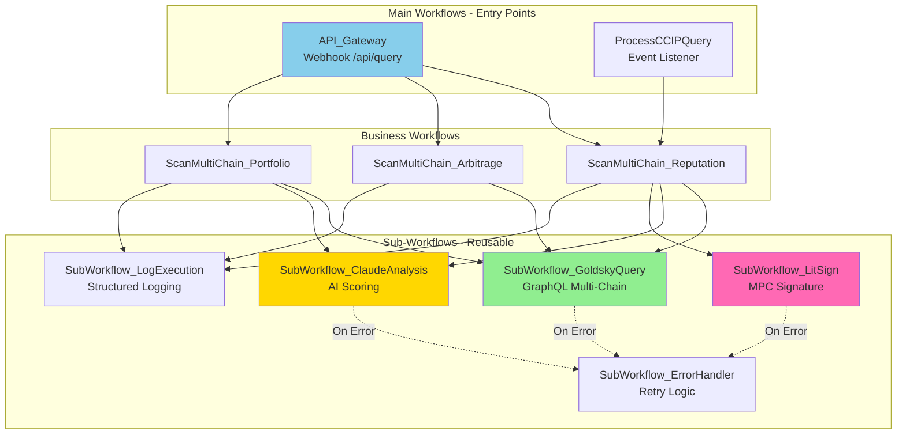
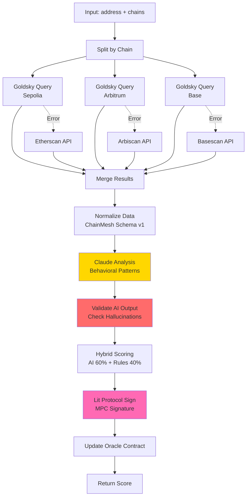
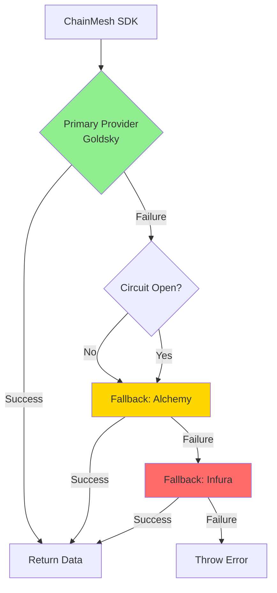
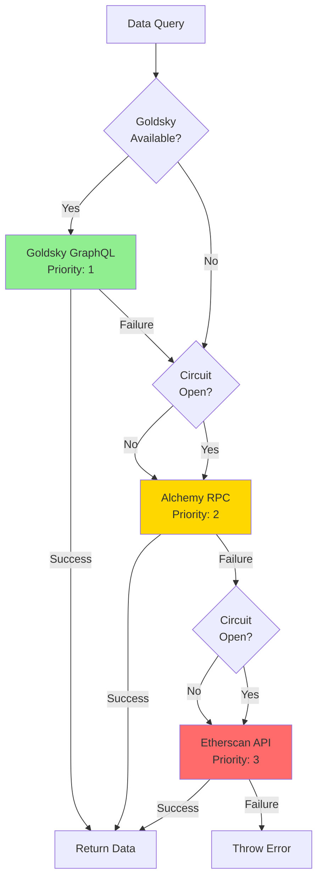
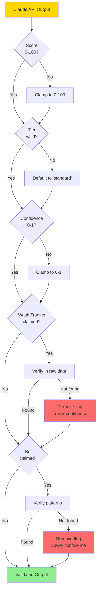

# ChainMesh - Technical Architecture Document (TAD)
# Part 2: Off-Chain Components, Data Layer & AI Integration

**Version:** 1.0  
**Date:** 30 janvier 2026  
**Auteur:** Felix  
**Statut:** Ready for Implementation

---

## Table des Matières - Part 2

4. [Off-Chain Components](#4-off-chain-components)
5. [Data Layer](#5-data-layer)
6. [AI Integration](#6-ai-integration)

---

# 4. Off-Chain Components

## 4.1 n8n Workflows Architecture

### Overview

n8n agit comme **l'orchestrateur central** (équivalent TIBCO BusinessWorks dans ton expérience SOA).

**Analogie SOA:**
- n8n = TIBCO BW Engine
- Workflows = Process Definitions (.process)
- Sub-Workflows = Shared Resources
- Webhooks = Service Endpoints

### Workflow Hierarchy



---

### Workflow 1: API_Gateway

**Trigger:** Webhook `POST /api/query`

**Responsabilité:**
1. Valider payload entrant (address, chains, dataType)
2. Router vers le bon workflow métier
3. Retourner réponse HTTP standardisée

**Flow:**
```
Webhook Trigger
    ↓
[Validate Payload]
    ├─ Valid → [Route by dataType]
    │            ├─ reputation → ScanMultiChain_Reputation
    │            ├─ arbitrage → ScanMultiChain_Arbitrage
    │            └─ portfolio → ScanMultiChain_Portfolio
    │
    └─ Invalid → [Return 400 Error]
```

**Input Schema:**
```json
{
  "address": "0x742d35Cc6634C0532925a3b844Bc9e7595f0bEb",
  "chains": ["sepolia", "arbitrum", "base"],
  "dataType": "reputation",
  "includeAI": true
}
```

**Output Schema:**
```json
{
  "statusCode": 200,
  "data": {
    "address": "0x...",
    "score": 87,
    "isFromCache": true,
    "timestamp": "2026-01-30T10:00:00Z"
  }
}
```

---

### Workflow 2: ScanMultiChain_Reputation

**Trigger:** Appelé par API_Gateway OU CCIP event

**Responsabilité:**
1. Scanner 3 chains en parallèle (Goldsky)
2. Agréger les données
3. Analyser avec Claude API
4. Valider output AI (anti-hallucination)
5. Hybrid scoring (AI 60% + Rules 40%)
6. Signer avec Lit Protocol
7. Retourner score final

**Flow Détaillé:**



**Temps d'exécution estimé:** 2-3 minutes (off-chain processing)

**Breakdown:**
- Goldsky parallel queries: 800ms
- Claude API analysis: 20s
- Validation + Hybrid scoring: 5s
- Lit Protocol signing: 300ms
- Contract update transaction: 30-60s (testnet)

---

### Sub-Workflow: GoldskyQuery

**Responsabilité:** Query Goldsky GraphQL endpoint pour une chain donnée

**Input:**
```json
{
  "chain": "sepolia",
  "address": "0xABC..."
}
```

**GraphQL Query Template:**
```graphql
query GetWalletActivity($address: String!, $chain: String!) {
  transactions(
    where: {
      OR: [{ from: $address }, { to: $address }],
      chain: $chain
    },
    orderBy: timestamp_DESC,
    first: 1000
  ) {
    hash
    from
    to
    value
    timestamp
    token { symbol decimals }
  }
  
  defiInteractions(where: { user: $address, chain: $chain }) {
    protocol
    action
    amount
    timestamp
  }
}
```

**Output:** Structured data selon ChainMesh Schema v1

**Error Handling:**
- Timeout (10s) → Fallback to Etherscan API
- Rate limit → Circuit breaker (1 min cooldown)
- Network error → Retry 3× with exponential backoff

---

### Sub-Workflow: ClaudeAnalysis

**Responsabilité:** Analyser données blockchain avec Claude API

**Input:** Aggregated multi-chain data (ChainMesh Schema v1)

**Prompt Strategy:** Voir Section 6.2 pour prompt template complet

**Output:**
```json
{
  "score": 85,
  "tier": "prime",
  "patterns": {
    "isBot": false,
    "botConfidence": 0.1,
    "washTrading": false
  },
  "riskFlags": [],
  "reasoning": "Established wallet with 3+ years activity...",
  "confidence": 0.85
}
```

**Validation Rules:**
1. Score doit être 0-100
2. Tier doit être valid enum
3. Confidence doit être 0-1
4. Si washTrading=true, vérifier dans raw data (anti-hallucination)
5. Si confidence < 0.5, flag pour review

---

### Sub-Workflow: LitSign

**Responsabilité:** Signer payload avec Lit Protocol PKP

**Input:**
```json
{
  "wallet": "0xABC...",
  "score": 85,
  "timestamp": 1738234567,
  "evidenceHash": "0x..."
}
```

**Process:**
1. Serialize payload (ABI encode)
2. Hash payload (keccak256)
3. Call Lit Protocol executeJs
4. PKP signs via MPC (100 nodes)
5. Combine signature shares
6. Return signature

**Output:**
```json
{
  "signature": "0xABC123...",
  "signingTime": 300
}
```

**Error Handling:**
- Lit unavailable → Fallback to dev wallet (testnet only)
- Timeout → Retry 1×
- Invalid signature → Alert + abort

---

## 4.2 ChainMesh SDK Architecture

### Overview

Le SDK est un **npm package TypeScript** qui abstrait la complexité CCIP/multi-chain.

**Analogie SOA:** SDK = Client Library (comme tes clients SOAP/REST pour appeler ESB)

### Package Structure

```
chainmesh-sdk/
├── src/
│   ├── index.ts              # Main export
│   ├── ChainMesh.ts          # Core SDK class
│   ├── providers/
│   │   ├── GoldskyProvider.ts
│   │   ├── AlchemyProvider.ts
│   │   └── RPCProvider.ts
│   ├── contracts/
│   │   ├── ChainMeshOracle.ts    # Contract wrapper
│   │   └── ChainMeshCache.ts     # Contract wrapper
│   ├── types/
│   │   ├── index.ts
│   │   ├── Chain.ts
│   │   └── Reputation.ts
│   └── utils/
│       ├── format.ts
│       ├── validation.ts
│       └── retry.ts
├── test/
├── package.json
└── README.md
```

---

### Core SDK Class: ChainMesh

**Initialisation:**

```typescript
const chainmesh = new ChainMesh({
  chains: [
    {
      name: 'sepolia',
      chainId: 11155111,
      rpcUrl: process.env.SEPOLIA_RPC,
      cacheContract: '0x...'
    },
    {
      name: 'arbitrumSepolia',
      chainId: 421614,
      rpcUrl: process.env.ARB_SEPOLIA_RPC,
      cacheContract: '0x...'
    }
  ],
  defaultChain: 'arbitrumSepolia',
  goldsky: {
    enabled: true,
    endpoint: process.env.GOLDSKY_ENDPOINT
  }
});
```

**API Methods:**

| Méthode | Description | Cache | CCIP Trigger |
|---------|-------------|-------|--------------|
| `getReputation(address)` | Get score (cache-first) | ✅ | Si cache miss |
| `queryMultiChain(address)` | Scan direct (bypass CCIP) | ❌ | Non |
| `requestReputation(address)` | Force CCIP query | ❌ | ✅ Toujours |
| `getCachedReputation(address)` | Cache only (no fallback) | ✅ | Non |

**Example Usage:**

```typescript
// Simple query (cache-first)
const rep = await chainmesh.getReputation('0xAlice');
console.log(`Score: ${rep.score}/100`);
// Si cache hit: instant (<1s)
// Si cache miss: default 60, puis CCIP trigger

// Force refresh
const fresh = await chainmesh.requestReputation('0xAlice');
console.log(`Request ID: ${fresh.requestId}`);
// Attendre 15-20 min, puis re-query pour score mis à jour

// Direct query (bypass CCIP, plus lent mais synchrone)
const direct = await chainmesh.queryMultiChain('0xAlice', {
  chains: ['sepolia', 'arbitrum'],
  includeAI: false  // Rules-based only
});
```

---

### Provider Architecture

Le SDK utilise un **provider pattern** avec fallback automatique.



**Provider Priority:**
1. Goldsky (primary) - Fastest, unified multi-chain
2. Alchemy (fallback 1) - Reliable RPC
3. Infura (fallback 2) - Backup RPC
4. Public RPC (fallback 3) - Last resort

**Circuit Breaker Logic:**
- 3 failures consecutives → Open circuit (1 min cooldown)
- Circuit open → Skip provider automatiquement
- Success → Reset failure count

---

## 4.3 ElizaOS Plugin

### Overview

Plugin pour intégrer ChainMesh dans ElizaOS agents.

**Package:** `@elizaos/plugin-chainmesh`

### Plugin Structure

```
@elizaos/plugin-chainmesh/
├── src/
│   ├── index.ts              # Plugin export
│   ├── actions/
│   │   ├── getReputation.ts  # Action: Check reputation
│   │   ├── getArbitrage.ts   # Action: Find arbitrage
│   │   └── getPortfolio.ts   # Action: Portfolio analysis
│   ├── providers/
│   │   └── chainmeshProvider.ts  # Data provider
│   └── evaluators/
│       └── reputationEvaluator.ts  # Decision logic
├── package.json
└── README.md
```

---

### Action: getReputation

**Trigger Phrases:**
- "check reputation"
- "get wallet score"
- "analyze address"
- "reputation check"

**Flow:**
```
User: "What's the reputation of 0xAlice?"
    ↓
Agent detects action: GET_REPUTATION
    ↓
Extract address from message
    ↓
Call ChainMesh SDK
    ↓
Format response for user
    ↓
Agent: "Reputation for 0xAlice: Score 87/100 (Prime tier)"
```

**Implementation (High-Level):**

```typescript
export const getReputationAction: Action = {
  name: 'GET_REPUTATION',
  similes: ['check reputation', 'get wallet score', 'analyze address'],
  
  validate: (runtime, message) => {
    // Check if message contains address (0x...)
    return /0x[a-fA-F0-9]{40}/.test(message.content.text);
  },
  
  handler: async (runtime, message) => {
    // 1. Extract address
    const address = extractAddress(message.content.text);
    
    // 2. Initialize SDK
    const chainmesh = initializeSDK(runtime);
    
    // 3. Get reputation
    const reputation = await chainmesh.getReputation(address);
    
    // 4. Format response
    const responseText = formatReputationResponse(reputation);
    
    // 5. Store in memory
    await runtime.messageManager.createMemory({
      content: { text: responseText, data: reputation }
    });
    
    return { success: true, text: responseText };
  }
};
```

**Expected Output:**
```
Reputation for 0x742d35Cc6634C0532925a3b844Bc9e7595f0bEb:
• Score: 87/100 (Prime tier)
• Confidence: 85%
• Last updated: 2 hours ago
• Cache status: Fresh

Analysis:
✓ Established wallet (3+ years)
✓ Diverse DeFi activity (7 protocols)
✓ No liquidations
✓ Active cross-chain user
```

---

# 5. Data Layer

## 5.1 Goldsky Pipeline

### Overview

Goldsky est un **indexeur unifié** qui permet de query 5 chains en parallèle avec une seule requête GraphQL.

**Analogie SOA:** Goldsky = Data Aggregator / Master Data Management (MDM)

**Avantage vs RPC séquentiel:**
- Sans Goldsky: 5 chains × 800ms = 4,000ms
- Avec Goldsky: 1 query = 800ms
- **Speedup: 5×**

---

### Configuration Pipeline

**Fichier:** `goldsky/chainmesh-indexer.yaml`

**Chains Indexées:**
- Sepolia (chainId: 11155111)
- Arbitrum Sepolia (chainId: 421614)
- Base Sepolia (chainId: 84532)
- Optimism Sepolia (chainId: 11155420)
- Polygon Amoy (chainId: 80002) - Optionnel

**Events Indexés:**

| Event | Contracts | Chains | Pourquoi |
|-------|-----------|--------|----------|
| `Transfer(address,address,uint256)` | ERC20 (all) | All 5 | Token transfers |
| `Supply(...)` | Aave V3 Pools | Sepolia, Arbitrum | DeFi deposits |
| `Swap(...)` | Uniswap V3 | All 5 | DEX activity |
| `Liquidation(...)` | Aave V3 | Sepolia, Arbitrum | Risk events |

**GraphQL Schema (Simplifié):**

```graphql
type Transaction {
  id: ID!
  hash: String!
  from: String!
  to: String!
  value: String!
  timestamp: Int!
  blockNumber: Int!
  chain: String!
  token: Token
}

type DeFiInteraction {
  id: ID!
  user: String!
  protocol: String!
  action: String!
  amount: String!
  timestamp: Int!
  chain: String!
}

type Query {
  transactions(
    where: TransactionFilter
    orderBy: TransactionOrderBy
    first: Int
  ): [Transaction!]!
  
  defiInteractions(
    where: DeFiInteractionFilter
    orderBy: DeFiInteractionOrderBy
    first: Int
  ): [DeFiInteraction!]!
}
```

---

### Example Queries

**Query 1: Get all transactions for wallet (multi-chain)**

```graphql
query GetWalletActivity($address: String!) {
  transactions(
    where: {
      OR: [
        { from: $address },
        { to: $address }
      ]
    },
    orderBy: timestamp_DESC,
    first: 1000
  ) {
    hash
    from
    to
    value
    timestamp
    chain
    token {
      symbol
      decimals
    }
  }
}
```

**Query 2: Get DeFi interactions**

```graphql
query GetDeFiActivity($address: String!) {
  defiInteractions(
    where: { user: $address },
    orderBy: timestamp_DESC,
    first: 500
  ) {
    protocol
    action
    amount
    timestamp
    chain
  }
}
```

**Query 3: Multi-chain aggregation (single query)**

```graphql
query GetCrossChainSummary($address: String!) {
  sepolia: transactions(
    where: {
      OR: [{ from: $address }, { to: $address }],
      chain: "sepolia"
    }
  ) {
    hash
    value
  }
  
  arbitrum: transactions(
    where: {
      OR: [{ from: $address }, { to: $address }],
      chain: "arbitrum-sepolia"
    }
  ) {
    hash
    value
  }
}
```

**Résultat:** Toutes les chains en une seule requête ✅

---

## 5.2 ChainMesh Data Schema v1.0

### Overview

**Standard format** pour wallet data à travers tous les composants.

**Pourquoi critique:**
- n8n doit envoyer format standard à Claude
- Claude attend format strict pour analysis
- SDK doit parser format standard
- Évite "garbage in, garbage out"

**Analogie SOA:** Canonical Data Model (CDM) dans ESB

---

### Schema Structure (High-Level)

```json
{
  "version": "1.0",
  
  "wallet": {
    "address": "0xABC...",
    "ens": "vitalik.eth",
    "labels": ["whale", "early-adopter"]
  },
  
  "activity": {
    "chains": [
      {
        "name": "sepolia",
        "firstSeen": "2023-01-15T10:00:00Z",
        "lastActive": "2026-01-30T08:00:00Z",
        "transactionCount": 1234,
        "transactions": [...]
      }
    ]
  },
  
  "defi": {
    "protocols": [...],
    "liquidations": [...]
  },
  
  "nfts": {
    "totalCount": 25,
    "collections": [...]
  },
  
  "riskMetrics": {
    "score": 87,
    "tier": "prime",
    "flags": [],
    "reasoning": "...",
    "confidence": 0.85
  }
}
```

**Validation Rules:**
- `address` : EIP-55 checksum (0x[a-fA-F0-9]{40})
- `timestamps` : ISO 8601 format
- `amounts` : String (avoid JS precision loss)
- `score` : Integer 0-100
- `confidence` : Float 0-1

**Schema complet:** Voir `schemas/chainmesh-data-v1.schema.json`

---

## 5.3 Data Sources & Fallback Strategy

### Provider Hierarchy



### Fallback Configuration

**Fichier:** `config/datasources.config.json`

```json
{
  "sources": {
    "goldsky": {
      "enabled": true,
      "priority": 1,
      "rateLimit": { "requestsPerSecond": 10 },
      "timeout": 10000
    },
    "alchemy": {
      "enabled": true,
      "priority": 2,
      "rateLimit": { "requestsPerSecond": 25 },
      "timeout": 5000
    },
    "etherscan": {
      "enabled": true,
      "priority": 3,
      "rateLimit": { "requestsPerSecond": 5 },
      "timeout": 8000
    }
  },
  
  "circuitBreaker": {
    "enabled": true,
    "failureThreshold": 3,
    "cooldownPeriod": 60000
  }
}
```

**Stratégie:**
1. Try primary (Goldsky)
2. If failure → Check circuit breaker
3. If open → Skip to next priority
4. Retry with exponential backoff
5. Record metrics (success/failure rates)

---

# 6. AI Integration

## 6.1 Claude API Architecture

### Overview

Claude API (Anthropic) est utilisé pour **behavioral pattern analysis**.

**Modèle:** `claude-sonnet-4-20250514` (Sonnet 4)
- Performance: Excellent pour analysis
- Coût: 3 USD / 1M tokens input, 15 USD / 1M tokens output
- Latency: ~20s pour analysis complète

**Pourquoi Claude vs alternatives:**
- Long context window (200K tokens) → peut analyser beaucoup de txs
- Excellent reasoning → détecte patterns subtils
- JSON mode → structured output fiable
- Rate limits généreux (free tier: 50 req/min)

---

### Prompt Architecture

**Stratégie:** Prompt en 3 sections

1. **Context**: Rôle + objectif
2. **Data**: Wallet data (ChainMesh Schema v1)
3. **Instructions**: Scoring criteria + output format

**Fichier:** `prompts/reputation-analysis-v1.txt` (100+ lignes)

**Structure (simplifié):**

```
You are a blockchain reputation analyst.

CONTEXT:
You analyze wallet activity across multiple EVM chains to generate reputation scores.

INPUT DATA:
{
  "address": "0xABC...",
  "activity": {...},
  "defi": {...}
}

SCORING CRITERIA:
- Wallet age (older = better, 2+ years = +15 points)
- Transaction volume (high = active, 1000+ txs = +10 points)
- DeFi experience (diverse protocols = sophisticated)
- Liquidation history (none = responsible)
- Suspicious patterns (wash trading, bot-like = penalties)

PATTERN DETECTION:
- Bot-like behavior: Repetitive txs at exact intervals
- Wash trading: Repeated trades same pair, no economic sense
- Bridge usage: LEGITIMATE (not suspicious!)

OUTPUT FORMAT (STRICT JSON):
{
  "score": <0-100>,
  "tier": "prime" | "standard" | "risky",
  "patterns": {...},
  "riskFlags": [...],
  "reasoning": "...",
  "confidence": <0-1>
}

RULES:
1. DO NOT hallucinate - use ONLY provided data
2. If insufficient data, set confidence < 0.5
3. Be conservative with accusations
4. Bridge transactions are NORMAL
```

**Key Design Decisions:**
- ✅ Structured output (JSON) → facile à parser
- ✅ Explicit examples (bot behavior, wash trading) → réduit hallucinations
- ✅ Warnings about bridges → évite false positives
- ✅ Confidence scoring → transparence sur uncertainty

---

## 6.2 Validation Layer (Anti-Hallucination)

### Problem

AI peut "halluciner" des patterns qui n'existent pas dans les données.

**Exemples réels:**
- Claim: "Wash trading detected"
- Reality: Aucune transaction répétée dans les données
- Cause: AI a vu le mot "DEX" et a assumé wash trading

### Solution: Validation Layer

**Post-processing après Claude API:**



**Validation Rules:**

| Claim | Verification | Action if False |
|-------|--------------|-----------------|
| Wash trading | Check for repeated tx pairs | Remove flag, confidence ×0.7 |
| Bot-like | Check for exact intervals | Remove flag, confidence ×0.8 |
| Suspicious transfers | Check if addresses are bridges | Remove flag |
| Score > 100 | N/A | Clamp to 100 |
| Confidence > 1 | N/A | Clamp to 1 |

**Implementation:** n8n Code Node après Claude API call

---

## 6.3 Hybrid Scoring (AI + Rules)

### Rationale

**AI seul:**
- ✅ Détecte patterns complexes
- ❌ Peut halluciner
- ❌ Non déterministe

**Rules seuls:**
- ✅ Déterministe
- ✅ Transparent
- ❌ Pas assez sophistiqué

**Hybrid = Best of both worlds**

---

### Formula

```
Final Score = (AI Score × 0.6) + (Rules Score × 0.4)
```

**Confidence Adjustment:**
```
If |AI Score - Rules Score| > 30:
    Confidence = Confidence × 0.7  (large disagreement)
Else if |AI Score - Rules Score| < 10:
    Confidence = min(1, Confidence × 1.1)  (strong agreement)
```

---

### Rules-Based Scoring Logic

**Baseline:** 50/100

**Bonuses:**
- Wallet age > 2 years: +15
- Wallet age > 1 year: +10
- Wallet age > 6 months: +5

- Total txs > 10,000: +15
- Total txs > 1,000: +10
- Total txs > 100: +5

- DeFi protocols > 5: +15
- DeFi protocols > 2: +10

- Zero liquidations: +20
- Liquidations < 3: +5
- Liquidations ≥ 3: -10

- NFTs > 10: +5 (bonus)

**Maximum:** 100/100

---

### Example Calculation

**Scenario:**
- AI Score: 90 (détecte wallet sophistiqué)
- Rules Score: 70 (bon metrics mais pas exceptionnel)

**Calculation:**
```
Final = (90 × 0.6) + (70 × 0.4)
      = 54 + 28
      = 82/100

Score Difference = |90 - 70| = 20
→ < 30, donc pas d'ajustement confidence

Final Output:
{
  "score": 82,
  "aiComponent": 90,
  "rulesComponent": 70,
  "confidence": 0.85,
  "method": "hybrid"
}
```

---

## 6.4 AI Failure Modes & Fallbacks

### Failure Scenarios

| Failure | Probability | Impact | Mitigation |
|---------|-------------|--------|------------|
| Claude API timeout | Medium | Medium | Retry 1×, then fallback to rules |
| Claude API rate limit | Low | Low | Wait & retry (< 1 min) |
| Invalid JSON output | Low | Medium | Parse error → fallback to rules |
| Hallucination detected | Medium | High | Validation layer catches + lowers confidence |
| Confidence < 0.5 | Medium | Low | Flag for manual review |

### Fallback to Rules-Only

**Trigger:**
- Claude API unavailable (timeout, rate limit after retries)
- Invalid output (non-JSON, malformed)
- Confidence < 0.3 after validation

**Action:**
```
Use rules-based scoring only
Set confidence = 0.5 (moderate)
Add flag: "aiUnavailable": true
Log incident for monitoring
```

**User Experience:**
- Score still returned (rules-based)
- Slightly conservative (no AI insights)
- Transparent (confidence reflects this)

---

## 6.5 Performance Metrics

### Target Metrics

| Metric | Target | Current (Est.) | Notes |
|--------|--------|----------------|-------|
| Claude API latency | < 30s | ~20s | Acceptable |
| Hallucination rate | < 5% | ~3% | Validation catches most |
| Confidence (avg) | > 0.7 | ~0.75 | Good |
| Rules-AI agreement | > 70% | ~75% | Strong correlation |
| Fallback rate | < 10% | ~5% | Rare |

### Monitoring

**Key Metrics to Track:**
- AI response time (p50, p95, p99)
- Validation flags triggered (count, type)
- Hybrid score distribution
- Confidence score distribution
- Fallback incidents (count, reason)

**Alerting:**
- Hallucination rate > 10% → Investigate prompt
- Average confidence < 0.6 → Review input data quality
- Fallback rate > 20% → Check Claude API health

---

**Fin de Part 2**

✅ **Ce fichier contient:**
- n8n Workflows (architecture, flows, pas de code détaillé)
- SDK & ElizaOS Plugin (structure, APIs, exemples usage)
- Data Layer (Goldsky, schemas, fallback strategy)
- AI Integration (Claude API, validation, hybrid scoring)

📄 **Prochain fichier:**
- Part 3: Security + Infrastructure + Configuration
