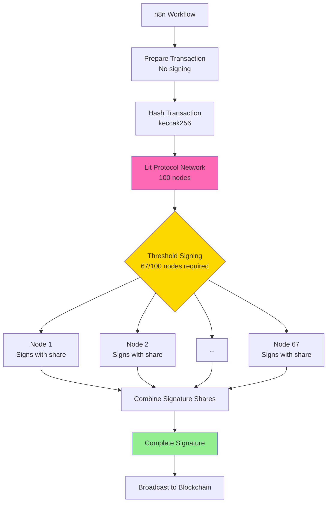
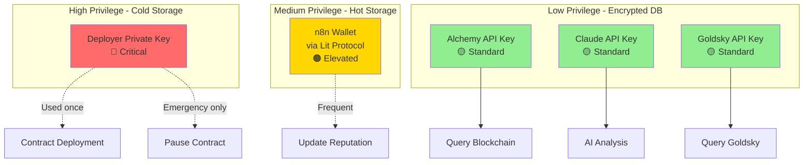
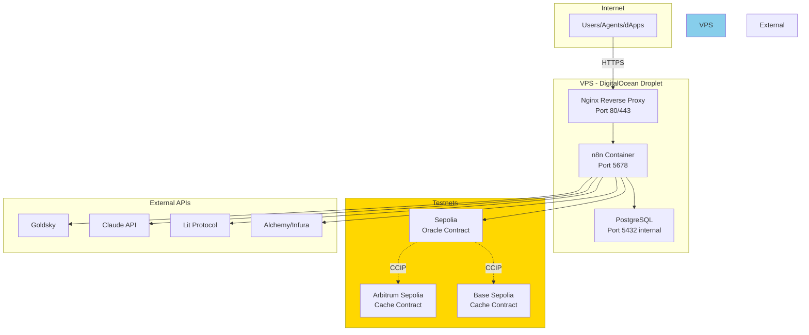

# ChainMesh - Technical Architecture Document (TAD)
# Part 3: Security, Infrastructure & Configuration

**Version:** 1.0  
**Date:** 30 janvier 2026  
**Auteur:** Felix  
**Statut:** Ready for Implementation

---

## Table des Matières - Part 3

7. [Security Architecture](#7-security-architecture)
8. [Infrastructure & DevOps](#8-infrastructure--devops)
9. [Configuration Management](#9-configuration-management)
10. [Appendices](#10-appendices)

---

# 7. Security Architecture

## 7.1 Threat Model

### Assets à Protéger

| Asset | Criticité | Menaces | Impact si compromis |
|-------|-----------|---------|---------------------|
| **Smart Contracts** | 🔴 Critique | Reentrancy, access control bypass | Fonds perdus, réputation corrompue |
| **Private Keys** | 🔴 Critique | Vol, exposition | Contrôle total du système |
| **API Keys** | 🟠 Élevée | Exposition, rate limit abuse | Coûts élevés, DoS |
| **CCIP Messages** | 🟠 Élevée | Replay, spoofing | Fausses données, cache pollution |
| **AI Outputs** | 🟡 Moyenne | Hallucinations, manipulation | Scores incorrects, confiance réduite |
| **User Data** | 🟡 Moyenne | Exposition publique | Vie privée (mais données déjà publiques on-chain) |

---

### Threat Scenarios

**Scénario 1: Attaque Reentrancy sur Oracle**
- **Vecteur:** Fonction `sendResponse()` fait appel externe avant update state
- **Impact:** Double-spending de reputation scores
- **Mitigation:** `ReentrancyGuard` + Checks-Effects-Interactions pattern

**Scénario 2: CCIP Message Spoofing**
- **Vecteur:** Attaquant forge message CCIP avec fausse source chain
- **Impact:** Cache pollué avec fausses réputations
- **Mitigation:** Authentication stricte (chain selector + sender address)

**Scénario 3: Private Key Compromise (n8n wallet)**
- **Vecteur:** Vol de clé privée du wallet n8n
- **Impact:** Attaquant peut appeler `updateReputation()` avec UPDATER_ROLE
- **Mitigation:** Lit Protocol PKP (distributed signing, pas de single point of failure)

**Scénario 4: AI Prompt Injection**
- **Vecteur:** Attaquant manipule données blockchain pour tromper AI
- **Impact:** Faux scores élevés pour wallets malveillants
- **Mitigation:** Validation layer + Hybrid scoring (AI ne contrôle que 60%)

**Scénario 5: Rate Limit Exhaustion**
- **Vecteur:** Attaquant spam `requestReputation()` sur Cache contract
- **Impact:** DoS + coûts CCIP élevés
- **Mitigation:** Rate limiting (1 req/hour/user) + circuit breakers

---

## 7.2 Lit Protocol Integration

### Overview

**Problème:** Hot wallet (private key) = single point of failure
**Solution:** Lit Protocol PKP (Programmable Key Pair) = distributed MPC signing

**Analogie SOA:** Au lieu d'un seul serveur avec clé (single point of failure), on a 100 serveurs qui doivent collaborer (Byzantine Fault Tolerant).

---

### Architecture MPC



**Key Advantages:**
- ✅ No single private key to steal
- ✅ 66/100 nodes must be compromised (practically impossible)
- ✅ Programmable conditions (can add logic: "only sign if X")
- ✅ Key rotation possible without changing on-chain address

**Latency:** ~300ms (acceptable overhead for security gain)

---

### PKP Configuration

**Key Parameters:**
- **PKP Public Key:** `0x04ABC...` (secp256k1 public key)
- **Auth Method:** Session signature (wallet signs once, valid 24h)
- **Permitted Actions:** Sign transactions for ChainMesh Oracle updates only
- **Network:** Datil-Test (testnet) → Datil (mainnet)

**Security Model:**
- n8n prépare transaction (unsigned)
- Sends to Lit Protocol avec auth signature
- Lit nodes verify auth + execute signing
- Returns combined signature
- n8n broadcasts signed transaction

**Fallback (Testnet Only):**
- Si Lit unavailable → Use dev wallet (logged as degraded mode)
- Production → Must have Lit or fail (no fallback)

---

## 7.3 Access Control Matrix

### Smart Contracts (RBAC)

**ChainMeshOracle Roles:**

| Role | Permissions | Assigned To | Notes |
|------|-------------|-------------|-------|
| `DEFAULT_ADMIN_ROLE` | Grant/revoke roles, pause, withdraw | Deployer wallet (cold storage) | Rarely used |
| `UPDATER_ROLE` | `updateReputation()`, `sendResponse()` | n8n wallet (via Lit PKP) | Frequent use |
| `PAUSER_ROLE` | `pause()`, `unpause()` | Deployer + multisig | Emergency only |
| Public | `getReputation()` (read-only) | Anyone | No restrictions |

**ChainMeshCache Roles:**

| Role | Permissions | Assigned To |
|------|-------------|-------------|
| `Owner` | `invalidateCache()`, `withdraw()` | Deployer wallet |
| Public | `requestReputation()`, `getReputation()` | Anyone (rate limited) |

---

### n8n Workflows

**Access Levels:**

| Component | Authentication | Authorization |
|-----------|----------------|---------------|
| **Webhook Endpoints** | Basic Auth (username/password) | Public (after auth) |
| **Admin UI** | Basic Auth | Admin user only |
| **Workflow Execution** | Internal | Based on trigger |
| **API Credentials** | Encrypted at rest (PostgreSQL) | Workflow-specific |

**Credential Management:**
- All API keys stored in n8n encrypted credentials (NOT in workflow JSON)
- Encryption key: `N8N_ENCRYPTION_KEY` environment variable
- PostgreSQL database encrypted at rest
- Never export credentials in workflow backups

---

### API Keys Hierarchy



**Key Rotation Schedule:**
- Deployer key: Never rotated (cold storage, hardware wallet)
- n8n/Lit PKP: Can rotate monthly (Lit Protocol feature)
- API keys: Rotate quarterly or if compromised

---

## 7.4 Security Patterns

### Pattern 1: Defense in Depth (Layers)

```
Layer 1: Network (VPS firewall, rate limiting)
    ↓
Layer 2: Application (n8n auth, input validation)
    ↓
Layer 3: Smart Contract (access control, reentrancy guard)
    ↓
Layer 4: Cryptographic (MPC signing, signature verification)
    ↓
Layer 5: Monitoring (alerts, anomaly detection)
```

**Analogie SOA:** Comme tes layers de sécurité TIBCO (firewall → gateway → service → database)

---

### Pattern 2: Principle of Least Privilege

**Application:**
- n8n wallet: Only `UPDATER_ROLE`, not `ADMIN`
- API keys: Read-only where possible (Etherscan, Goldsky)
- PostgreSQL user: Only access to n8n schema
- VPS user: No root access for n8n process

---

### Pattern 3: Fail-Safe Defaults

**Examples:**
- Cache miss → Return default score (60/100), not error
- API timeout → Fallback to next provider, not crash
- Invalid signature → Reject transaction, not accept
- AI confidence < 0.5 → Flag for review, not auto-reject

---

### Pattern 4: Input Validation (Everywhere)

**Validation Points:**

| Input | Validation | Where |
|-------|-----------|-------|
| Wallet address | EIP-55 checksum, non-zero | Smart contract + n8n + SDK |
| Score | 0-100 range | Smart contract + n8n validation |
| Timestamp | Not future, reasonable past | Smart contract |
| CCIP message | Source chain + sender verification | Smart contract `_ccipReceive()` |
| Webhook payload | JSON schema validation | n8n first node |

**Rule:** Validate at every boundary (external → internal)

---

## 7.5 Security Checklist

### Pre-Deployment

**Smart Contracts:**
- [ ] Access control roles configured
- [ ] Reentrancy guards on all state-changing functions
- [ ] Custom errors used (gas optimization)
- [ ] Events emitted for all state changes
- [ ] NatSpec documentation complete
- [ ] Foundry tests: coverage > 80%
- [ ] Gas optimization reviewed
- [ ] Testnet deployment successful

**n8n:**
- [ ] All API keys in encrypted credentials
- [ ] No secrets in workflow JSON exports
- [ ] Error handlers on all external calls
- [ ] Circuit breakers configured
- [ ] Rate limiting enabled on webhooks
- [ ] Backup workflows exported (without credentials)

**Infrastructure:**
- [ ] VPS firewall configured (only ports 80, 443, 22)
- [ ] SSH key-based auth (password disabled)
- [ ] PostgreSQL not exposed publicly
- [ ] TLS/SSL certificates configured
- [ ] Fail2ban or equivalent for brute-force protection

---

### Post-Deployment Monitoring

**Metrics to Watch:**
- Failed transactions (> 5% → investigate)
- Unauthorized access attempts (any → alert)
- API rate limit hits (> 80% threshold → scale up)
- Circuit breaker opens (> 3/day → check provider)
- Abnormal score distributions (sudden spike → potential attack)

**Alerting Channels:**
- Email for high-severity (contract paused, key compromise suspected)
- Telegram for medium-severity (circuit breaker open, API errors)
- Logs only for low-severity (cache misses, routine errors)

---

# 8. Infrastructure & DevOps

## 8.1 Deployment Topology

### Overview



---

### Component Specifications

| Component | Technology | Resource Allocation | Purpose |
|-----------|-----------|---------------------|---------|
| **VPS** | DigitalOcean Droplet | 2 vCPU, 4GB RAM, 80GB SSD | Host n8n + PostgreSQL |
| **n8n** | Docker container | 1.5 vCPU, 2GB RAM | Workflow orchestration |
| **PostgreSQL** | Docker container | 0.5 vCPU, 1.5GB RAM | Workflow data + logs |
| **Nginx** | Native install | 0.1 vCPU, 256MB RAM | Reverse proxy + SSL |

**Total Cost:** ~$6/month (Basic Droplet) + ~$4 domain = **$10/month**

**Scalability:**
- Current: Handles ~10 queries/sec
- Bottleneck: CCIP (not n8n)
- Vertical scaling: Upgrade to $12/month (4 vCPU, 8GB RAM) → 25 queries/sec
- Horizontal scaling: Not needed for MVP (testnet)

---

## 8.2 Development Workflow

### Environment Strategy

**3 Environments:**

| Environment | Purpose | Infrastructure | Data |
|-------------|---------|----------------|------|
| **Local** | Development, unit tests | Anvil (local chain), n8n local | Mock data |
| **Staging** | Integration tests, E2E | Testnet (Sepolia, Arbitrum, Base), n8n VPS | Real testnet data |
| **Production** | Live system (future) | Mainnet, n8n VPS (prod) | Real mainnet data |

**Current Focus:** Local + Staging (Production hors scope pour 16 semaines)

---

### Git Workflow

**Branching Strategy:**

```
main (protected, staging-ready)
  ├── develop (integration)
  │     ├── feature/eliza-plugin
  │     ├── feature/lit-integration
  │     └── feature/goldsky-pipeline
  └── hotfix/ccip-auth-bug (direct to main)
```

**Commit Convention:**
```
feat(oracle): add Lit Protocol signing
fix(ccip): correct message authentication
docs(sdk): update API reference
test(cache): add fuzz tests for scoring
```

**Pull Request Process:**
1. Feature branch → PR to develop
2. CI runs tests (Foundry + npm test)
3. Review + approval
4. Merge to develop
5. Weekly: develop → main (staging deployment)

---

## 8.3 Monitoring Strategy

### Observability Pillars

**1. Metrics (Quantitative)**
- CCIP message success rate
- Cache hit rate
- API latency (Goldsky, Claude, Lit)
- Error rates by component
- Gas costs per transaction

**2. Logs (Events)**
- n8n execution logs (structured JSON)
- Smart contract events (indexed by Goldsky)
- API call traces
- Error stack traces

**3. Traces (Distributed)**
- Request ID propagation (n8n → APIs → contracts)
- End-to-end latency breakdown
- Bottleneck identification

---

### Key Metrics Dashboard

**Proposed Metrics (for future implementation):**

| Metric | Type | Alert Threshold | Purpose |
|--------|------|-----------------|---------|
| CCIP Success Rate | % | < 95% | Detect CCIP issues |
| Cache Hit Rate | % | < 70% | Optimize cache TTL |
| Goldsky Latency (p95) | ms | > 2000ms | Provider health |
| Claude API Latency (p95) | ms | > 40s | AI performance |
| Lit Protocol Latency (p95) | ms | > 1s | MPC health |
| Error Rate (total) | % | > 10% | System health |
| Daily Active Queries | count | N/A | Usage tracking |

**Tools (suggestions, not requirements):**
- Grafana for dashboards
- Prometheus for metrics collection
- Loki for log aggregation
- Or simpler: n8n workflows that query logs + send to Google Sheets

---

## 8.4 Backup & Disaster Recovery

### What to Backup

| Asset | Backup Frequency | Retention | Priority |
|-------|------------------|-----------|----------|
| **Smart Contracts** | N/A (immutable on-chain) | Forever | 🔴 Critical |
| **Contract Addresses** | After each deployment | Forever | 🔴 Critical |
| **n8n Workflows** | Daily | 30 days | 🟠 High |
| **PostgreSQL DB** | Daily | 7 days | 🟡 Medium |
| **API Keys** | Manual (not automated) | Offline | 🔴 Critical |
| **Deployment Scripts** | Git commits | Forever | 🟠 High |

---

### Disaster Scenarios

**Scenario 1: VPS Crash**
- **Impact:** n8n down, no new queries processed (existing cache still works)
- **Recovery:** Redeploy n8n on new VPS, restore workflows from Git, reconnect PostgreSQL
- **RTO (Recovery Time Objective):** 2 hours
- **RPO (Recovery Point Objective):** Last workflow commit (< 24h)

**Scenario 2: Smart Contract Bug**
- **Impact:** Reputation data corrupted or locked
- **Recovery:** Deploy new contract, migrate data, update n8n config
- **RTO:** 1 week (requires re-deployment + testing)
- **Mitigation:** Extensive testing + testnet validation before mainnet

**Scenario 3: API Key Compromise (Claude/Goldsky)**
- **Impact:** Unauthorized usage, high costs
- **Recovery:** Rotate key immediately, update n8n credentials
- **RTO:** 15 minutes
- **Mitigation:** Monitor usage, set spending limits

**Scenario 4: Database Corruption**
- **Impact:** Workflow execution history lost (not critical for system function)
- **Recovery:** Restore from daily backup
- **RTO:** 1 hour
- **RPO:** 24 hours (daily backup)

---

# 9. Configuration Management

## 9.1 Configuration Philosophy

### Principles

**1. Separation of Concerns**
- Code ≠ Configuration
- Configuration externalisée (environment variables, JSON files)
- Secrets ≠ Configuration (secrets encrypted, config plain text)

**2. Environment Parity**
- Same code, different config (dev/staging/prod)
- 12-Factor App methodology

**3. Hot Reload Where Possible**
- Chain config changes → restart n8n (no redeploy)
- Smart contract changes → redeploy (immutable)

**Analogie SOA:** Comme tes fichiers de properties TIBCO (dev.properties, prod.properties)

---

## 9.2 Configuration Layers

### Layer 1: Environment Variables (.env)

**Purpose:** Secrets + environment-specific values

**Examples:**
```bash
# RPC Endpoints
SEPOLIA_RPC=https://eth-sepolia.g.alchemy.com/v2/...
ARB_SEPOLIA_RPC=https://arb-sepolia.g.alchemy.com/v2/...

# API Keys (secrets)
ALCHEMY_KEY=...
ANTHROPIC_KEY=...
GOLDSKY_KEY=...

# Contract Addresses (post-deployment)
ORACLE_CONTRACT_SEPOLIA=0x...
CACHE_CONTRACT_ARB_SEPOLIA=0x...
```

**Storage:** `.env` file (git ignored), injected into Docker containers

---

### Layer 2: JSON Configuration Files

**Purpose:** Structured config, reusable across environments

**Example 1: chains.config.json**
```json
{
  "version": "1.0",
  "chains": {
    "sepolia": {
      "chainId": 11155111,
      "selector": "16015286601757825753",
      "ccipRouter": "0x0BF3dE8c...",
      "rpcUrl": "${SEPOLIA_RPC}",
      "gasLimit": 500000
    }
  }
}
```

**Example 2: datasources.config.json**
```json
{
  "sources": {
    "goldsky": {
      "enabled": true,
      "priority": 1,
      "timeout": 10000
    }
  },
  "circuitBreaker": {
    "failureThreshold": 3,
    "cooldownPeriod": 60000
  }
}
```

**Storage:** Git committed (no secrets), loaded at runtime

---

### Layer 3: Smart Contract Deployment Artifacts

**Purpose:** Track deployed contract addresses

**Example: deployments/sepolia.json**
```json
{
  "network": "sepolia",
  "chainId": 11155111,
  "contracts": {
    "ChainMeshOracle": {
      "address": "0xABC...",
      "deployedAt": "2026-01-30T10:00:00Z",
      "deployer": "0xDEF...",
      "transactionHash": "0x123..."
    }
  }
}
```

**Storage:** Git committed, generated by deployment scripts

---

## 9.3 Configuration Management Tools

### ChainManager (SDK)

**Purpose:** Centralized chain configuration access

**Responsibilities:**
- Load chains.config.json
- Interpolate environment variables
- Provide typed chain config to SDK
- Validate configuration (required fields, valid chain IDs)

**Usage Pattern:**
```typescript
const chainManager = getChainManager();
const sepoliaConfig = chainManager.getChain('sepolia');
const provider = chainManager.getProvider('sepolia');
```

---

### DataSourceManager (SDK)

**Purpose:** Manage data source providers with fallback

**Responsibilities:**
- Load datasources.config.json
- Implement circuit breaker pattern
- Track provider health (success/failure rates)
- Automatic fallback on provider failure

**Usage Pattern:**
```typescript
const dsManager = new DataSourceManager();
const sources = dsManager.getEnabledSources(); // Sorted by priority

for (const source of sources) {
  if (dsManager.isCircuitOpen(source.name)) continue;
  
  try {
    const data = await source.query(address);
    dsManager.recordSuccess(source.name);
    return data;
  } catch (error) {
    dsManager.recordFailure(source.name);
  }
}
```

---

## 9.4 Configuration Update Workflow

### Adding a New Chain (Example: Optimism Sepolia)

**Steps:**
1. Update `chains.config.json` (add Optimism config)
2. Update `.env` (add OPTIMISM_SEPOLIA_RPC, CCIP_ROUTER_OPTIMISM_SEPOLIA)
3. Deploy ChainMeshCache on Optimism (deployment script)
4. Update deployment artifacts (deployments/optimism-sepolia.json)
5. Restart n8n (hot reload config)
6. Update SDK version (if needed)
7. Test E2E flow

**Impact:** No smart contract redeployment on existing chains ✅

---

### Changing Data Source Priority

**Steps:**
1. Update `datasources.config.json` (change priority values)
2. Commit to Git
3. Restart n8n (no code changes needed)

**Example:**
```json
// Before: Goldsky priority 1, Alchemy priority 2
{
  "goldsky": { "priority": 1 },
  "alchemy": { "priority": 2 }
}

// After: Switch priorities (Goldsky having issues)
{
  "goldsky": { "priority": 2 },
  "alchemy": { "priority": 1 }
}
```

---

# 10. Appendices

## 10.1 Glossary

| Term | Definition |
|------|------------|
| **CCIP** | Chainlink Cross-Chain Interoperability Protocol - messaging layer for cross-chain communication |
| **DON** | Decentralized Oracle Network - Chainlink's distributed oracle nodes |
| **PKP** | Programmable Key Pair - Lit Protocol's distributed MPC signing key |
| **MPC** | Multi-Party Computation - cryptographic method for distributed signing (no single private key) |
| **Chain Selector** | Unique uint64 identifier for each blockchain in CCIP ecosystem |
| **Oracle Chain** | Primary chain hosting the Oracle contract (Sepolia in ChainMesh) |
| **Consumer Chain** | Chain that queries the Oracle (Arbitrum, Base, Optimism) |
| **Cache Hit** | Reputation found in local cache (instant response <1s) |
| **Cache Miss** | Reputation not in cache (triggers CCIP query, ~15 min) |
| **Hybrid Scoring** | Weighted average of AI analysis (60%) and rules-based scoring (40%) |
| **Circuit Breaker** | Pattern to prevent cascading failures by temporarily disabling failing services |
| **TTL** | Time To Live - duration before cache entry expires (24h for ChainMesh) |
| **Testnet** | Test blockchain network with free tokens for development (Sepolia, Arbitrum Sepolia, etc.) |
| **Gas** | Computational cost for executing blockchain transactions (measured in wei) |
| **Wei** | Smallest unit of Ether (1 ETH = 10^18 Wei) |
| **EIP-55** | Ethereum Improvement Proposal for checksummed addresses (mixed case) |

---

## 10.2 External Resources

### Official Documentation

**Blockchain & CCIP:**
- Chainlink CCIP Docs: https://docs.chain.link/ccip
- Chainlink Faucets (testnet tokens): https://faucets.chain.link
- Foundry Book: https://book.getfoundry.sh
- Hardhat Docs: https://hardhat.org/docs

**Data & Indexing:**
- Goldsky Docs: https://docs.goldsky.com
- The Graph Docs: https://thegraph.com/docs
- Alchemy API Reference: https://docs.alchemy.com/reference/api-overview
- Etherscan API: https://docs.etherscan.io

**Security & Signing:**
- Lit Protocol Docs: https://developer.litprotocol.com
- OpenZeppelin Contracts: https://docs.openzeppelin.com/contracts

**Orchestration & AI:**
- n8n Documentation: https://docs.n8n.io
- Claude API Reference: https://docs.anthropic.com/claude/reference
- ElizaOS GitHub: https://github.com/elizaos/eliza

---

### Community Resources

**Forums & Support:**
- Chainlink Discord: https://discord.gg/chainlink
- Lit Protocol Discord: https://discord.gg/litprotocol
- Foundry Telegram: https://t.me/foundry_rs
- n8n Community Forum: https://community.n8n.io

**Learning Resources:**
- Chainlink Learning Path: https://chain.link/education-hub
- Smart Contract Security Best Practices: https://consensys.github.io/smart-contract-best-practices/
- CCIP Masterclass (YouTube): Search "Chainlink CCIP tutorial"

---

## 10.3 Project Milestones

### Phase 1: Foundation (Weeks 1-4)

**Deliverables:**
- ✅ Smart contracts deployed on testnet (Oracle + 3 Caches)
- ✅ Basic CCIP flow working (query → response)
- ✅ n8n workflows operational (single chain scan)
- ✅ Claude API integration (baseline)

**Success Criteria:**
- E2E test passes: Request on Arbitrum → Response received in < 20 min
- Cache hit/miss logic works correctly
- No critical security vulnerabilities in contracts

---

### Phase 2: Advanced Features (Weeks 5-11)

**Week 5-7: ElizaOS Plugin**
- Plugin published to npm (`@elizaos/plugin-chainmesh`)
- 3 actions implemented (getReputation, getArbitrage, getPortfolio)
- Documentation + example agent

**Week 8-9: Lit Protocol Integration**
- PKP created and configured
- MPC signing working in n8n
- Hot wallet retired (testnet)

**Week 10-11: Goldsky Pipeline**
- 5 chains indexed (Sepolia, Arbitrum, Base, Optimism, Polygon)
- GraphQL schema deployed
- Multi-chain queries < 1s

---

### Phase 3: Polish & Documentation (Weeks 12-16)

**Week 12-13: Security & Testing**
- Comprehensive test suite (coverage > 80%)
- Security audit checklist completed
- E2E integration tests passing

**Week 14-15: Documentation**
- API reference (SDK + Plugin)
- Architecture diagrams
- Video demo (5-10 min)
- Blog post series (3 articles)

**Week 16: Final Presentation**
- Meetup presentation prepared
- Demo practiced
- GitHub README polished
- Portfolio materials ready

---

## 10.4 Success Metrics

### Technical Metrics

| Metric | Target | Measurement |
|--------|--------|-------------|
| **Cache Hit Rate** | > 80% | PostgreSQL logs (after warm-up) |
| **CCIP Success Rate** | > 95% | Smart contract events |
| **Multi-Chain Query Latency** | < 1s | Goldsky GraphQL response time |
| **AI Analysis Latency** | < 30s | Claude API response time |
| **Lit Protocol Latency** | < 500ms | MPC signing time |
| **Test Coverage** | > 80% | Foundry coverage report |
| **Uptime (n8n)** | > 99% | VPS monitoring (4 weeks) |

---

### Portfolio Metrics (Career Impact)

| Metric | Target | Purpose |
|--------|--------|---------|
| **GitHub Stars** | 50+ | Community interest |
| **npm Downloads** | 100+ | SDK adoption |
| **Blog Post Views** | 1,000+ | Technical reach |
| **Conference Talk** | 1× accepted | Public speaking |
| **Recruiter Inquiries** | 5+ | Job opportunities |
| **Technical Interviews** | 3+ | Career progression |

---

## 10.5 Known Limitations & Future Work

### Current Limitations (MVP)

**Testnet Only:**
- No mainnet deployment (cost, risk)
- Testnet CCIP slower (5-15 min vs 1-5 min mainnet)
- Free tier APIs (rate limits)

**Scope Constraints:**
- EVM chains only (no Solana, Aptos)
- 5 chains max (scalability not tested beyond)
- Basic AI validation (could be more sophisticated)
- No UI dashboard (CLI + API only)

**Architecture Trade-offs:**
- Cache-first = eventual consistency (not real-time)
- Hybrid scoring = still 40% vulnerable to rules gaming
- Single n8n instance = SPOF (no HA)

---

### Future Enhancements (Post-MVP)

**v2.0 Features (6-12 months):**
- Mainnet deployment
- Solana + Aptos support (non-EVM)
- Real-time scoring (WebSocket updates)
- Admin dashboard (UI)
- Multi-signature wallet (Gnosis Safe)
- High availability n8n (cluster)

**v3.0 Features (12+ months):**
- Decentralized oracle network (multiple n8n nodes)
- On-chain AI (zkML for score verification)
- Privacy-preserving reputation (zero-knowledge proofs)
- Reputation NFTs (portable reputation across chains)
- DAO governance (community-driven scoring updates)

---

## 10.6 Contact & Support

**Project Maintainer:** Felix

**Repository:** https://github.com/felixusername/chainmesh (TBD)

**Documentation:** https://docs.chainmesh.dev (TBD)

**Community:**
- Discord: https://discord.gg/chainmesh (TBD)
- Telegram: @chainmesh (TBD)

**Security Issues:** security@chainmesh.dev

**General Inquiries:** contact@chainmesh.dev

---

**Fin du TAD - Part 3**

---

# Conclusion Générale du TAD

Ce Technical Architecture Document fournit les spécifications complètes pour implémenter ChainMesh sur 16 semaines.

**Documents Liés:**
- [PRD v1.1](ChainMesh_PRD.md) - Vision produit, use cases, roadmap
- [DevGuide v1.1](ChainMesh_DevGuide_v1.1.md) - Standards de code, best practices

**Prochaines Étapes:**
1. ✅ Review TAD (Part 1, 2, 3)
2. Setup environnement de dev (Foundry, n8n, testnet wallets)
3. Commencer Phase 1 - Week 1: Smart contracts + deployment
4. Itérer selon roadmap 16 semaines

**Document Status:** Ready for Implementation

**Version History:**
- v1.0 (2026-01-30): Initial TAD complet (3 parties)

**Next Review:** After Phase 1 (Week 4) - 2026-03-03

---

**Note Importante pour Claude Code:**

Ce document est un **guide architectural**, pas du code à copier-coller. Utilise-le pour comprendre:
- Les patterns à suivre (CCIP flow, cache-first, hybrid scoring)
- Les contraintes à respecter (testnet, budget, 16 semaines)
- Les décisions déjà prises (Lit Protocol, Goldsky, ElizaOS)

Mais implémente selon les besoins réels, pas selon le code d'exemple dans Part 1.

**Bon développement ! 🚀**
