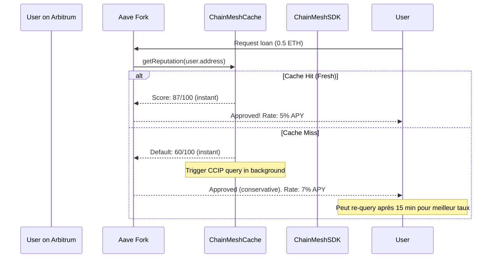

# ChainMesh - Product Requirements Document (PRD)

**Version:** 1.3
**Date:** 11 fevrier 2026
**Auteur:** Felix
**Statut:** Module 1 & 2 Completed - Testnet

---

## Changelog

**v1.3 (11 fevrier 2026):**
- Module 1 (Blockchain Layer) termine : GenericOracle, GenericCache, Adapters, 123 tests, >80% coverage
- Module 2 (Orchestration) termine : Providers, Analyzers, Signers, WorkflowOrchestrator, n8n workflows
- Documentation architecture creee pour les deux modules
- Specifications consolidees (SPEC_Module2_Orchestration.md remplace les 3 fichiers Part1/Part2/Part3)
- Stack technique confirmee : Zod v4, ethers v6, Winston, Vitest, PostgreSQL

**v1.2 (30 janvier 2026):**
- Timeline unifiee : 16 semaines confirmee
- Scope technique clarifie : Goldsky + ElizaOS sont P0
- Securite : Lit Protocol P0 (MPC signing), n8n credentials = fallback testnet uniquement
- Use Cases MVP : 1 agent (Reputation) pour v1.0, autres agents en v2.0

---

## Table des Matières

1. [Vision & Positionnement](#1-vision--positionnement)
2. [Personas & User Stories](#2-personas--user-stories)
3. [Use Cases Détaillés](#3-use-cases-détaillés)
4. [Spécifications Techniques](#4-spécifications-techniques)
5. [Roadmap & Timeline](#5-roadmap--timeline)
6. [Risques & Mitigations](#6-risques--mitigations)
7. [Success Metrics](#7-success-metrics)
8. [Scope Management](#8-scope-management)

---

# 1. Vision & Positionnement

## 1.1 Vision Statement

**ChainMesh est l'infrastructure CCIP-native qui permet aux AI agents d'accéder et d'agir sur des données multi-chain en temps quasi-réel.**

**Positionnement:** "Le layer d'orchestration CCIP pour AI agents"

**Analogie SOA (pour Felix):**
- CCIP = Message Bus (ActiveMQ, RabbitMQ)
- ChainMesh = ESB/Orchestrateur (TIBCO BusinessWorks)
- AI Agents = Applications métier
- Blockchains = Backend systems (CRM, ERP)

---

## 1.2 Infrastructure vs Application

**Décision Stratégique Majeure:**

ChainMesh n'est **PAS** une application spécifique (ex: "yet another reputation system").

ChainMesh **EST** une infrastructure réutilisable que d'autres peuvent utiliser pour construire leurs propres agents.

**Différence:**

| Approche | Description | Valeur | Exemples |
|----------|-------------|--------|----------|
| **Application** | Reputation system spécifique avec UI | Limitée au use case | Gitcoin Passport, Lens Protocol |
| **Infrastructure** | CCIP orchestration + SDK + Plugin | Scalable, réutilisable | Chainlink (oracles), The Graph (indexing) |

**ChainMesh = Infrastructure** ✅

---

## 1.3 Différenciation

### vs Projets Existants

**ChainGPT:**
- Focus: AI crypto tools (chatbot, trading)
- CCIP: Feature parmi d'autres
- **Gap:** Pas d'infrastructure CCIP réutilisable

**ElizaOS:**
- Focus: Agent framework (multi-chain actions)
- CCIP: Récemment ajouté (Q4 2024)
- **Gap:** Solana-first, pas d'infrastructure EVM CCIP

**Fetch.ai uAgents:**
- Focus: Agent framework
- Cross-chain: IBC (Cosmos), proprietary
- **Gap:** Pas CCIP, pas compatible EVM natif

**ChainMesh Unique Value:**
- ✅ Infrastructure-first (pas une app)
- ✅ CCIP-native (EVM cross-chain standard)
- ✅ Agent-agnostic (compatible tout framework)
- ✅ Cache-first architecture (UX temps réel malgré CCIP latency)

---

# 2. Personas & User Stories

## 2.1 Persona 1: Alex - AI Agent Developer

**Profil:**
- Développeur Python/TypeScript, 3 ans d'expérience
- Construit des agents pour DeFi, NFTs, DAO governance
- Frustrations actuelles:
  - Multi-chain data = 5+ API calls séquentiels (lent)
  - CCIP complexe (documentation cryptique)
  - Pas de framework unifié pour cross-chain

**Objectifs:**
- Accéder données 5 chains en < 1 seconde
- Intégration simple (npm install, 3 lignes de code)
- Focus sur logique métier, pas infrastructure

**User Stories:**

| ID | Story | Acceptance Criteria |
|----|-------|---------------------|
| US-01 | En tant qu'Alex, je veux installer ChainMesh SDK en une commande | `npm install chainmesh-sdk` fonctionne, documentation claire |
| US-02 | Je veux query la réputation d'un wallet en 3 lignes de code | `const rep = await chainmesh.getReputation('0xABC')` retourne score 0-100 |
| US-03 | Je veux que les résultats soient instantanés (< 1s) pour UX | Cache hit rate > 80% après warm-up, default score si cache miss |
| US-04 | Je veux intégrer ChainMesh dans ElizaOS sans réécrire mon agent | Plugin `@elizaos/plugin-chainmesh` disponible, 3 actions prêtes |

---

## 2.2 Persona 2: Maya - Blockchain Architect

**Profil:**
- Architecte senior, 7 ans d'expérience blockchain
- Travaille sur protocoles DeFi, DAO infrastructure
- Responsable de décisions techniques (sécurité, scalabilité)

**Préoccupations:**
- Sécurité (pas de single point of failure)
- Coûts (CCIP mainnet = cher)
- Vendor lock-in (dépendance à un provider)
- Auditabilité (transparence des données)

**Objectifs:**
- Infrastructure décentralisée (pas de hot wallet centralisé)
- Coûts prévisibles et optimisés
- Fallback automatique (providers)
- Open source + auditable

**User Stories:**

| ID | Story | Acceptance Criteria |
|----|-------|---------------------|
| US-05 | En tant que Maya, je veux que les clés soient distribuées (MPC) | Lit Protocol PKP utilisé, pas de private key unique |
| US-06 | Je veux un fallback automatique si Goldsky down | Alchemy fallback configuré, circuit breaker implémenté |
| US-07 | Je veux auditer la source des scores AI | Chaque score a un `evidenceHash` (IPFS), AI output tracé |
| US-08 | Je veux estimer les coûts CCIP avant déploiement mainnet | Documentation claire: cache hit = $0, cache miss = $5-10 |

---

# 3. Use Cases Détaillés

## 3.1 Use Case Principal (MVP): Reputation Oracle

**Problème:**
Un protocole DeFi (ex: Aave fork) veut évaluer la "trustworthiness" d'un emprunteur en analysant son historique cross-chain, mais:
- Données éparpillées sur 5+ chains
- Patterns comportementaux complexes (nécessite AI)
- UX doit être instantanée (utilisateur n'attend pas 15 min)

**Solution ChainMesh:**



**Données Analysées:**
- **Tier 1 (On-Chain):** Wallet age, transaction count, balances
- **Tier 2 (DeFi):** Aave borrows, Uniswap volume, liquidation history
- **Tier 3 (AI):** Behavioral patterns (bot detection, wash trading, risk profile)

**Output:**
```json
{
  "address": "0xAlice",
  "score": 87,
  "tier": "prime",
  "confidence": 0.85,
  "evidence": {
    "positive": ["3+ years active", "7 protocols used", "0 liquidations"],
    "negative": []
  },
  "timestamp": "2026-01-30T10:00:00Z",
  "expiresAt": "2026-01-31T10:00:00Z"
}
```

**Business Value:**
- Protocoles DeFi: Meilleurs taux pour bons emprunteurs → plus de volume
- Utilisateurs: Reputation portable → accès facilité cross-chain
- ChainMesh: Infrastructure utilisée par tous → network effect

---

## 3.2 Use Case v2.0: Arbitrage Detection Agent

**Problème:**
Un trader veut détecter opportunités d'arbitrage entre DEXs cross-chain (ex: ETH moins cher sur Uniswap Base vs Uniswap Arbitrum), mais:
- Prix changent rapidement (< 1 min)
- CCIP prend 5-15 min (trop lent)
- Gas costs + CCIP fees = ROI négatif si mal calculé

**Solution ChainMesh (Future):**

1. **Cache DEX prices** (TTL: 30 secondes)
2. **Scan parallèle** 5 chains via Goldsky
3. **Calculate net profit** (price delta - gas - CCIP fees - slippage)
4. **Alert si profitable** (> 2% net après coûts)

**Architecture:**
```
ChainMesh SDK
    ↓
Query DEX prices (cached) → Calculate arbitrage → Filter profitable
    ↓
Return top 5 opportunities sorted by ROI
```

**Scope:** ⏳ **Post-MVP (v2.0)** - Semaines 17-20 (hors 16 semaines MVP)

---

## 3.3 Use Case v2.0: Portfolio Rebalancing Agent

**Problème:**
Un investisseur a des positions sur 5 chains (Aave deposits, Uniswap LPs, staking) et veut optimiser rendement, mais:
- Tracking manuel = erreurs
- Opportunités manquées (yield sur autre chain meilleur)
- Gas costs de rebalancing > gains si mal planifié

**Solution ChainMesh (Future):**

1. **Scan holdings** cross-chain (cached)
2. **Compare current APYs** (Aave vs Compound vs Lido)
3. **Calculate optimal allocation**
4. **Simulate gas costs + CCIP fees**
5. **Recommend rebalancing** si gain > 5% (après coûts)

**Scope:** ⏳ **Post-MVP (v2.0)** - Semaines 17-20

---

# 4. Spécifications Techniques

## 4.1 Architecture Overview

### 6-Module Architecture

| Module | Role | Status |
|---|---|---|
| Module 1: Smart Contracts | On-chain storage, CCIP messaging, adapters | Completed |
| Module 2: Orchestration | n8n workflows, pipeline coordination, resilience | Completed |
| Module 3: AI Engine | Claude API analysis, rules engine, hybrid scoring | Implemented (within Module 2) |
| Module 4: Security | Lit Protocol MPC signing, testnet wallet fallback | Implemented (within Module 2) |
| Module 5: Data Layer | Goldsky/Alchemy providers, circuit breakers, fallback cascade | Implemented (within Module 2) |
| Module 6: SDK & Plugin | TypeScript SDK, ElizaOS plugin | Planned |

---

### Core Components

| Component | Technology | Rôle | Priority |
|-----------|-----------|------|----------|
| **ChainMeshOracle** | Solidity | Receive CCIP queries, store reputation | 🔴 P0 |
| **ChainMeshCache** | Solidity | Local cache, send CCIP queries | 🔴 P0 |
| **n8n Workflows** | n8n (self-hosted) | Orchestration, data aggregation | 🔴 P0 |
| **Goldsky Indexer** | Goldsky (SaaS) | Multi-chain data (< 1s) | 🔴 P0 |
| **Claude API** | Anthropic API | AI behavioral analysis | 🔴 P0 |
| **Lit Protocol** | Lit PKP (MPC) | Distributed signing (no hot wallet) | 🔴 P0 |
| **ChainMesh SDK** | TypeScript (npm) | Developer-friendly API | 🔴 P0 |
| **ElizaOS Plugin** | TypeScript (npm) | Agent framework integration | 🔴 P0 |

**Décision Technique Majeure:** Tous les composants ci-dessus sont **P0** (Phase 1-2, Semaines 1-11).

---

## 4.2 Data Flow: Cache-First Pattern

**Problème:** CCIP latency (5-15 min testnet) inacceptable pour UX.

**Solution:** Cache-first avec async update.

```
User Query
    ↓
Check Cache
    ├─ HIT (fresh < 24h) → Return score instantly (0ms) ✅
    ├─ MISS → Return default 60/100 + Trigger CCIP ⏳
    └─ HIT (stale > 24h) → Return cached + Background refresh 🔄
```

**Metrics:**
- Cache hit rate target: **> 80%** (après warm-up)
- Cache miss response time: **< 1s** (default score)
- CCIP update time: **5-15 min** (testnet), 1-5 min (mainnet future)

---

## 4.3 Technology Stack

### Smart Contracts

| Component | Framework | Language | Testnet |
|-----------|-----------|----------|---------|
| Contracts | Foundry | Solidity 0.8.20+ | Sepolia, Arbitrum Sepolia, Base Sepolia |
| Testing | Foundry (forge) | Solidity | Local (Anvil) |
| Deployment | Foundry scripts | Solidity | Testnet only (MVP) |

**Key Libraries:**
- OpenZeppelin: Access control, reentrancy guard
- Chainlink CCIP: Cross-chain messaging

---

### Off-Chain (Orchestration) - Implemented

| Component | Technology | Hosting | Cost |
|-----------|-----------|---------|------|
| n8n | Docker container | DigitalOcean VPS ($6/month) | ~$24 (4 mois) |
| PostgreSQL | Docker container | Same VPS | Included |
| Node.js v24 | TypeScript strict | Same VPS | Included |

**n8n Workflows (implemented):**
- API_Gateway (webhook POST /api/query)
- CCIP_EventListener (poll QueryReceived events every 30s)
- GenericOrchestrator (sub-workflow: validate, rate-limit, fetch, analyze, encode, sign, oracle update)

**TypeScript Modules (implemented):**
- Providers: GoldskyProvider, AlchemyProvider, ProviderFactory (fallback cascade + circuit breaker)
- Analyzers: ClaudeAnalyzer, RulesAnalyzer, HybridAnalyzer (AI x0.6 + Rules x0.4)
- Signers: LitSigner, DevWalletSigner, SignerFactory (MPC + testnet fallback)
- Orchestrator: WorkflowOrchestrator, RateLimiter (1 req/h/key, PostgreSQL)
- Validators: Zod v4 schemas for input (GenericQueryRequest) and output (DataProviderOutput, AnalyzerOutput, SignerOutput)
- Infrastructure: CircuitBreaker, RetryPolicy, Winston structured logging, environment validation

---

### Data Sources

| Source | Type | Priority | Free Tier | Fallback |
|--------|------|----------|-----------|----------|
| **Goldsky** | GraphQL indexer | 1 (primary) | Yes (generous) | Alchemy RPC |
| **Alchemy** | RPC provider | 2 (fallback) | 300M compute units/month | Infura |
| **Etherscan APIs** | REST API | 3 (fallback) | 5 req/sec, 100k/day | Public RPC |
| **Claude API** | AI analysis | N/A (unique) | 50 req/min | Rules-based fallback |
| **Lit Protocol** | MPC signing | N/A (unique) | Testnet free | Dev wallet (testnet only) |

---

### SDK & Plugin

| Package | Language | Distribution | Consumers |
|---------|----------|--------------|-----------|
| `chainmesh-sdk` | TypeScript | npm | Developers, dApps |
| `@elizaos/plugin-chainmesh` | TypeScript | npm | ElizaOS agents |

**Key Features:**
- Cache-aware API (`getReputation()` checks cache first)
- Provider fallback (Goldsky → Alchemy → Etherscan)
- Circuit breaker pattern (automatic failover)
- TypeScript types (full type safety)

---

## 4.4 Data Schema: ChainMesh v1.0

**Standard format** pour wallet data (utilisé entre n8n → Claude → SDK).

**High-Level Structure:**

```json
{
  "version": "1.0",
  "wallet": {
    "address": "0xABC...",
    "ens": "vitalik.eth",
    "labels": ["whale", "early-adopter"]
  },
  "activity": {
    "chains": [
      {
        "name": "sepolia",
        "firstSeen": "2023-01-15T10:00:00Z",
        "transactionCount": 1234,
        "transactions": [...]
      }
    ]
  },
  "defi": {
    "protocols": [...],
    "liquidations": [...]
  },
  "riskMetrics": {
    "score": 87,
    "tier": "prime",
    "confidence": 0.85,
    "reasoning": "Established wallet with diverse DeFi activity..."
  }
}
```

**Document Complet:** `schemas/chainmesh-data-v1.schema.json` (créé Semaine 2)

---

## 4.5 Security Architecture

### Threat Model

**Assets Critiques:**
1. Smart contracts (fonds + réputation data)
2. Private keys (hot wallet = SPOF)
3. API keys (coûts si compromis)
4. CCIP messages (spoofing risk)

**Mitigations:**

| Threat | Mitigation | Status |
|--------|-----------|--------|
| **Reentrancy attack** | ReentrancyGuard (OpenZeppelin) | 🔴 P0 |
| **CCIP message spoofing** | Authenticate source chain + sender | 🔴 P0 |
| **Hot wallet compromise** | Lit Protocol PKP (MPC, no single key) | 🔴 P0 |
| **AI hallucination** | Validation layer + Hybrid scoring | 🔴 P0 |
| **Rate limit exhaustion** | 1 req/hour/user on Cache contract | 🔴 P0 |

---

### Lit Protocol MPC

**Problème:** n8n wallet = single private key = single point of failure.

**Solution:** Lit Protocol PKP (Programmable Key Pair).

**Architecture:**
```
n8n prepares unsigned transaction
    ↓
Send to Lit Protocol (100 nodes)
    ↓
67/100 nodes must sign (threshold)
    ↓
Combine signature shares → Complete signature
    ↓
Broadcast to blockchain
```

**Avantages:**
- ✅ No single key to steal (distributed across 100 nodes)
- ✅ Programmable conditions (can add logic: "only sign if X")
- ✅ Key rotation possible

**Latency:** ~300ms (acceptable overhead)

**Fallback (Testnet Only):** Dev wallet si Lit unavailable (logged as degraded mode).

---

# 5. Roadmap & Timeline

## 5.1 Timeline: 16 Semaines (Source de Vérité)

**Décision Finale:** 16 semaines confirmée (pas 8, pas 20).

**Justification:**
- ElizaOS plugin: 3 semaines (non-trivial)
- Lit Protocol: 2 semaines (MPC setup)
- Goldsky pipeline: 1.5 semaines (configuration + tests)
- Tests + Security audit: 4 semaines (critique)
- Buffer: 1 semaine (contingency)

**Total:** 16 semaines = réaliste et confortable.

---

## 5.2 Phase Breakdown

### Phase 1: Foundation (Semaines 1-4) - COMPLETED

**Objectif:** CCIP flow fonctionnel + contracts deployes.

**Resultats:**
- GenericOracle deploye avec CCIP receive, data storage, query management, replay protection
- GenericCache avec TTL 24h, rate-limit 1h/key, CCIP request/response
- ReputationAdapter (schema ReputationV1) et PriceAdapter (schema PriceV1)
- 123 tests Foundry, coverage >80% (Oracle 97%, Cache 96%)
- Architecture adapter pattern generique (ajout de nouveaux types sans modifier Oracle/Cache)

---

### Phase 2: Orchestration (Semaines 5-11) - COMPLETED

**Objectif:** Module 2 off-chain complet.

**Resultats:**
- DataProviders : GoldskyProvider (GraphQL primary), AlchemyProvider (RPC fallback), ProviderFactory avec cascade et circuit breaker
- Analyzers : ClaudeAnalyzer (AI via HTTP), RulesAnalyzer (heuristiques deterministes), HybridAnalyzer (scoring pondere AI x0.6 + Rules x0.4)
- Signers : LitSigner (MPC production), DevWalletSigner (testnet fallback), SignerFactory
- WorkflowOrchestrator : pipeline complet validate, rate-limit, fetch, analyze, encode, sign, oracle update, CCIP response
- RateLimiter : 1 req/h/key avec persistance PostgreSQL
- CircuitBreaker : 3 echecs, 60s cooldown, etats CLOSED/OPEN/HALF_OPEN
- RetryPolicy : 3 tentatives, backoff exponentiel (1s, 2s, 4s)
- Validation Zod v4 stricte en entree et sortie
- n8n workflows : API_Gateway, CCIP_EventListener, GenericOrchestrator
- Tests unitaires Vitest pour chaque composant

---

### Phase 3: Polish & Security (Semaines 12-15)

**Objectif:** Production-ready, documenté, sécurisé.

#### Semaine 12: Configuration Management

**Livrables:**
- ✅ ChainManager (JSON config pour chains)
- ✅ DataSourceManager (JSON config pour providers)
- ✅ Hot reload (restart n8n, pas redeploy)

#### Semaine 13: Security Audit

**Livrables:**
- ✅ Security audit checklist (contracts + n8n)
- ✅ Foundry tests: coverage > 80%
- ✅ Vulnerability scan (Slither, Mythril)
- ✅ Code review (external si possible)

#### Semaine 14: Documentation

**Livrables:**
- ✅ SDK API Reference (TypeDoc)
- ✅ ElizaOS Plugin Guide
- ✅ Implementation Guide (déploiement step-by-step)
- ✅ Architecture diagrams (Mermaid)

#### Semaine 15: Content Creation

**Livrables:**
- ✅ Blog post 1: "ChainMesh Architecture Overview"
- ✅ Blog post 2: "CCIP Deep Dive"
- ✅ Blog post 3: "Hybrid AI Scoring"
- ✅ Video demo (5-10 min screencast)
- ✅ Presentation deck (meetup slides)

---

### Phase 4: Final Preparation (Semaine 16)

**Objectif:** Buffer + préparation présentation.

**Livrables:**
- ✅ Bugfixes (issues identifiées semaines 12-15)
- ✅ GitHub README polished (portfolio presentation)
- ✅ Presentation practice (meetup)
- ✅ Demo rehearsal

**Success Criteria:**
- Tous tests passent (E2E, unit, integration)
- Documentation complète et à jour
- Demo fluide (< 10 min)
- Prêt pour présentation publique

---

## 5.3 Gantt Chart (Visuel)

```
Semaines    1  2  3  4  5  6  7  8  9  10 11 12 13 14 15 16
          ├──┼──┼──┼──┼──┼──┼──┼──┼──┼──┼──┼──┼──┼──┼──┼──┤
Phase 1   [████████████████]
CCIP      [████████████]
n8n       [████████████████]
Claude       [████████████]

Phase 2                  [███████████████████████████████]
ElizaOS                  [████████████]
Lit                                  [████████]
Goldsky                                      [████████]

Phase 3                                              [████████████████]
Config                                               [████]
Security                                                 [████]
Docs                                                         [████]
Content                                                          [████]

Phase 4                                                              [████]
```

---

# 6. Risques & Mitigations

## 6.1 Risques Techniques

### R1: AI Hallucination (CRITIQUE)

**Probabilité:** 🟠 Moyenne (20-30% des analyses sans validation)

**Impact:** 🔴 Élevé (faux scores → perte confiance utilisateurs)

**Scénario:**
- Claude API claim "wash trading detected"
- Reality: Aucune transaction répétée dans data
- Cause: AI assume patterns basés sur keywords

**Mitigations:**
1. ✅ **Validation Layer** (post-processing)
   - Vérifier claims AI dans raw data
   - Exemple: washTrading=true → check repeated tx pairs
   - Si non trouvé → remove flag, lower confidence ×0.7

2. ✅ **Hybrid Scoring** (AI 60% + Rules 40%)
   - AI ne contrôle pas 100% du score
   - Rules agissent comme "sanity check"
   - Large disagreement (|AI - Rules| > 30) → lower confidence

3. ✅ **Structured Output** (JSON schema strict)
   - Force AI à respecter format
   - Reduce hallucinations vs free-form text

4. ✅ **Known Patterns Whitelist**
   - Bridge contracts whitelisted
   - DEX contracts whitelisted
   - Pas de faux positifs "suspicious transfers"

**KPI:** Hallucination rate < 5% (tracked via validation flags)

---

### R2: API Dependencies (ÉLEVÉ)

**Probabilité:** 🟠 Moyenne (APIs externes = hors contrôle)

**Impact:** 🟠 Moyen (système degraded mais fonctionne)

**Scénario:**
- Goldsky down (maintenance, outage)
- Claude API rate limited
- Lit Protocol réseau lent

**Mitigations:**
1. ✅ **Failover Architecture**
   - Goldsky → Alchemy → Infura → Public RPC
   - 4 layers de fallback

2. ✅ **Circuit Breaker**
   - 3 failures → skip provider 1 min (cooldown)
   - Automatic recovery après cooldown
   - Monitoring dashboard (provider health)

3. ✅ **Degraded Mode Graceful**
   - Claude down → Rules-based scoring only (confidence = 0.5)
   - Lit down → Dev wallet (testnet only, logged)
   - Goldsky down → Alchemy (slower mais fonctionne)

4. ✅ **Rate Limit Management**
   - Track usage (Alchemy: 300M compute units/month)
   - Alert à 80% threshold
   - Automatic throttling si approche limite

**KPI:** Uptime > 99% (malgré dépendances externes)

---

### R3: Cross-Chain Identity (MOYEN)

**Probabilité:** 🟡 Moyenne (adresses peuvent être différents owners)

**Impact:** 🟡 Moyen (faux positifs dans scoring)

**Problème:**
- `0xABC` sur Polygon ≠ forcément même owner que `0xABC` sur Base
- Contract wallets (Gnosis Safe) peuvent avoir même address cross-chain mais owners différents

**Mitigations:**
1. ✅ **Probabilistic Identity Scoring**
   - Same address cross-chain: +0.7 confidence
   - Bridge transactions linking: +0.2 confidence
   - Similar behavioral patterns: +0.1 confidence
   - ENS resolution: +0.3 confidence

2. ✅ **Transparent Disclaimer**
   - Include `identityConfidence` in output
   - Example: "85% confidence same owner"
   - Documentation: "Cross-chain identity probabilistic"

3. ✅ **Future Enhancement** (v2.0)
   - On-chain attestations (EAS, Verax)
   - ZK proofs (same owner cross-chain)

**KPI:** Identity confidence > 0.7 for 80% of wallets

---

### R4: Orchestration Complexity (ÉLEVÉ)

**Probabilité:** 🟠 Moyenne (n8n + 5 services = beaucoup de moving parts)

**Impact:** 🟠 Moyen (debugging difficile si failure)

**Composants:**
- n8n (orchestrateur)
- Goldsky (data)
- Claude (AI)
- Lit (signing)
- CCIP (messaging)
- PostgreSQL (state)

**Mitigations:**
1. ✅ **Comprehensive Logging**
   - Structured JSON logs (timestamp, service, status)
   - Request ID propagation (trace end-to-end)
   - Centralized log aggregation

2. ✅ **Error Handling Patterns**
   - Try-catch sur tous external calls
   - Exponential backoff retries
   - Fallback logic défini pour chaque service

3. ✅ **Circuit Breakers** (déjà mentionné R2)
   - Per-service health tracking
   - Automatic skip si unhealthy

4. ✅ **Monitoring Dashboard**
   - n8n execution status
   - API latencies (p50, p95, p99)
   - Error rates by service
   - CCIP success rate

**KPI:** Mean Time To Recovery (MTTR) < 1 hour

---

### R5: Scope Creep (CRITIQUE)

**Probabilité:** 🔴 Élevée (tentation d'ajouter features)

**Impact:** 🔴 Élevé (deadline missed, burnout)

**Scénario:**
- "On pourrait ajouter Solana aussi..."
- "Et si on faisait un UI dashboard..."
- "Mainnet deployment serait cool..."

**Mitigations:**
1. ✅ **"Not Now" List Strict**
   - Maintenue dans PRD (section 8.2)
   - Reviewed chaque semaine
   - Features rejetées = v2.0 candidates

2. ✅ **Weekly Scope Review**
   - Question: "Is this P0 for MVP?"
   - Si non → defer to v2.0
   - Time-boxing: "Max 3 jours, sinon skip"

3. ✅ **Red Lines (Non-Negotiable)**
   - No mainnet in 16 weeks
   - No UI dashboard in 16 weeks
   - No non-EVM chains in 16 weeks

4. ✅ **Buffer Week** (Semaine 16)
   - Contingency pour scope creep involontaire
   - Uniquement bugfixes, pas new features

**KPI:** 100% P0 features delivered, 0% P1 features in MVP

---

### R6: CCIP Testnet Instability (MOYEN)

**Probabilité:** 🟡 Moyenne (testnet = moins stable que mainnet)

**Impact:** 🟡 Moyen (tests lents, pas blockers)

**Problème:**
- CCIP testnet peut être lent (> 30 min au lieu de 5-15 min)
- Parfois down (Chainlink maintenance)
- Faucets peuvent être vides (pas de testnet LINK)

**Mitigations:**
1. ✅ **Start CCIP Early** (Semaine 1, pas Semaine 7)
   - Identify issues tôt
   - Plus de temps pour workarounds

2. ✅ **Mock CCIP Locally**
   - Unit tests sans dépendance testnet
   - Event-based mocking (simulate CCIP with events)

3. ✅ **Monitor Chainlink Discord**
   - Alerts maintenance scheduled
   - Community workarounds

4. ✅ **Document Issues as Learning**
   - Blog post: "CCIP Testnet Gotchas"
   - Demonstrate problem-solving skills

5. ✅ **Contingency: Simulate CCIP**
   - Si testnet unusable (rare)
   - Use event logs to simulate flow
   - Still valid for demo/portfolio

**KPI:** E2E test passes 80% of attempts (testnet volatility accepted)

---

# 7. Success Metrics

## 7.1 Technical Metrics

| Metric | Target | Measurement Method | Priority |
|--------|--------|-------------------|----------|
| **Cache Hit Rate** | > 80% | PostgreSQL logs (n8n) | 🔴 P0 |
| **CCIP Success Rate** | > 95% | Smart contract events | 🔴 P0 |
| **Multi-Chain Query Latency** | < 1s | Goldsky GraphQL response time | 🔴 P0 |
| **AI Analysis Latency** | < 30s | Claude API response time | 🟠 P1 |
| **Lit Protocol Latency** | < 500ms | MPC signing time | 🟠 P1 |
| **Test Coverage** | > 80% | Foundry coverage report | 🔴 P0 |
| **Uptime (n8n)** | > 99% | VPS monitoring (4 weeks) | 🟠 P1 |

---

## 7.2 Portfolio Metrics (Career Impact)

**Primary Goal:** Impressive portfolio project → Web3 job offers

| Metric | Target | Timing | Why Important |
|--------|--------|--------|---------------|
| **GitHub Stars** | 50+ | Week 16+ | Community interest validation |
| **npm Downloads** | 100+ | Week 16+ | SDK adoption proof |
| **Blog Post Views** | 1,000+ | Week 16+ | Technical reach + SEO |
| **Conference Talk** | 1× accepted | Q2 2026 | Public speaking credential |
| **Recruiter Inquiries** | 5+ | Week 16+ | Direct job interest |
| **Technical Interviews** | 3+ | Q2 2026 | Career progression signal |

**Portfolio Pitch (30 seconds):**
> "ChainMesh: CCIP orchestration infrastructure for AI agents. Query 5 blockchains in < 1 second (Goldsky), decentralized MPC signing (Lit Protocol), compatible with any ElizaOS agent. Production-ready architecture built with 15 years SOA/ESB experience translated to Web3."

---

## 7.3 Quality Gates

**Phase 1 Gate (Week 4):**
- [ ] E2E test passes (CCIP query → response)
- [ ] Cache hit/miss works correctly
- [ ] Foundry tests > 80% coverage
- [ ] No critical vulnerabilities (Slither clean)
- **Decision:** Continue to Phase 2 or pivot?

**Phase 2 Gate (Week 11):**
- [ ] ElizaOS plugin published (npm)
- [ ] Lit Protocol signing works (< 500ms)
- [ ] Goldsky queries < 1s (5 chains)
- [ ] Circuit breakers tested (failover works)
- **Decision:** Continue to Phase 3 or extend timeline?

**Phase 3 Gate (Week 15):**
- [ ] Security audit checklist complete
- [ ] Documentation published (API reference, guides)
- [ ] Blog posts drafted (3 articles)
- [ ] Demo rehearsed (< 10 min, fluent)
- **Decision:** Ready for presentation or need buffer week?

---

# 8. Scope Management

## 8.1 P0 Features (MVP - Must Have)

**Definition:** Features absolutely required for MVP to be functional and impressive.

| Feature | Description | Weeks | Status |
|---------|-------------|-------|--------|
| **Smart Contracts** | Oracle + Cache (3 chains) | 1-4 | 🔴 P0 |
| **CCIP Integration** | Cross-chain messaging | 1-4 | 🔴 P0 |
| **n8n Workflows** | Orchestration (scan, AI, sign) | 1-4 | 🔴 P0 |
| **Goldsky Pipeline** | Multi-chain indexing | 10-11 | 🔴 P0 |
| **Claude API** | AI behavioral analysis | 2-4 | 🔴 P0 |
| **Lit Protocol** | MPC signing (no hot wallet) | 8-9 | 🔴 P0 |
| **ChainMesh SDK** | TypeScript npm package | 1-4 | 🔴 P0 |
| **ElizaOS Plugin** | Agent framework integration | 5-7 | 🔴 P0 |
| **Validation Layer** | Anti-hallucination checks | 3-4 | 🔴 P0 |
| **Hybrid Scoring** | AI 60% + Rules 40% | 4 | 🔴 P0 |
| **Cache-First Pattern** | Instant responses (< 1s) | 1-4 | 🔴 P0 |
| **Circuit Breakers** | Failover automation | 11 | 🔴 P0 |
| **Security Audit** | Checklist + tests | 13 | 🔴 P0 |
| **Documentation** | API ref, guides, diagrams | 14 | 🔴 P0 |
| **Reputation Agent** | 1 reference implementation | 1-7 | 🔴 P0 |

---

## 8.2 "Not Now" List (Explicitly Out of Scope)

**Definition:** Features that are tempting but explicitly deferred to avoid scope creep.

| Feature | Why Tempting | Why Not Now | Future |
|---------|--------------|-------------|--------|
| **Mainnet Deployment** | "Real" deployment | Costs, risk, not needed for portfolio | v2.0 (Q2 2026) |
| **UI Dashboard** | Visual impressive | 4+ weeks, not core value | v2.0 |
| **Solana Support** | Multi-paradigm cool | Different architecture, 3+ weeks | v2.0 |
| **Aptos Support** | Same as Solana | Move language, 3+ weeks | v2.0 |
| **Arbitrage Agent** | Second use case | MVP = 1 agent only | v2.0 |
| **Portfolio Agent** | Third use case | MVP = 1 agent only | v2.0 |
| **On-Chain AI** | zkML cutting-edge | Too experimental, 8+ weeks | v3.0 |
| **DAO Governance** | Decentralized control | Premature, needs users first | v3.0 |
| **High Availability n8n** | Cluster setup | Overkill for testnet | v2.0 (mainnet) |
| **Mobile App** | User-friendly | Not developer-focused MVP | v3.0 |
| **Chrome Extension** | Easy access | Scope creep | v2.0 |

**Rule:** Any feature request → Check this list first. If listed → "Great idea, v2.0 roadmap!"

---

## 8.3 P1 Features (Nice to Have, If Time)

**Definition:** Features that add polish but not critical. Only if ahead of schedule.

| Feature | Value | Effort | Week |
|---------|-------|--------|------|
| **Admin Dashboard** (basic) | Monitoring convenience | 2 weeks | Week 17-18 (post-MVP) |
| **Automated Alerts** (Telegram) | Proactive monitoring | 3 days | Week 16 (if time) |
| **GraphQL API** (n8n) | Developer experience | 1 week | Post-MVP |
| **Rate Limit Dashboard** | API usage tracking | 2 days | Week 16 (if time) |

**Decision Point:** Week 12 review. Si ahead of schedule → pick 1-2 P1 features. Si behind → skip all.

---

## 8.4 Scope Control Process

**Weekly Review (Every Friday):**
1. **Progress Check:** On track vs timeline?
2. **Feature Requests:** Any new ideas this week?
3. **Scope Decision:**
   - P0 blocked? → Escalate, find workaround
   - New idea? → "Not Now" list or P1 (if trivial)
   - Behind schedule? → Cut P1, focus P0

**Red Flags (Stop & Reassess):**
- 🚩 P0 feature taking 2× estimated time
- 🚩 New dependency added without plan (ex: "Let's use X library")
- 🚩 "Just one more feature..." (scope creep signal)

**Mantra:** "Is this P0 for MVP? If no, defer."

---

# Conclusion

## Document Status

**Version 1.2** est la **source de vérité unique** pour ChainMesh.

**Contradictions Résolues:**
- ✅ Timeline: **16 semaines** (pas 8, pas 20)
- ✅ Scope: **Goldsky + ElizaOS + Lit = P0** (pas optional)
- ✅ Sécurité: **Lit Protocol P0** (MPC signing, pas hot wallet)
- ✅ Use Cases MVP: **1 agent (Reputation)** pour v1.0

**Next Steps:**
1. Review PRD v1.2 (ce document)
2. Référencer TAD (Part 1, 2, 3) pour architecture détaillée
3. Référencer DevGuide v1.1 pour standards de code
4. Commencer Phase 1 - Week 1: Smart contracts deployment

**Documents lies:**
- [TAD Part 1](01_TAD_Part1_Introduction_Architecture_Contracts.md)
- [TAD Part 2](02_TAD_Part2_OffChain_Data_AI.md)
- [TAD Part 3](03_TAD_Part3_Security_Infrastructure_Config.md)
- [Module 1 Architecture](../module1-blockchain/docs/MODULE1_ARCHITECTURE.md)
- [Module 2 Architecture](../module2-orchestration/docs/MODULE2_ARCHITECTURE.md)
- [Module 2 Specification](../module2-orchestration/docs/SPEC_Module2_Orchestration.md)

---

**Last Updated:** 11 fevrier 2026
