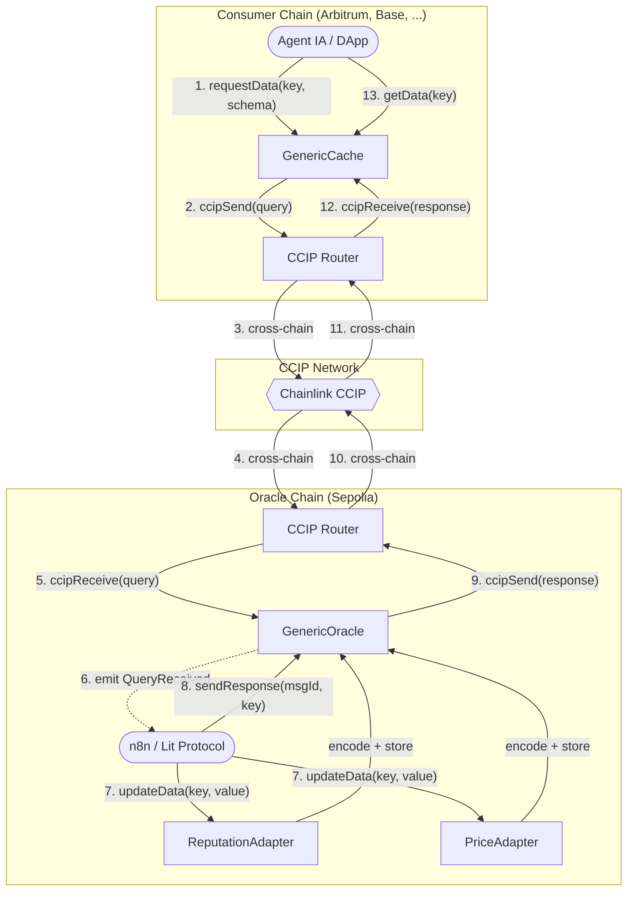
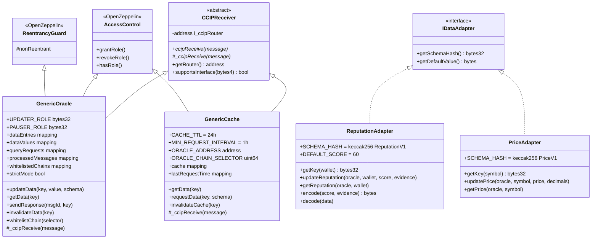
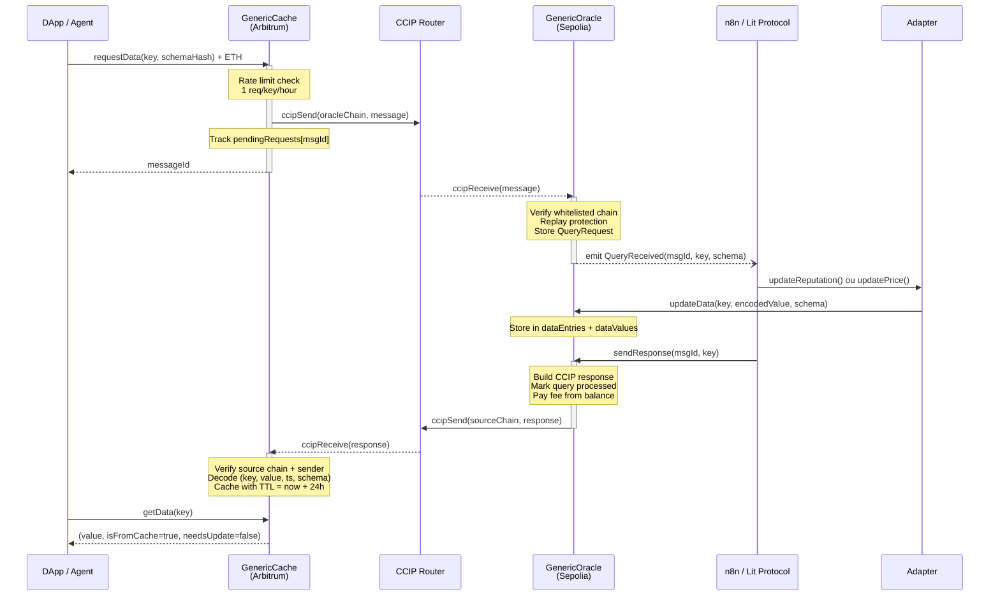
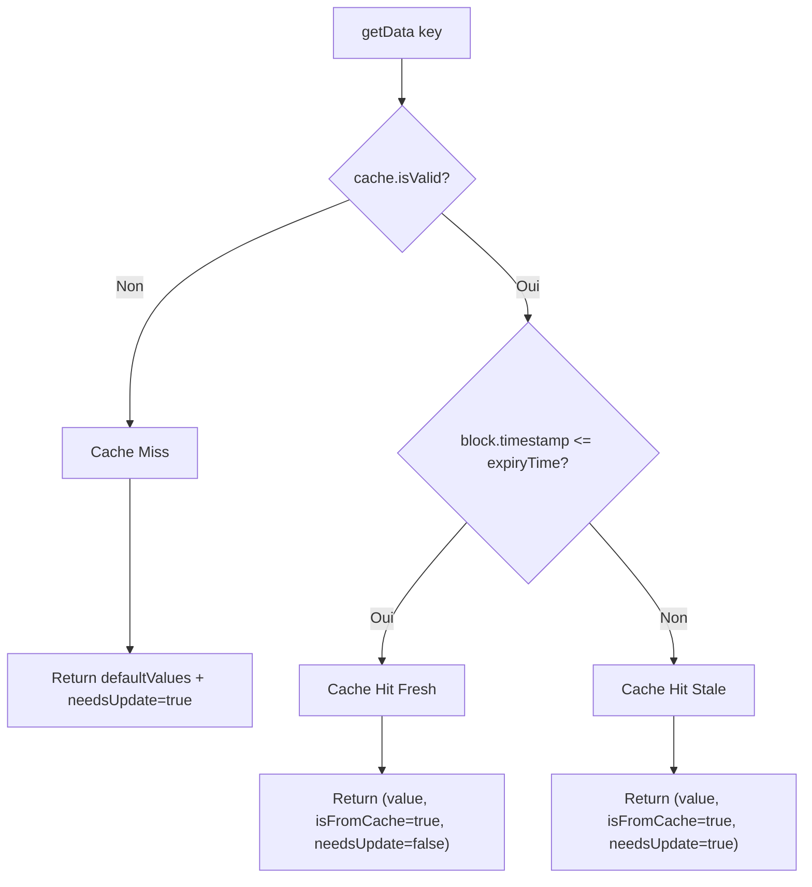
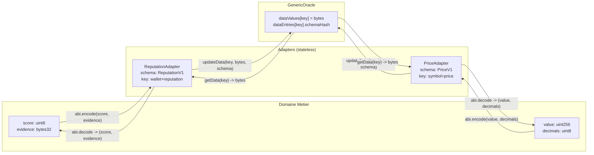
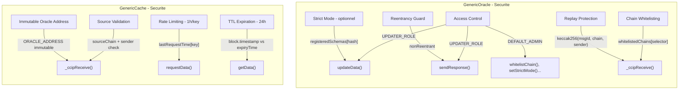
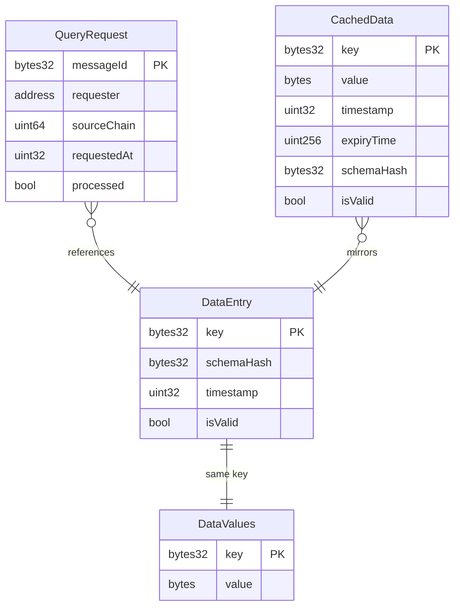
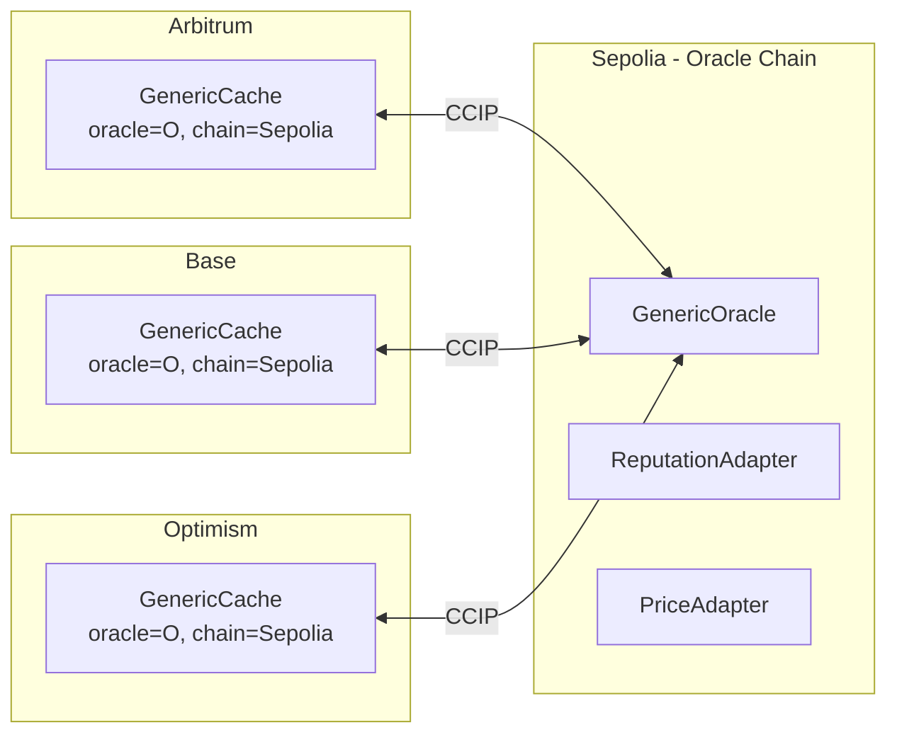

# ChainMesh Module 1 - Architecture & Design

Infrastructure oracle cross-chain generique construite sur Chainlink CCIP. Le systeme permet a des agents IA (via n8n/Lit Protocol) de stocker et distribuer des donnees (reputation, prix, etc.) entre blockchains via un pattern adapters schema-agnostique.

---

## Vue d'ensemble

Le flux complet : un utilisateur sur la chain consommateur demande une donnee via le Cache. Le Cache envoie une requete CCIP a l'Oracle. L'Oracle emet un evenement capte par un agent off-chain (n8n), qui met a jour la donnee via un Adapter, puis declenche l'envoi de la reponse. Le Cache la recoit et la stocke avec un TTL de 24h.

---

## Hierarchie des contrats

L'Oracle et le Cache heritent tous deux de `CCIPReceiver` (reception de messages cross-chain) et `AccessControl` (gestion des roles). L'Oracle ajoute `ReentrancyGuard` pour proteger `sendResponse`. Les Adapters sont stateless : ils implementent `IDataAdapter` et servent uniquement d'encodeurs/decodeurs entre donnees metier et le format generique `bytes` de l'Oracle.

---

## Fichiers sources

### Infrastructure

| Fichier | Role |
|---|---|
| `src/CCIPReceiver.sol` | Base abstraite : recoit les messages CCIP via le modifier `onlyRouter`, delegue a `_ccipReceive()` |
| `src/GenericOracle.sol` | Oracle chain : stocke les donnees cle-valeur, recoit les requetes CCIP, envoie les reponses |
| `src/GenericCache.sol` | Consumer chain : cache TTL 24h, rate-limit 1h/cle, requetes CCIP vers l'Oracle |

### Interfaces

| Fichier | Role |
|---|---|
| `src/interfaces/Client.sol` | Library : structs CCIP (`Any2EVMMessage`, `EVM2AnyMessage`, `EVMExtraArgsV1`) |
| `src/interfaces/IRouterClient.sol` | Interface du router CCIP (`ccipSend`, `getFee`) |
| `src/interfaces/IAny2EVMMessageReceiver.sol` | Interface de reception CCIP (`ccipReceive`) |
| `src/interfaces/IGenericOracle.sol` | Interface Oracle pour les Adapters (`updateData`, `getData`) |
| `src/interfaces/IDataAdapter.sol` | Interface standard Adapter (`getSchemaHash`, `getDefaultValue`) |

### Adapters

| Fichier | Role |
|---|---|
| `src/adapters/ReputationAdapter.sol` | Schema `ReputationV1` : encode `(uint8 score, bytes32 evidenceHash)`, cle = `keccak256(wallet + "reputation")` |
| `src/adapters/PriceAdapter.sol` | Schema `PriceV1` : encode `(uint256 value, uint8 decimals)`, cle = `keccak256(symbol + "price")` |

---

## Flux de donnees detaille

### Requete cross-chain (Cache -> Oracle -> Cache)

Le diagramme montre le cycle complet d'une requete. Trois points cles de securite : le rate-limiting cote Cache (evite le spam), la protection replay cote Oracle (empeche le rejeu), et la double validation de la reponse cote Cache (chain selector + adresse oracle).

### Lecture locale (Cache hit/miss)

Trois etats possibles : miss (pas de donnee, retourne le defaut), hit fresh (donnee valide dans le TTL), hit stale (donnee expiree mais encore retournee en attendant un refresh). Le flag `needsUpdate` signale au consommateur qu'un `requestData` serait pertinent.

---

## Pattern Adapter

Les Adapters sont la couche de traduction. Ils n'ont aucun state — ils encodent les donnees metier en `bytes` generiques pour l'Oracle et les decodent en retour. Pour ajouter un nouveau type de donnee, il suffit de creer un nouvel Adapter implementant `IDataAdapter`, sans modifier l'Oracle ni le Cache. La separation cle/schema evite les collisions : `keccak256(wallet + "reputation")` ne peut jamais egal `keccak256("ETH" + "price")`.

---

## Modele de securite

L'Oracle concentre la securite en ecriture : seuls les comptes UPDATER_ROLE (agents n8n) peuvent modifier les donnees ou envoyer des reponses. Le Cache concentre la securite en lecture/requete : adresse oracle immutable (pas de changement post-deploy), rate-limiting pour eviter l'abus, et validation stricte de la source des reponses CCIP.

---

## Stockage Oracle

`dataEntries` et `dataValues` sont separes volontairement (optimisation gas : les metadonnees legeres dans un slot, les bytes lourds dans un autre). `QueryRequest` lie un message CCIP entrant a un requester et une source chain. `CachedData` (cote Cache) est le miroir local avec TTL.

---

## Deploiement multi-chain

Un seul Oracle sur Sepolia sert N caches sur differentes chains. Chaque Cache est configure avec l'adresse Oracle et le chain selector Sepolia en immutable. Les Adapters sont deployes uniquement cote Oracle (c'est la qu'on ecrit les donnees).
