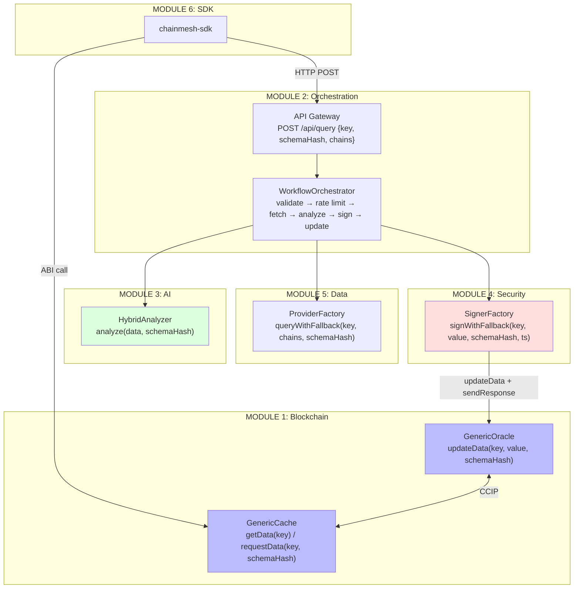

# ChainMesh - Module Interfaces (Version 2.0)

**Date:** 11 February 2026
**Purpose:** Strict boundaries between the 6 modules for isolated development.

ChainMesh is schema-agnostic. All interfaces below use generic types (`bytes32 key`, `bytes32 schemaHash`, `bytes value`). Reputation and Price are two example adapters, but any data type can be added without modifying any core interface. The only domain-specific code lives in adapters (on-chain) and analyzers (off-chain).

---

## MODULE 1: Smart Contracts

**Technology:** Solidity 0.8.20, Foundry, Chainlink CCIP, OpenZeppelin
**Location:** `module1-blockchain/contracts/src/`

### 1.1 GenericOracle (Sepolia)

Stores key-value pairs identified by `bytes32 key` and `bytes32 schemaHash`. Receives CCIP queries from consumer chains, emits events for the off-chain orchestrator, and sends CCIP responses back.

**Data model:**

```solidity
struct DataEntry {
    bytes32 key;
    bytes32 schemaHash;
    uint32  timestamp;
    bool    isValid;
}
// dataValues[key] stored separately (gas optimization)

struct QueryRequest {
    address requester;
    uint64  sourceChain;
    uint32  requestedAt;
    bool    processed;
}
```

**External functions (UPDATER_ROLE):**

```solidity
function updateData(bytes32 key, bytes memory value, bytes32 schemaHash) external;
function sendResponse(bytes32 messageId, bytes32 key) external returns (bytes32);
```

**View functions (public):**

```solidity
function getData(bytes32 key) external view
    returns (bytes memory value, uint32 timestamp, bytes32 schemaHash, bool isValid);
```

**Admin functions (DEFAULT_ADMIN_ROLE):**

```solidity
function whitelistChain(uint64 chainSelector) external;
function removeChainFromWhitelist(uint64 chainSelector) external;
function registerSchema(bytes32 schemaHash) external;
function setStrictMode(bool enabled) external;
function setDefaultValue(bytes32 schemaHash, bytes memory defaultValue) external;
function invalidateData(bytes32 key) external;
function withdraw(address payable to, uint256 amount) external;
```

**Events:**

```solidity
event QueryReceived(bytes32 indexed messageId, bytes32 indexed key, bytes32 indexed schemaHash, uint64 sourceChain, address requester);
event DataUpdated(bytes32 indexed key, bytes32 indexed schemaHash, uint256 timestamp);
event ResponseSent(bytes32 indexed messageId, uint64 destinationChain, bytes32 key, bytes32 schemaHash);
event SchemaRegistered(bytes32 indexed schemaHash);
event DataInvalidated(bytes32 indexed key);
```

**Consumed by:** Module 2 (orchestrator calls `updateData` + `sendResponse`), Adapters (call `updateData` + `getData`)
**CCIP receiver:** `_ccipReceive` validates whitelisted chain, checks replay protection, stores `QueryRequest`, emits `QueryReceived`.

---

### 1.2 GenericCache (Arbitrum, Base, Optimism)

TTL cache on consumer chains. On cache miss or stale data, sends a CCIP request to the Oracle.

**Constants:** `CACHE_TTL = 24 hours`, `MIN_REQUEST_INTERVAL = 1 hour`
**Immutables:** `ORACLE_ADDRESS`, `ORACLE_CHAIN_SELECTOR`

**Data model:**

```solidity
struct CachedData {
    bytes32 key;
    bytes   value;
    uint32  timestamp;
    uint256 expiryTime;
    bytes32 schemaHash;
    bool    isValid;
}
```

**External functions:**

```solidity
function getData(bytes32 key) external view
    returns (bytes memory value, bool isFromCache, bool needsUpdate);

function requestData(bytes32 key, bytes32 schemaHash) external payable
    returns (bytes32 messageId);

function setDefaultValue(bytes32 schemaHash, bytes memory value) external; // ADMIN
function invalidateCache(bytes32 key) external;                           // ADMIN
```

**Events:**

```solidity
event DataQueried(bytes32 indexed key, bytes32 indexed schemaHash, address indexed requester, bytes32 messageId);
event DataCached(bytes32 indexed key, bytes32 indexed schemaHash, uint256 expiryTime);
event CacheHit(bytes32 indexed key, bytes32 schemaHash, bool isFresh);
event CacheMiss(bytes32 indexed key, bytes32 schemaHash);
```

**Consumed by:** Module 6 (SDK reads `getData`, calls `requestData`), end users.

---

### 1.3 Adapter Pattern (IDataAdapter)

Adapters are stateless encoder/decoders. They translate between domain-specific types and the generic `bytes` format used by Oracle/Cache.

```solidity
interface IDataAdapter {
    function getSchemaHash() external pure returns (bytes32);
    function getDefaultValue() external pure returns (bytes memory);
}
```

**Existing adapters:**

| Adapter | Schema | Key derivation | Encoded format |
|---|---|---|---|
| ReputationAdapter | `keccak256("ReputationV1")` | `keccak256(abi.encodePacked(wallet, "reputation"))` | `abi.encode(uint8 score, bytes32 evidenceHash)` |
| PriceAdapter | `keccak256("PriceV1")` | `keccak256(abi.encodePacked(symbol, "price"))` | `abi.encode(uint256 value, uint8 decimals)` |

**Adding a new adapter:** Implement `IDataAdapter`, define `getKey()`, `encode()`, `decode()`, and a convenience function that calls `oracle.updateData(key, encoded, schemaHash)`. No change to Oracle or Cache.

---

## MODULE 2: Orchestration

**Technology:** TypeScript strict, n8n, Vitest, Zod v4, ethers v6, Winston
**Location:** `module2-orchestration/src/`

### 2.1 Entry Point: API Gateway

```
POST /api/query
Content-Type: application/json
```

**Request body (GenericQueryRequest):**

```typescript
{
  key: string;           // bytes32 (0x + 64 hex chars)
  schemaHash: string;    // bytes32
  chains: string[];      // ['sepolia', 'arbitrum', 'base', 'optimism'] (min 1)
  includeAnalysis: boolean; // default true
  options?: {
    timeoutMs?: number;     // 10000-300000, default 180000
    fallbackProviders?: boolean; // default true
  };
  metadata?: {              // present when triggered by CCIP event
    messageId?: string;     // bytes32
    sourceChain?: string;
    requester?: string;     // address
  };
}
```

**Response:**

```typescript
{
  executionId: string;
  status: 'success' | 'error';
  result?: {
    data: Record<string, unknown>;
    analysis?: { result: unknown; confidence: number; reasoning: string };
    signature?: { signature: string; pkpPublicKey: string };
  };
  error?: { type: string; message: string };
}
```

### 2.2 Entry Point: CCIP Event Listener

Polls `QueryReceived` events from GenericOracle every 30 seconds. Checks idempotency (PostgreSQL `processed_events` table), builds a `GenericQueryRequest` from the event data, and calls the same orchestrator pipeline. When `metadata.messageId` is present, the pipeline triggers `sendResponse` at the end.

### 2.3 Pipeline Steps

The `WorkflowOrchestrator.execute()` runs this sequence:

1. **Validate** -- Zod schema validation (`GenericQueryRequest`)
2. **Rate limit** -- 1 request/key/hour (PostgreSQL `rate_limits` table)
3. **Fetch data** -- `ProviderFactory.queryWithFallback()` (Module 5)
4. **Analyze** -- `HybridAnalyzer.analyze()` if `includeAnalysis=true` (Module 3)
5. **Encode** -- JSON to hex (`ethers.toUtf8Bytes` + `ethers.hexlify`)
6. **Sign** -- `SignerFactory.signWithFallback()` (Module 4)
7. **Oracle update** -- Call `oracle.updateData(key, value, schemaHash)` on-chain
8. **CCIP response** -- If `metadata.messageId` present, call `oracle.sendResponse(messageId, key)`

**Consumed by:** n8n workflows (API_Gateway.json, CCIP_EventListener.json, GenericOrchestrator.json)

---

## MODULE 3: AI Engine

**Technology:** Claude API (Anthropic), deterministic rules engine
**Location:** `module2-orchestration/src/analyzers/`

### 3.1 Input (from Module 2)

```typescript
// HybridAnalyzer.analyze(data, schemaHash)
data: Record<string, unknown>;   // raw data from providers
schemaHash: string;              // determines which analysis to apply
```

The analyzer is schema-aware: it uses the `schemaHash` to determine which analysis logic to apply (reputation scoring, price validation, etc.). New analysis types can be added by extending the router in `HybridAnalyzer`.

### 3.2 Output (AnalyzerOutput)

```typescript
{
  result: unknown;        // schema-specific (e.g. { score: 75, tier: 'standard' })
  confidence: number;     // 0.0 - 1.0
  reasoning: string;      // human-readable explanation
  metadata: {
    model?: string;       // 'claude-sonnet-4-5-20250929' or 'rules-engine'
    method?: string;      // 'hybrid' | 'ai-only' | 'rules-only'
    processingTime: number; // ms
    tokensUsed?: number;
  };
}
```

### 3.3 Internal Architecture

`HybridAnalyzer` combines two engines: `ClaudeAnalyzer` (AI, weight 0.6) and `RulesAnalyzer` (deterministic, weight 0.4). If AI and rules disagree strongly (delta > 30 points), confidence is lowered. If Claude is unavailable, falls back to rules-only transparently.

**Isolation:** Receives only JSON data + schemaHash. No knowledge of blockchain, CCIP, or signing.

---

## MODULE 4: Security (Lit Protocol MPC)

**Technology:** Lit Protocol PKP (Datil-Test), ethers v6
**Location:** `module2-orchestration/src/signers/`

### 4.1 Input (SignablePayload)

```typescript
// SignerFactory.signWithFallback(key, value, schemaHash, timestamp)
key: string;           // bytes32
value: string;         // hex-encoded data
schemaHash: string;    // bytes32
timestamp: number;     // Unix timestamp
```

The payload is ABI-encoded and hashed before signing. The signer does not know what the data represents.

### 4.2 Output (SignerOutput)

```typescript
{
  signature: string;     // ECDSA signature (0x + 130 hex chars = 65 bytes)
  signingTime: number;   // latency in ms
  pkpPublicKey: string;  // public key of the PKP that signed
}
```

### 4.3 Internal Architecture

`SignerFactory` tries `LitSigner` first (MPC, ~100 nodes, 67 threshold, ~300ms). If Lit is unavailable and `ENVIRONMENT=testnet`, falls back to `DevWalletSigner` (local ethers.Wallet). DevWallet fallback is disabled in production.

**Isolation:** Receives only raw data to sign. No knowledge of data source, analysis results, or blockchain destination.

---

## MODULE 5: Data Layer

**Technology:** Goldsky (GraphQL), Alchemy (RPC + SDK), ethers v6
**Location:** `module2-orchestration/src/providers/`

### 5.1 Input (from Module 2)

```typescript
// ProviderFactory.queryWithFallback(key, chains, schemaHash)
key: string;           // bytes32
chains: string[];      // ['sepolia', 'arbitrum', ...]
schemaHash: string;    // bytes32
```

### 5.2 Output (DataProviderOutput)

```typescript
{
  data: Record<string, unknown>;  // aggregated multi-chain data
  metadata: {
    chains: string[];       // chains actually queried
    timestamp: string;      // ISO 8601
    provider: string;       // 'goldsky' | 'alchemy'
    queryDuration: number;  // ms
    partialData?: boolean;  // true if some chains failed
    successRate?: number;   // 0.0 - 1.0
    warnings?: string[];
  };
}
```

### 5.3 Fallback Strategy

`ProviderFactory` maintains a list of providers with circuit breakers. For each chain, it tries providers in order (Goldsky primary, Alchemy fallback). Each provider has a `CircuitBreaker` (3 failures = 60s cooldown) and `RetryPolicy` (3 attempts, exponential backoff 1s/2s/4s). If fewer than 50% of chains succeed, the query fails.

**Isolation:** Receives key + chains + schemaHash. Returns normalized data. No knowledge of analysis, signing, or on-chain destination.

---

## MODULE 6: SDK & Plugin (Planned)

**Technology:** TypeScript (npm), ElizaOS Framework
**Location:** `module6-sdk/` (to be created)

### 6.1 SDK Public API (proposed)

```typescript
interface ChainMeshSDK {
  // Cache-first read: calls GenericCache.getData() on-chain
  getData(key: string, chain: string): Promise<{
    value: bytes;
    isFromCache: boolean;
    needsUpdate: boolean;
  }>;

  // Trigger CCIP request: calls GenericCache.requestData()
  requestData(key: string, schemaHash: string, chain: string): Promise<{
    messageId: string;
  }>;

  // API Gateway query: calls POST /api/query (Module 2)
  query(request: {
    key: string;
    schemaHash: string;
    chains: string[];
    includeAnalysis?: boolean;
  }): Promise<QueryResult>;
}
```

The SDK wraps both on-chain reads (via ethers.js + GenericCache ABI) and off-chain queries (via HTTP to the API Gateway). The developer chooses the strategy: cache-first (fast, on-chain), API-first (fresh, off-chain), or hybrid.

### 6.2 Adapter Helpers (proposed)

The SDK should also provide adapter-specific helpers that encode/decode domain types:

```typescript
// Mirrors the on-chain ReputationAdapter
const reputation = chainmesh.adapters.reputation;
const key = reputation.getKey(walletAddress);    // keccak256(wallet + "reputation")
const { score, evidenceHash } = reputation.decode(rawBytes);

// Mirrors the on-chain PriceAdapter
const price = chainmesh.adapters.price;
const key = price.getKey("ETH");                 // keccak256("ETH" + "price")
const { value, decimals } = price.decode(rawBytes);
```

### 6.3 ElizaOS Plugin (proposed)

```typescript
// Actions available to AI agents
QUERY_DATA:      "query chainmesh for [key] on [chain]"
CHECK_CACHE:     "check if [key] is cached on [chain]"
REQUEST_UPDATE:  "request fresh data for [key] on [chain]"
```

Not limited to reputation or price -- any adapter registered in ChainMesh is queryable. The plugin resolves the schemaHash from a human-readable adapter name.

**Isolation:** Depends only on GenericCache ABI (on-chain reads) and API Gateway HTTP interface (off-chain queries). No knowledge of orchestration internals, AI engine, signing, or data providers.

---

## Cross-Module Data Flow



Every arrow carries only generic types: `bytes32 key`, `bytes32 schemaHash`, `bytes value`, `string[] chains`. Domain-specific encoding/decoding happens exclusively in adapters (on-chain) and analyzer routers (off-chain).
