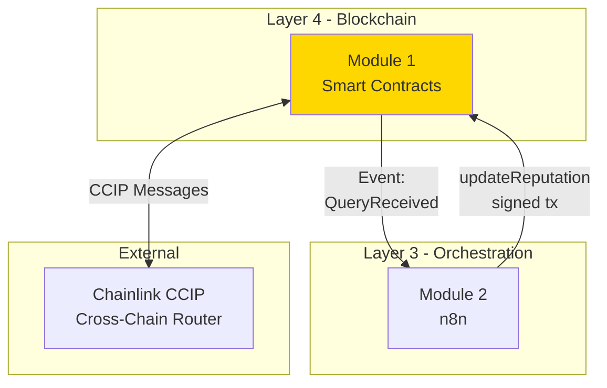

# Module 1 : Smart Contracts (Blockchain Layer)
# Spécification Fonctionnelle Détaillée

**Version:** 1.0  
**Date:** 31 janvier 2026  
**Audience:** Claude-Code (développement isolé)  
**Pré-requis:** Claude.md (interfaces contractuelles)

---

## 1. Vue d'Ensemble du Module

### 1.1 Responsabilités

**Ce que fait ce module :**
- Recevoir requêtes de réputation via CCIP (depuis consumer chains)
- Stocker données de réputation on-chain (score + evidence + timestamp)
- Envoyer réponses CCIP aux consumer chains après analyse off-chain
- Gérer le cache local sur chaque consumer chain (TTL 24h)

**Ce que ce module NE fait PAS :**
- ❌ Analyser la réputation (fait par Module 3 - AI Engine off-chain)
- ❌ Scanner les blockchains (fait par Module 5 - Data Layer)
- ❌ Orchestrer les workflows (fait par Module 2 - n8n)
- ❌ Signer avec MPC (fait par Module 4 - Lit Protocol)

**Dépendances externes :**
- Chainlink CCIP (cross-chain messaging)
- OpenZeppelin (AccessControl, ReentrancyGuard)

---

### 1.2 Positionnement dans l'Architecture



**Interfaces consommées :** Aucune (module terminal)

**Interfaces exposées :**
- Events : `QueryReceived`, `ReputationUpdated`, `ResponseSent`
- Functions : `updateReputation()`, `getReputation()`, `sendResponse()`, `requestReputation()`

---

### 1.3 Contraintes Non-Fonctionnelles (NFR)

| Contrainte | Target | Mesure |
|------------|--------|--------|
| **Performance** | Gas < 100k par updateReputation | `forge test --gas-report` |
| **Sécurité** | 0 vulnérabilités critiques | Slither + tests |
| **Disponibilité** | Contracts immutables (pas de proxy) | Design pattern |
| **Scalabilité** | Support 5 chains (extensible à 10+) | Architecture modulaire |

---

## 2. ChainMeshOracle (Contrat Principal)

### 2.1 Rôle et Responsabilités

**Analogie SOA :**
Oracle = Service central ESB qui :
- Reçoit requêtes via message bus (CCIP)
- Stocke données maître (reputation)
- Répond aux requêtes cross-chain

**Responsabilités spécifiques :**
- Recevoir messages CCIP depuis consumer chains (Arbitrum, Base, Optimism)
- Authentifier source des messages (anti-spoofing)
- Tracker requêtes en cours (messageId → requester mapping)
- Stocker reputation data après analyse off-chain
- Envoyer réponses CCIP avec score + evidence

**Localisation :** Deployed sur **Sepolia** (Oracle chain unique)

---

### 2.2 State Management

#### 2.2.1 Reputation Storage

**Quoi stocker :**
- `score` (uint8) : Score 0-100
- `timestamp` (uint32) : Quand mis à jour (Unix timestamp)
- `evidenceHash` (bytes32) : Hash IPFS des données d'analyse
- `isValid` (bool) : Si cette entrée est valide

**Pourquoi struct :**
Optimisation gas via packing (6 bytes dans slot 1, 32 bytes dans slot 2 = 2 slots total au lieu de 4)

**Lifecycle :**
- **Création :** `updateReputation()` première fois
- **Lecture :** `getReputation()` (public view)
- **Update :** `updateReputation()` (overwrite, pas d'historique)
- **Invalidation :** Admin peut invalider (emergency)

**Contrainte :**
- Score peut changer (wallet réputation évolue)
- evidenceHash NE change PAS (immutable après création)
- Pas de versioning (v1.0 = single state)

---

#### 2.2.2 Query Tracking

**Quoi tracker :**
- `requester` (address) : Qui a demandé la query
- `sourceChain` (uint64) : Chain selector source
- `requestedAt` (uint32) : Timestamp demande
- `processed` (bool) : Si query déjà traitée

**Pourquoi tracker :**
- Traçabilité des requêtes
- Replay protection (éviter double-traitement)
- Identifier source pour sendResponse()

**Cleanup strategy :**
Pas de cleanup automatique (gas-expensive). Admin peut nettoyer manuellement si mappings trop larges.

---

#### 2.2.3 Access Control

**Rôles requis :**
- `DEFAULT_ADMIN_ROLE` : Deployer (grant/revoke roles, pause)
- `UPDATER_ROLE` : n8n wallet via Lit Protocol (updateReputation)
- `PAUSER_ROLE` : Deployer + multisig optionnel (emergency pause)

**Qui obtient quoi (deployment) :**
- Deployer → DEFAULT_ADMIN_ROLE (automatique)
- n8n wallet → UPDATER_ROLE (via grantRole post-deployment)
- Multisig → PAUSER_ROLE (optionnel, pour production future)

**Pourquoi 3 rôles :**
Principe du moindre privilège (separation of concerns). n8n ne peut QUE update, pas admin.

---

### 2.3 Fonctions Publiques (Comportement Détaillé)

#### 2.3.1 updateReputation()

**Signature (référence Claude.md) :**
```solidity
function updateReputation(address wallet, uint8 score, bytes32 evidenceHash) 
    external onlyRole(UPDATER_ROLE);
```

**Comportement attendu :**

**Étape 1 : Validation**
- `wallet` ne doit pas être `address(0)`
- `score` doit être ≤ 100
- Caller doit avoir `UPDATER_ROLE`

**Étape 2 : State Change**
- Créer ou overwrite `Reputation` struct
- `timestamp` = `block.timestamp` (automatique)
- `isValid` = `true`

**Étape 3 : Event**
- Emit `ReputationUpdated(wallet, score, evidenceHash, timestamp)`
- Tous les paramètres indexés sauf evidenceHash

**Gas Target :** 
- First write : ~80k gas
- Subsequent writes : ~30k gas (warm storage)

**Edge Cases à gérer :**

| Cas | Comportement |
|-----|-------------|
| Wallet déjà existant | Overwrite (pas d'erreur, pas d'historique) |
| Score = 0 | Valide (différent de "non évalué") |
| evidenceHash = bytes32(0) | Valide (données off-chain optionnelles) |

**Erreurs possibles :**
- `InvalidScore(score, 100)` si score > 100
- `ZeroAddress()` si wallet == address(0)
- `AccessControl` revert si caller n'a pas UPDATER_ROLE

---

#### 2.3.2 getReputation()

**Signature :**
```solidity
function getReputation(address wallet) 
    external view 
    returns (uint8 score, uint256 timestamp, bytes32 evidenceHash, bool isValid);
```

**Comportement :**
- Pure lecture (view function, 0 gas si call, ~2.1k gas si transaction)
- Retourne struct décomposée (4 valeurs séparées)
- Si wallet jamais évalué → `isValid = false`, `score = 0`, autres valeurs = default

**Pas d'erreur possible** (lecture toujours réussit, même si wallet inexistant)

**Utilisation :**
- Appelée par consumer chains (ChainMeshCache) pour vérifier cache
- Appelée par frontend/SDK pour display

---

#### 2.3.3 sendResponse()

**Signature :**
```solidity
function sendResponse(bytes32 messageId, address wallet) 
    external onlyRole(UPDATER_ROLE) 
    returns (bytes32 responseMessageId);
```

**Contexte :** 
Appelée par n8n APRÈS `updateReputation()` pour renvoyer score via CCIP au consumer chain.

**Comportement attendu :**

**Étape 1 : Lookup**
- Retrouver `QueryRequest` via `queryRequests[messageId]`
- Vérifier que requester != address(0) (query existe)

**Étape 2 : Validation**
- Query pas déjà processed (`processed == false`)
- Reputation pour `wallet` existe et est valide (`isValid == true`)

**Étape 3 : Build CCIP Message**
- `receiver` = requester address (abi.encode)
- `data` = abi.encode(wallet, score, timestamp, evidenceHash)
- `gasLimit` = 200k (fixe, pas dynamique)
- `feeToken` = address(0) (native token)

**Étape 4 : Fee Calculation**
- Appeler `IRouterClient(router).getFee(destinationChain, message)`
- Vérifier contract balance ≥ fees

**Étape 5 : Send CCIP**
- Appeler `ccipSend{value: fees}(destinationChain, message)`
- Récupérer `responseMessageId`

**Étape 6 : Update State**
- Marquer query comme processed (`query.processed = true`)

**Étape 7 : Event**
- Emit `ResponseSent(responseMessageId, destinationChain, wallet, score)`

**Edge Cases :**

| Cas | Action |
|-----|--------|
| Insufficient balance | Revert `InsufficientBalance(required, available)` |
| CCIP Router unreachable | Transaction revert (pas de retry automatique) |
| Query déjà processed | Revert `QueryAlreadyProcessed(messageId)` |
| Query inexistante | Revert `QueryNotFound(messageId)` |

**Gas Target :** < 250k gas (incluant CCIP send)

---

### 2.4 Gestion CCIP (Cœur du Module)

#### 2.4.1 Réception de Messages (_ccipReceive)

**Fonction :** `_ccipReceive(Client.Any2EVMMessage memory message) internal override`

**Flow détaillé (sans code) :**

**Étape 1 : Authentification**
- Vérifier `message.sourceChainSelector` est dans whitelist (Arbitrum, Base, Optimism)
- Vérifier `message.sender` est un ChainMeshCache autorisé
- **Pourquoi critique :** Empêcher messages spoofés (attaquant pourrait forger fausses requêtes)

**Étape 2 : Replay Protection**
- Calculer hash unique : `keccak256(abi.encodePacked(messageId, sourceChain, sender))`
- Vérifier si hash déjà dans `processedMessages` mapping
- Marquer hash comme vu **AVANT** traitement (protection reentrancy)
- **Pattern :** Check → Set → Process (Checks-Effects-Interactions)

**Étape 3 : Décodage Payload**
- Décoder `message.data` : `(address wallet, address requester)`
- Validation : `wallet != address(0)`
- **Format attendu :** ABI-encoded tuple (voir Claude.md)

**Étape 4 : Stockage Query**
- Créer struct `QueryRequest`
- Stocker dans `queryRequests[messageId]`
- **Pourquoi stocker :** Needed pour `sendResponse()` (retrouver requester + sourceChain)

**Étape 5 : Event Emission**
- Emit `QueryReceived(messageId, wallet, sourceChain, requester)`
- **Consommateur :** n8n webhook (Module 2 écoute cet event)

**Note importante :**
Oracle NE fait PAS l'analyse ici. Il stocke juste la query et émet event. L'analyse se passe off-chain (n8n → Goldsky → Claude → Lit → back to Oracle).

---

#### 2.4.2 Gestion des Fees CCIP

**Problématique :**
CCIP coûte du gas natif (ETH sur Sepolia). Contract doit payer ces fees.

**Stratégie :**

**Funding :**
- Contract reçoit ETH via `receive() external payable {}`
- Admin fund manuellement (ex: 0.5 ETH au deployment)
- **Pas de calcul automatique** de combien garder

**Monitoring :**
- Admin doit monitorer `address(this).balance`
- Si balance < 0.1 ETH → Alert + refund

**Withdrawal :**
- Fonction `withdraw(address payable to, uint256 amount)` (onlyRole ADMIN)
- Permet récupérer ETH non utilisé
- **Use case :** Fin de projet, migration vers v2, etc.

**Gas Optimization :**
- Utiliser `gasLimit` fixe (200k) dans CCIP messages
- Éviter `estimateGas()` dynamique (coûteux on-chain)

---

### 2.5 Sécurité (Patterns Obligatoires)

#### 2.5.1 Reentrancy Protection

**Où appliquer :**
- `sendResponse()` : External call vers CCIP Router
- Toute fonction qui fait appel externe **ET** modifie state

**Pattern :** 
OpenZeppelin `ReentrancyGuard` + modifier `nonReentrant`

**Pourquoi :**
Même si CCIP Router est trusté, defense in depth. Attaquant théorique pourrait compromettre router.

**Implementation :**
```solidity
import "@openzeppelin/contracts/security/ReentrancyGuard.sol";

contract ChainMeshOracle is ReentrancyGuard {
    function sendResponse(...) external onlyRole(UPDATER_ROLE) nonReentrant {
        // Safe
    }
}
```

---

#### 2.5.2 Access Control

**Pattern :** 
OpenZeppelin `AccessControl`

**Configuration Deployment :**
1. Constructor : `_grantRole(DEFAULT_ADMIN_ROLE, msg.sender)`
2. Post-deployment : Deployer grant `UPDATER_ROLE` à n8n wallet
3. Post-deployment : Deployer grant `PAUSER_ROLE` à multisig (optionnel)

**Principe :** 
- Admin minimal (deployer seulement)
- Roles granulaires (UPDATER ≠ PAUSER ≠ ADMIN)
- Least privilege (n8n ne peut QUE update, rien d'autre)

---

#### 2.5.3 Checks-Effects-Interactions

**Règle obligatoire :**
Toute fonction avec external call DOIT suivre ce pattern :

**Pattern :**
1. **Checks :** `require()` / `revert()` (validations)
2. **Effects :** State changes (mappings, storage)
3. **Interactions :** External calls (CCIP, autre contrat)

**Application :**

**Exemple `sendResponse()` :**
1. **Checks :** Query existe, pas processed, reputation valide
2. **Effects :** `query.processed = true` (AVANT CCIP send)
3. **Interactions :** `ccipSend(...)` (APRÈS state change)

**Pourquoi critique :**
Protection reentrancy. Si external call avant state change → attaquant peut re-enter et doubler action.

---

## 3. ChainMeshCache (Contrat Consumer)

### 3.1 Rôle et Responsabilités

**Analogie SOA :**
Cache = Service local avec cache Redis :
- Répond immédiatement si cache hit
- Envoie requête async au service central si miss
- Reçoit update async du service central

**Responsabilités spécifiques :**
- Stocker reputation cache localement (TTL 24h)
- Fournir default score (60/100) si cache miss
- Envoyer requêtes CCIP vers Oracle
- Recevoir réponses CCIP et update cache
- Rate limiting (anti-spam) : 1 req/hour/user

**Localisation :** 
Deployed sur **chaque consumer chain** (Arbitrum Sepolia, Base Sepolia, Optimism Sepolia)

**Configuration :**
- `ORACLE_ADDRESS` : Address du Oracle sur Sepolia (immutable)
- `ORACLE_CHAIN_SELECTOR` : Chain selector Sepolia (immutable)

---

### 3.2 Cache Management Strategy

#### 3.2.1 TTL (Time To Live)

**Valeur :** 24 heures (86400 secondes)

**Rationale :**
- Reputation change lentement (activité blockchain = graduelle)
- Balance coût CCIP (cher) vs fraîcheur data
- 24h = bon compromis (wallet actif change peu en 1 jour)

**Testnet :** 
Peut être réduit à 1h pour tests rapides (facilitre debugging)

**Comportement Expiration :**
- Cache expiré → `getReputation()` retourne `isValid=false`
- Pas de cleanup automatique des entries expirées (gas expensive)
- Admin peut invalider manuellement via `invalidateCache(wallet)`

---

#### 3.2.2 Default Score Strategy

**Valeur :** 60/100 (constant `DEFAULT_SCORE`)

**Pourquoi 60 :**
- Conservative (pas trop haut = risque)
- Pas bloquant (pas 0 = permet actions limitées)
- Milieu de range (neutre)

**UX Impact :**
User avec cache miss peut quand même agir (ex: petit prêt) pendant que score réel est calculé.

**Important :**
SDK DOIT lire cette valeur via `getDefaultScore()` public function, PAS hardcoder. Sinon couplage SDK ↔ Contract.

**Fonction exposée :**
```solidity
function getDefaultScore() external pure returns (uint8) {
    return DEFAULT_SCORE;
}
```

---

### 3.3 Fonctions Publiques (Comportement)

#### 3.3.1 getReputation()

**Signature :**
```solidity
function getReputation(address wallet) 
    external view 
    returns (uint8 score, bool isFromCache, bool needsUpdate);
```

**Comportement Multi-Cas :**

**Cas 1 : Cache Hit (Fresh)**
- Condition : `cache[wallet].isValid == true && block.timestamp <= expiryTime`
- Retourne : `(cachedScore, true, false)`
- Event : `emit CacheHit(wallet, score, true)`
- **Latency :** ~1ms (lecture storage seule)

**Cas 2 : Cache Miss**
- Condition : `cache[wallet].isValid == false`
- Retourne : `(DEFAULT_SCORE, false, true)`
- Event : `emit CacheMiss(wallet, DEFAULT_SCORE)`
- **Action utilisateur :** Doit appeler `requestReputation()` pour déclencher CCIP query

**Cas 3 : Cache Stale (Expiré)**
- Condition : `isValid == true` mais `block.timestamp > expiryTime`
- Retourne : `(cachedScore, true, true)`
- Event : `emit CacheHit(wallet, score, false)`
- **Comportement :** Utilise vieux score MAIS suggère refresh (needsUpdate=true)

**Design Choice :**
View function (pas de state change). User doit appeler `requestReputation()` séparément pour trigger update.

---

#### 3.3.2 requestReputation()

**Signature :**
```solidity
function requestReputation(address wallet) 
    external payable 
    returns (bytes32 messageId);
```

**Flow détaillé :**

**Étape 1 : Rate Limiting Check**
- Lire `lastRequestTime[msg.sender]`
- Calculer temps écoulé : `block.timestamp - lastRequestTime[msg.sender]`
- Si < `MIN_REQUEST_INTERVAL` (1 hour) → Revert `RateLimitExceeded(timeUntilNext)`
- Update : `lastRequestTime[msg.sender] = block.timestamp`

**Étape 2 : Build CCIP Message**
- `receiver` = `ORACLE_ADDRESS` (abi.encode)
- `data` = `abi.encode(wallet, msg.sender)` (wallet + requester)
- `gasLimit` = 200k (fixe)
- `feeToken` = address(0) (native)

**Étape 3 : Calculate Fees**
- Appeler `IRouterClient(router).getFee(ORACLE_CHAIN_SELECTOR, message)`
- Obtenir `fees` (uint256)

**Étape 4 : Validate Payment**
- Si `msg.value < fees` → Revert `InsufficientFees(fees, msg.value)`

**Étape 5 : Send CCIP Message**
- `messageId = ccipSend{value: fees}(ORACLE_CHAIN_SELECTOR, message)`
- Récupérer messageId

**Étape 6 : Track Pending Request**
- `pendingRequests[messageId] = wallet`
- Permet retrouver wallet quand réponse arrive

**Étape 7 : Event**
- `emit ReputationQueried(wallet, msg.sender, messageId)`

**Étape 8 : Refund Excess ETH**
- Si `msg.value > fees` → Refund `msg.sender`
- `(bool success, ) = msg.sender.call{value: msg.value - fees}("")`
- `require(success, "Refund failed")`

**Edge Cases :**

| Cas | Action |
|-----|--------|
| User spam (< 1h depuis dernière req) | Revert avec temps restant |
| Insufficient msg.value | Revert avec montant requis exact |
| CCIP Router down | Transaction revert (retry manuel) |

**Gas Target :** < 200k gas

---

### 3.4 Réception Responses CCIP

**Fonction :** `_ccipReceive(Client.Any2EVMMessage memory message) internal override`

**Authentification (CRITIQUE) :**

**Check 1 : Source Chain**
- `message.sourceChainSelector` DOIT être `ORACLE_CHAIN_SELECTOR` (Sepolia)
- Sinon → Revert `InvalidSourceChain(chainSelector)`

**Check 2 : Sender Address**
- `abi.decode(message.sender, (address))` DOIT être `ORACLE_ADDRESS`
- Sinon → Revert `UnauthorizedSender(sender)`

**Pourquoi double check :**
Defense in depth. Attaquant ne peut pas forger message même s'il compromet une consumer chain.

**Decode Response :**
- `(address wallet, uint8 score, uint32 timestamp, bytes32 evidenceHash) = abi.decode(message.data, (...))`

**Update Cache :**
- Calculate `expiryTime = block.timestamp + CACHE_TTL` (24h)
- Store `CachedReputation` struct :
  - `score = score`
  - `timestamp = timestamp` (from Oracle)
  - `expiryTime = expiryTime` (local calculation)
  - `evidenceHash = evidenceHash`
  - `isValid = true`

**Event :**
- `emit ReputationCached(wallet, score, evidenceHash, expiryTime)`

**Pas de validation du score** (trust Oracle complètement).

---

## 4. Gas Optimization Strategies

### 4.1 Storage Packing

**Principe :**
EVM stocke données par slots de 32 bytes. Variables < 32 bytes peuvent partager un slot.

**Application Reputation struct :**
```
Slot 1 : [uint8 score][uint32 timestamp][bool isValid][26 bytes padding]
Slot 2 : [bytes32 evidenceHash]
Total: 2 slots
```

**Alternative NON optimisée :**
```
Slot 1 : [uint256 score] (32 bytes, waste 31 bytes!)
Slot 2 : [uint256 timestamp] (32 bytes, waste 28 bytes!)
Slot 3 : [bool isValid] (1 byte, waste 31 bytes!)
Slot 4 : [bytes32 evidenceHash] (32 bytes)
Total: 4 slots
```

**Gain :** 
- 2 slots vs 4 slots = 2x moins cher
- First write : 40k gas vs 80k gas
- Subsequent : 12k gas vs 24k gas

**Règle :** Toujours grouper variables < 32 bytes ensemble dans struct.

---

### 4.2 Immutable Variables

**Quand utiliser :**
Valeurs set une seule fois (constructor) et jamais changées.

**Exemples :**
- `ORACLE_ADDRESS` (ChainMeshCache)
- `ORACLE_CHAIN_SELECTOR` (ChainMeshCache)

**Bénéfice :**
- Storage SLOAD : 2,100 gas
- Immutable read : 3 gas
- **Gain : 700x moins cher**

**Implementation :**
```solidity
address public immutable ORACLE_ADDRESS;

constructor(address _oracle) {
    ORACLE_ADDRESS = _oracle; // Set once
}
```

---

### 4.3 Custom Errors

**Ancien pattern (Solidity < 0.8.4) :**
```solidity
require(score <= 100, "Score must be <= 100"); // ~150 gas
```

**Nouveau pattern (Solidity 0.8.4+) :**
```solidity
error InvalidScore(uint8 provided, uint8 max);
if (score > 100) revert InvalidScore(score, 100); // ~50 gas
```

**Gain :** 
- 100 gas par revert
- Plus informatif (paramètres dans error)
- Meilleure DX (developer experience)

**Règle :** TOUJOURS utiliser custom errors, jamais require strings.

---

## 5. Testing Requirements

### 5.1 Coverage Target

**Minimum :** 80%  
**Idéal :** > 90%  
**Mesure :** `forge coverage`

### 5.2 Test Categories

#### 5.2.1 Unit Tests (Foundry)

**Pour chaque fonction publique, tester :**
- ✅ Happy path (cas nominal)
- ✅ Edge cases (valeurs limites : 0, 100, max uint)
- ✅ Error cases (tous les reverts)
- ✅ Events emission (expectEmit)
- ✅ State changes (assertions)

**Exemple structure test :**
```solidity
contract ChainMeshOracleTest is Test {
    // setUp()
    // testUpdateReputation_Success()
    // testUpdateReputation_RevertInvalidScore()
    // testUpdateReputation_RevertZeroAddress()
    // testUpdateReputation_RevertUnauthorized()
    // testUpdateReputation_EmitsEvent()
}
```

---

#### 5.2.2 Fuzz Tests

**Cibles :**
- `updateReputation(wallet, score)` : Fuzz `score` 0-255 (tester overflow)
- Addresses : Fuzz random addresses (zero, max, middle)
- Timestamps : Fuzz block.timestamp variations

**Exemple :**
```solidity
function testFuzz_UpdateReputation(uint8 score) public {
    vm.assume(score <= 100); // Valid range
    vm.prank(updater);
    oracle.updateReputation(alice, score, bytes32(0));
    
    (uint8 stored, , , bool valid) = oracle.getReputation(alice);
    assertEq(stored, score);
    assertTrue(valid);
}
```

---

#### 5.2.3 Integration Tests

**Scénarios Multi-Fonctions :**
- Query → Update → SendResponse → CacheUpdate (flow complet)
- Multiple queries même wallet (idempotence)
- Query pendant processing (race condition)

**Durée :** 
Tests integration longs (CCIP = 5-10 min on testnet). Faire en Week 1.

---

### 5.3 Métriques Attendues

| Métrique | Target | Commande |
|----------|--------|----------|
| **Coverage** | > 80% | `forge coverage` |
| **Gas updateReputation** | < 100k | `forge test --gas-report` |
| **Gas requestReputation** | < 200k | `forge test --gas-report` |
| **Tests passing** | 100% | `forge test` |
| **Fuzz runs** | 10,000+ | `forge test` (default) |

---

## 6. Deployment Strategy

### 6.1 Ordre de Déploiement

**Séquence OBLIGATOIRE :**

**Step 1 : Deploy Oracle (Sepolia)**
```bash
forge script script/DeployOracle.s.sol \
    --rpc-url $SEPOLIA_RPC \
    --broadcast \
    --verify
```

**Step 2 : Note Oracle Address**
```bash
ORACLE_ADDRESS=$(jq -r '.oracle' deployments/sepolia.json)
echo "ORACLE_CONTRACT_SEPOLIA=$ORACLE_ADDRESS" >> .env
```

**Step 3 : Deploy Cache (Arbitrum Sepolia)**
```bash
forge script script/DeployCache.s.sol \
    --rpc-url $ARB_SEPOLIA_RPC \
    --broadcast \
    --verify
```

**Step 4 : Deploy Cache (Base Sepolia)**
```bash
forge script script/DeployCache.s.sol \
    --rpc-url $BASE_SEPOLIA_RPC \
    --broadcast \
    --verify
```

**Step 5 : Fund Contracts**
```bash
# Oracle needs ETH for CCIP responses
cast send $ORACLE_ADDRESS --value 0.1ether --rpc-url $SEPOLIA_RPC

# Caches NOT funded (users pay CCIP fees on requestReputation)
```

**Step 6 : Grant UPDATER_ROLE**
```bash
cast send $ORACLE_ADDRESS \
    "grantRole(bytes32,address)" \
    $(cast keccak "UPDATER_ROLE") \
    $N8N_WALLET \
    --rpc-url $SEPOLIA_RPC
```

---

### 6.2 Configuration Post-Deployment

**Sur Oracle (Sepolia) :**
- [ ] Verify deployer has DEFAULT_ADMIN_ROLE
- [ ] Verify n8n wallet has UPDATER_ROLE
- [ ] Verify balance ≥ 0.1 ETH (CCIP fees)
- [ ] Whitelist destination chains (Arbitrum, Base selectors)

**Sur Caches (Arbitrum, Base) :**
- [ ] Verify `ORACLE_ADDRESS` is correct (point to Sepolia Oracle)
- [ ] Verify `ORACLE_CHAIN_SELECTOR` is Sepolia selector
- [ ] No funding needed (users pay)

---

### 6.3 Validation Deployment

**Tests Post-Deployment (Checklist) :**

**Test 1 : Read Default**
```bash
cast call $CACHE_ARB \
    "getReputation(address)(uint8,bool,bool)" \
    0x0000000000000000000000000000000000000001
# Expected: (60, false, true) = default score
```

**Test 2 : Request (Trigger CCIP)**
```bash
cast send $CACHE_ARB \
    "requestReputation(address)" \
    0xAlice \
    --value 0.01ether
# Expected: Event ReputationQueried emitted
```

**Test 3 : Verify Oracle Received (Wait 5-10 min)**
```bash
# Check events on Sepolia Oracle
cast logs --address $ORACLE_ADDRESS \
    --from-block latest-100 \
    "QueryReceived(bytes32,address,uint64,address)"
# Expected: Event with Alice address
```

**Test 4 : Manual Update (As UPDATER)**
```bash
cast send $ORACLE_ADDRESS \
    "updateReputation(address,uint8,bytes32)" \
    0xAlice 85 0x0000000000000000000000000000000000000000000000000000000000000000 \
    --rpc-url $SEPOLIA_RPC \
    --private-key $N8N_PRIVATE_KEY
# Expected: ReputationUpdated event
```

**Test 5 : Send Response (Manual)**
```bash
cast send $ORACLE_ADDRESS \
    "sendResponse(bytes32,address)" \
    $MESSAGE_ID 0xAlice \
    --private-key $N8N_PRIVATE_KEY
# Expected: ResponseSent event
```

**Test 6 : Verify Cache Updated (Wait 5-10 min)**
```bash
cast call $CACHE_ARB \
    "getReputation(address)(uint8,bool,bool)" \
    0xAlice
# Expected: (85, true, false) = cached score
```

---

## 7. Maintenance & Operations

### 7.1 Monitoring Points

**Events à Monitorer (Indexer Goldsky) :**

| Event | Purpose | Alert Condition |
|-------|---------|-----------------|
| `QueryReceived` | Track volume queries | > 100/day (spam?) |
| `ReputationUpdated` | Track update frequency | < 5/day (n8n down?) |
| `ResponseSent` | Track CCIP success rate | Success rate < 95% |
| `ErrorOccurred` | Immediate alerts | Any occurrence |

**Metrics to Track :**
- Daily query volume
- Average CCIP latency (QueryReceived → ResponseSent)
- Oracle contract balance (alert if < 0.05 ETH)
- Failed transactions (rate)

---

### 7.2 Common Issues & Resolution

#### Issue 1 : Contract Out of ETH

**Symptom :** `sendResponse()` reverts `InsufficientBalance`

**Cause :** Oracle balance épuisé (trop de queries)

**Resolution :**
```bash
# 1. Withdraw unused ETH si besoin
cast send $ORACLE_ADDRESS "withdraw(address,uint256)" $ADMIN_ADDRESS 0.05ether

# 2. Refund contract
cast send $ORACLE_ADDRESS --value 0.2ether
```

**Prevention :** Monitor balance weekly, alert if < 0.05 ETH

---

#### Issue 2 : CCIP Message Stuck

**Symptom :** `QueryReceived` event émis mais pas `ResponseSent` après 30 min

**Cause probable :** n8n workflow down ou erreur

**Resolution :**
1. Check n8n logs (Module 2)
2. Manually call `updateReputation()` + `sendResponse()` si besoin
3. Redémarrer n8n si crash

**Prevention :** n8n monitoring + alerts

---

#### Issue 3 : Unauthorized Access

**Symptom :** `updateReputation()` reverts "AccessControl: account missing role"

**Cause :** n8n wallet n'a pas UPDATER_ROLE

**Resolution :**
```bash
# Deployer grants role
cast send $ORACLE_ADDRESS \
    "grantRole(bytes32,address)" \
    $(cast keccak "UPDATER_ROLE") \
    $N8N_WALLET \
    --private-key $DEPLOYER_KEY
```

**Prevention :** Vérifier roles post-deployment (checklist)

---

## 8. Évolutions Futures (Hors Scope MVP)

### 8.1 v2.0 Potentiel

**Features Possibles :**
- Historical reputation (versioning avec timestamps)
- Multi-signature updates (Gnosis Safe integration pour UPDATER_ROLE)
- Reputation NFT (score portable cross-chain via NFT)
- Subscription model (consumer chains payent fee mensuel, pas par query)
- On-chain aggregation (combiner scores multi-oracles)

**Contraintes Compatibilité :**
- Storage layout immutable (append-only, pas de reorg slots)
- Events backward-compatible (nouveaux events OK, pas de suppression)
- Interfaces ne changent pas (extend only, jamais break)

**Migration Strategy :**
- Deploy v2 contracts séparément
- Migrer données via script off-chain
- Garder v1 en read-only pendant transition

---

## 9. Spécification evidenceHash

### Format IPFS CID v1

**Specification :**
`evidenceHash` stocke un hash IPFS au format **CID v1** (Content Identifier version 1).

**Format CID v1 :**
- **Encoding :** base32
- **Hash function :** SHA-256
- **Exemple :** `bafybeigdyrzt5sfp7udm7hu76uh7y26nf3efuylqabf3oclgtqy55fbzdi`

**Conversion vers bytes32 (Solidity) :**
```
1. CID v1 string (ex: "bafybei...")
2. Hash the string: keccak256(abi.encodePacked(cidString))
3. Result: bytes32 (32 bytes)
```

**Exemple génération (TypeScript) :**
```typescript
const cid = "bafybeigdyrzt5sfp7udm7hu76uh7y26nf3efuylqabf3oclgtqy55fbzdi";
const evidenceHash = ethers.utils.keccak256(
    ethers.utils.toUtf8Bytes(cid)
);
// evidenceHash = 0x... (bytes32)
```

**Responsabilités par module :**
- **Module 3 (AI)** : Génère IPFS CID après upload données analyse
- **Module 4 (Lit)** : Reçoit evidenceHash, l'inclut dans payload signé
- **Module 1 (Blockchain)** : Stocke evidenceHash (bytes32), ne le génère PAS

**Validation :**
Module 1 ne valide PAS le format (trust Module 3). Stocke juste bytes32.

---

## 10. Checklist Développement

### Avant de Commencer
- [ ] J'ai lu `Claude.md` (interfaces contractuelles)
- [ ] J'ai lu `Module_Interfaces_ChainMesh.md` (vue module)
- [ ] J'ai lu cette spec complète (SPEC_Module1_Blockchain.md)
- [ ] J'ai accès à testnet wallets + faucets (Sepolia, Arbitrum Sepolia)
- [ ] Foundry installé et configuré (`forge --version`)

### Pendant Développement
- [ ] Code respecte gas targets (< 100k updateReputation)
- [ ] Custom errors utilisés (pas require strings)
- [ ] Events émis pour tous state changes
- [ ] NatSpec documentation complète (/// @notice, @param, @return)
- [ ] Tests écrits au fur et mesure (TDD)
- [ ] Pas de hardcoding (addresses, chain selectors, etc.)

### Avant Commit
- [ ] `forge test` → 100% pass
- [ ] `forge coverage` → > 80%
- [ ] `forge fmt` → Code formatted
- [ ] `slither .` → No critical/high vulnerabilities
- [ ] No compiler warnings
- [ ] README.md à jour avec deployment instructions

### Avant Deployment
- [ ] Tests sur Anvil local passent (fork testnet)
- [ ] Deployment script testé en dry-run (`--verify` sans `--broadcast`)
- [ ] Addresses CCIP Router vérifiées (Chainlink docs)
- [ ] Chain selectors vérifiés (Chainlink docs)
- [ ] Testnet ETH disponible pour deployment + funding

---

## 11. Questions Fréquentes

**Q: Puis-je modifier les interfaces définies dans Claude.md ?**  
**R:** NON. Les interfaces sont contractuelles. Toute modification casse l'isolation modulaire.

**Q: Comment gérer un edge case non documenté dans cette spec ?**  
**R:** Créer une issue, demander clarification à Felix. NE PAS deviner ou faire des choix arbitraires.

**Q: Puis-je utiliser des libraries externes (hors OpenZeppelin/Chainlink) ?**  
**R:** Seulement si justifié et approuvé par Felix. Privilégier code minimal, pas de dépendances inutiles.

**Q: Le code doit ressembler au TAD Part 1 ?**  
**R:** NON. TAD = exemples de design. Cette spec = requirements fonctionnels. Implémenter selon cette spec, pas TAD.

**Q: Que faire si Slither détecte un false positive ?**  
**R:** Documenter dans commentaire pourquoi c'est un false positive. Si doute, demander review.

**Q: Combien de temps pour implémenter Module 1 ?**  
**R:** Estimation : 2-3 jours (contracts + tests + deployment). Week 1 du roadmap.

---

**Fin de SPEC_Module1_Blockchain.md**

**Version:** 1.0  
**Status:** ✅ Ready for Implementation  
**Next Step:** Claude-code commence développement avec cette spec + Claude.md  
**Validation:** Tests coverage > 80%, deployment testnet réussi
