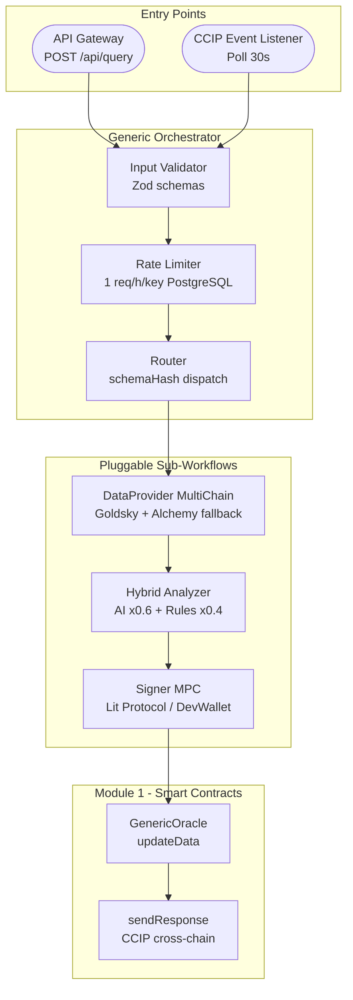
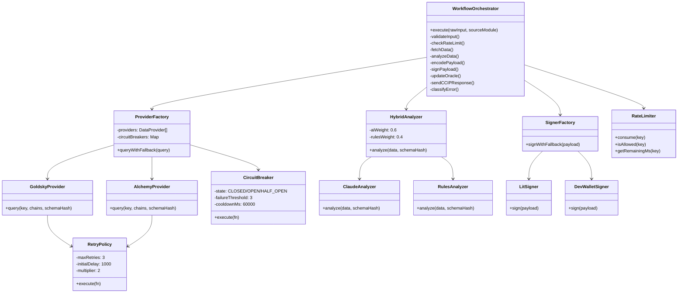
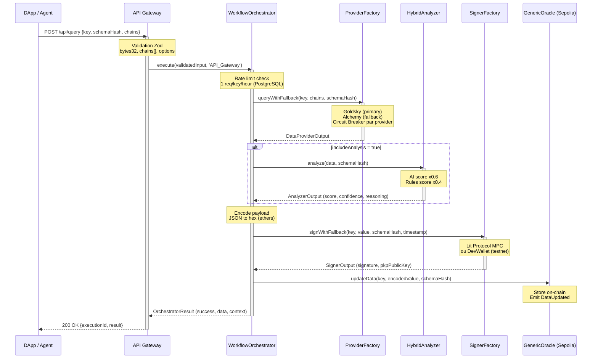
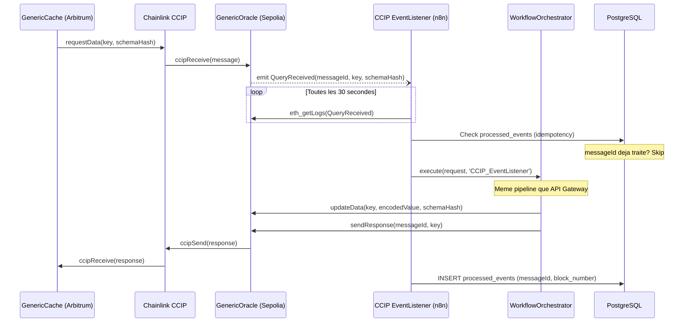
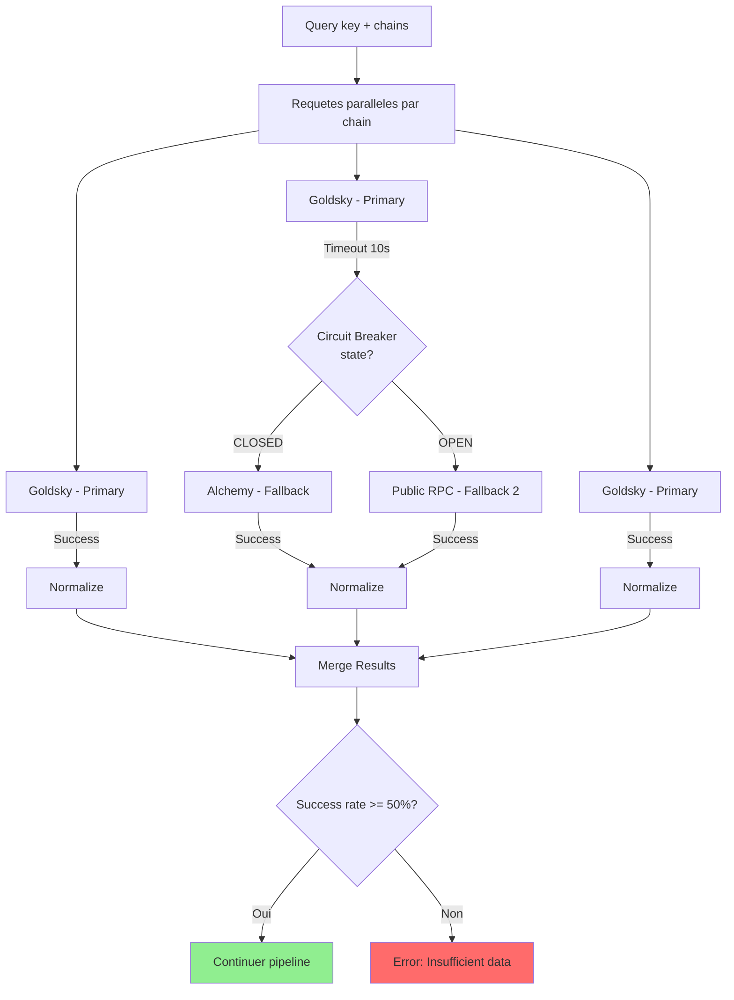
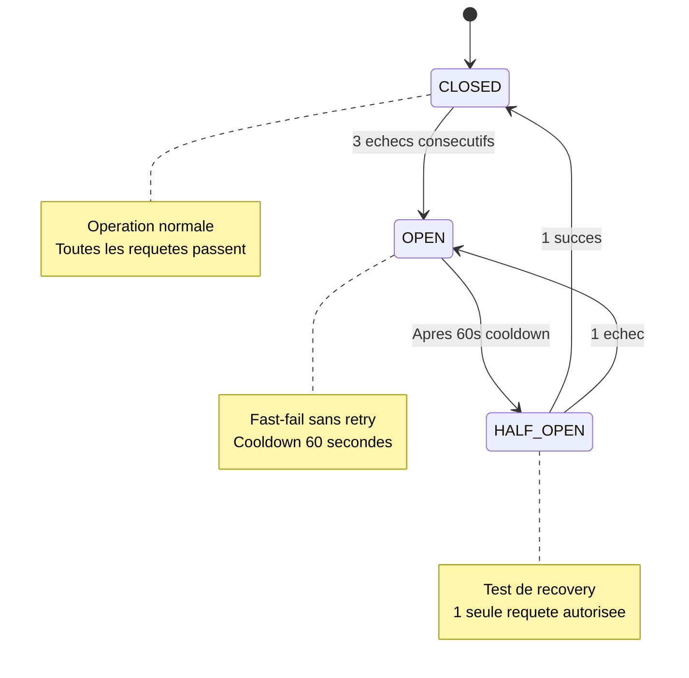
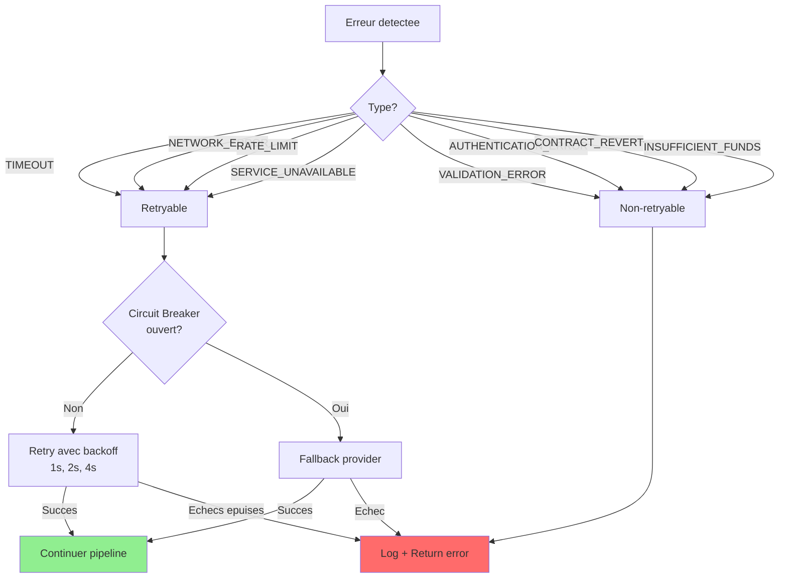
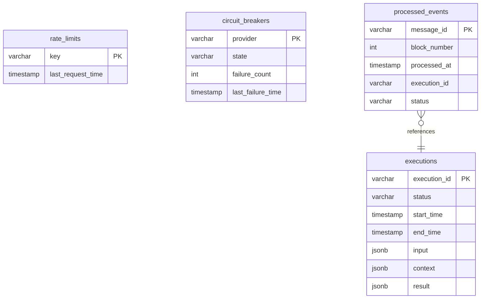
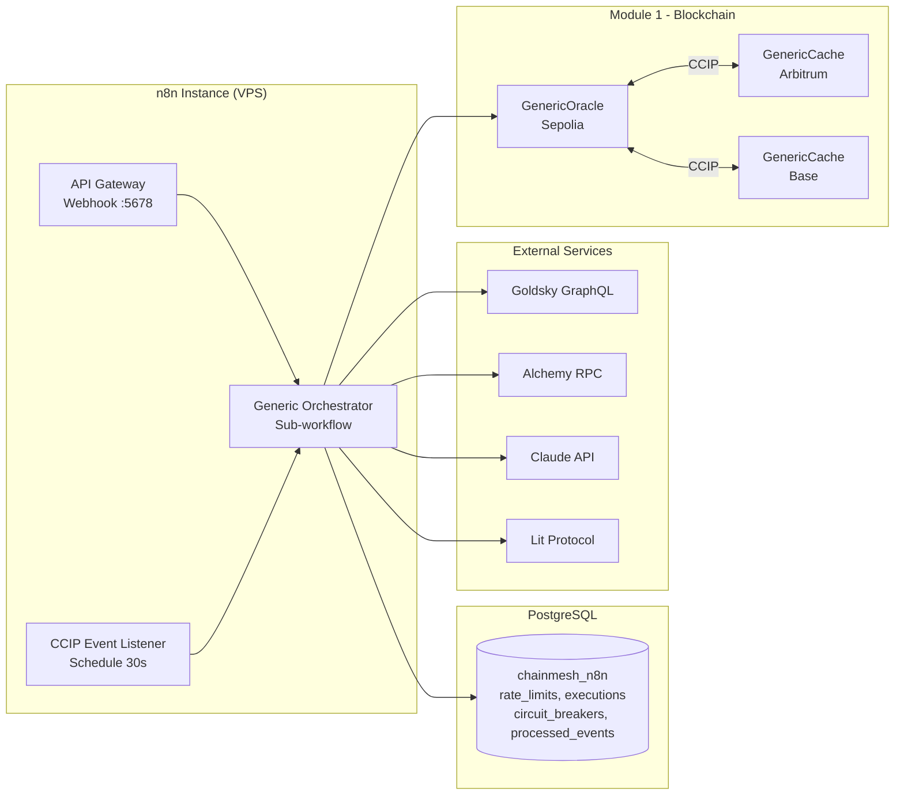

# ChainMesh Module 2 - Architecture & Design

Infrastructure d'orchestration off-chain generique construite sur n8n. Le systeme coordonne les flux entre evenements blockchain (Module 1), providers de donnees (Goldsky/Alchemy), analyseurs (AI/Rules) et signataires MPC (Lit Protocol) via un pipeline schema-agnostique.

---

## Vue d'ensemble

Le flux complet : une requete arrive par API HTTP ou par evenement CCIP. L'orchestrateur valide l'input, verifie le rate limit, collecte les donnees multi-chain, les analyse (optionnel), encode et signe le payload, puis met a jour l'Oracle on-chain. Si la requete provient d'un message CCIP, une reponse cross-chain est envoyee au Cache source.

---

## Hierarchie des composants

L'orchestrateur coordonne trois factories : `ProviderFactory` (donnees multi-chain avec fallback), `HybridAnalyzer` (scoring AI+Rules), `SignerFactory` (signature MPC avec fallback testnet). Chaque provider et signer est protege par un `CircuitBreaker` et une `RetryPolicy`. Le `RateLimiter` utilise PostgreSQL pour persister les timestamps.

---

## Fichiers sources

### Orchestration

| Fichier | Role |
|---|---|
| `src/orchestrator/WorkflowOrchestrator.ts` | Pipeline complet : validate, rate-limit, fetch, analyze, encode, sign, oracle update, CCIP response |
| `src/orchestrator/RateLimiter.ts` | Rate limit per-key (1 req/h), storage PostgreSQL ou in-memory |

### Providers

| Fichier | Role |
|---|---|
| `src/providers/GoldskyProvider.ts` | Provider primaire : requetes GraphQL vers Goldsky (indexeur) |
| `src/providers/AlchemyProvider.ts` | Provider fallback : requetes via ethers.js + Alchemy SDK |
| `src/providers/ProviderFactory.ts` | Factory avec fallback cascade et circuit breaker par provider |

### Analyzers

| Fichier | Role |
|---|---|
| `src/analyzers/ClaudeAnalyzer.ts` | Analyse AI via Claude API (axios), retourne score + confidence + reasoning |
| `src/analyzers/RulesAnalyzer.ts` | Heuristiques deterministes : scoring base 50 + bonuses/penalties |
| `src/analyzers/HybridAnalyzer.ts` | Combine AI (x0.6) et Rules (x0.4), fallback sur Rules si AI echoue |

### Signers

| Fichier | Role |
|---|---|
| `src/signers/LitSigner.ts` | Signature MPC via Lit Protocol PKP (production) |
| `src/signers/DevWalletSigner.ts` | Signature ethers.Wallet locale (testnet fallback uniquement) |
| `src/signers/SignerFactory.ts` | Factory : Lit en priorite, DevWallet si Lit indisponible sur testnet |

### Validators

| Fichier | Role |
|---|---|
| `src/validators/inputValidator.ts` | Schemas Zod : bytes32, address, chains, GenericQueryRequest |
| `src/validators/outputValidator.ts` | Schemas Zod : DataProviderOutput, AnalyzerOutput, SignerOutput |

### Infrastructure

| Fichier | Role |
|---|---|
| `src/config/environment.ts` | Validation env vars (Zod), construction AppConfig structure |
| `src/utils/Logger.ts` | Winston logger, format JSON structure, child loggers avec executionId |
| `src/utils/CircuitBreaker.ts` | Pattern circuit breaker : CLOSED/OPEN/HALF_OPEN, 3 failures, 60s cooldown |
| `src/utils/RetryPolicy.ts` | Retry avec exponential backoff : 3 tentatives, delay x2 |

### Workflows n8n

| Fichier | Role |
|---|---|
| `workflows/API_Gateway.json` | Webhook POST /api/query, validation, appel orchestrateur, reponse HTTP 200/400/500 |
| `workflows/CCIP_EventListener.json` | Poll eth_getLogs toutes les 30s, decodage events, idempotency PostgreSQL, appel orchestrateur |
| `workflows/GenericOrchestrator.json` | Sub-workflow : pipeline complet avec conditionnels (analysis, CCIP), persistance executions |

---

## Flux de donnees detaille

### Pipeline complet (API Gateway)

Temps d'execution estime : DataProvider 800ms, Analyzer 20-30s (si AI active), Signer 300-500ms, Oracle tx 30-60s (testnet). Total : 1-2 minutes.

### Pipeline CCIP (Event Listener)

Difference avec l'API Gateway : le traitement est asynchrone (pas de reponse HTTP), et l'etape sendResponse est declenchee quand un messageId est present dans les metadata.

---

## Provider Fallback Strategy

Trois niveaux de fallback : Goldsky (indexeur GraphQL, rapide), Alchemy (RPC enrichi), Public RPC (lent mais toujours disponible). Le circuit breaker evite de perdre du temps sur un provider defaillant (3 echecs = 60s cooldown).

---

## Modele de resilience

Le circuit breaker est instancie par provider dans la ProviderFactory. Le RetryPolicy gere les retries avec backoff exponentiel (1s, 2s, 4s). Les deux mecanismes sont combines : retry au sein d'un circuit CLOSED, fast-fail quand le circuit est OPEN.

---

## Classification des erreurs

Les erreurs retryables declenchent le backoff exponentiel (max 3 tentatives). Les erreurs fatales interrompent immediatement le pipeline. Le classifyError dans l'orchestrateur determine le type par inspection du message d'erreur.

---

## Stockage PostgreSQL

`rate_limits` : 1 row par key, mise a jour a chaque requete (UPSERT). `executions` : log complet de chaque execution du pipeline. `circuit_breakers` : etat par provider, persiste entre redemarrages n8n. `processed_events` : idempotency pour l'event listener CCIP, evite le double-traitement.

---

## Deploiement

Une seule instance n8n heberge les trois workflows. L'API Gateway expose un webhook HTTP, l'Event Listener poll le contrat Oracle. Les deux appellent le meme sub-workflow GenericOrchestrator. Toutes les donnees de persistence (rate limits, executions, circuit breakers, events traites) sont dans la meme base PostgreSQL.
