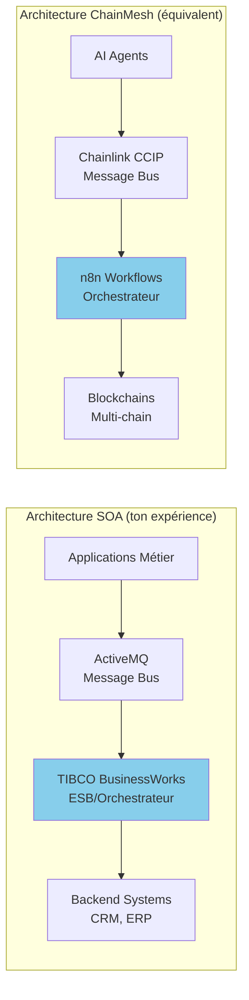
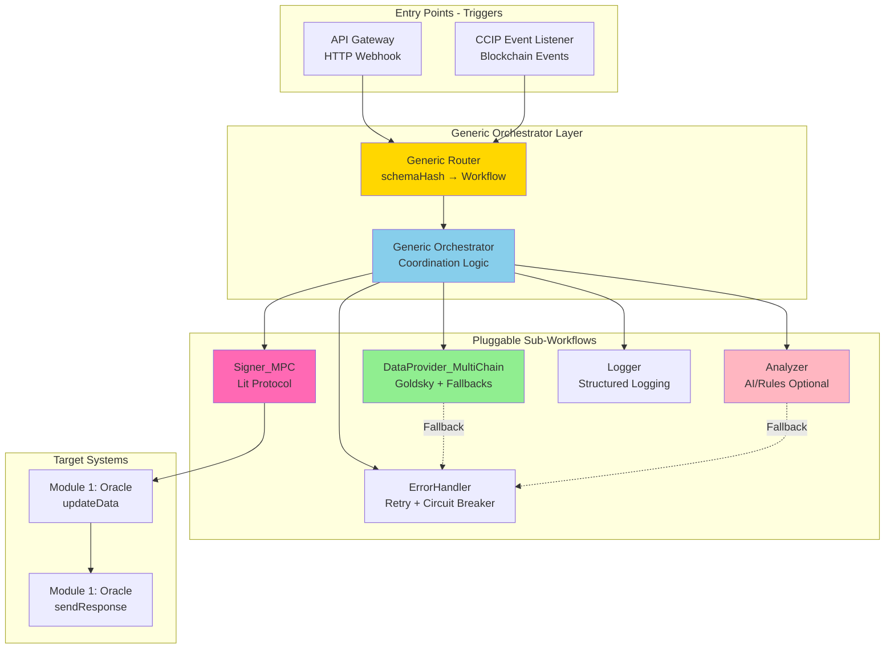
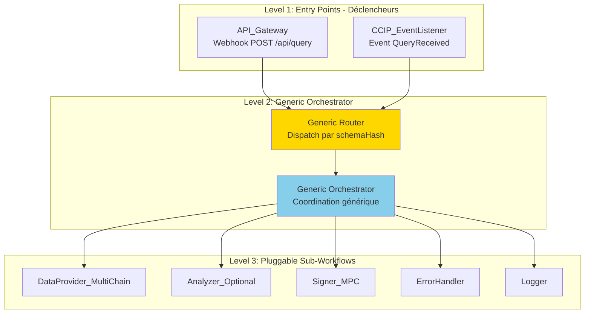
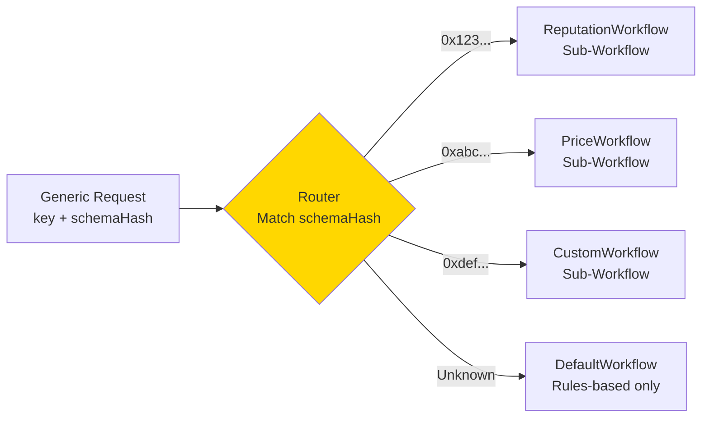
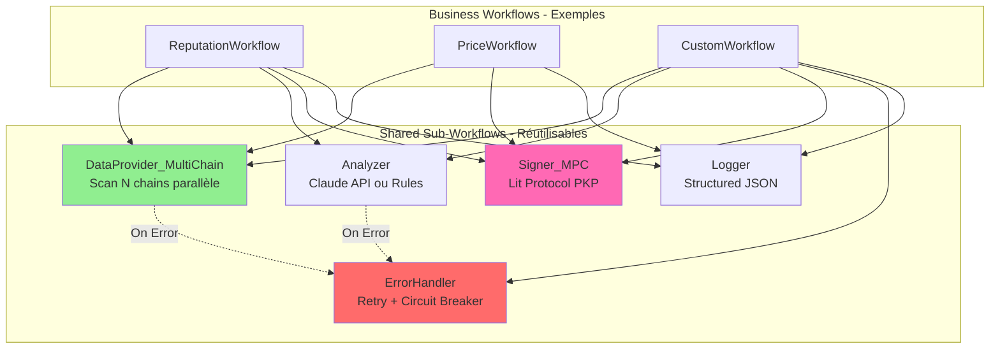
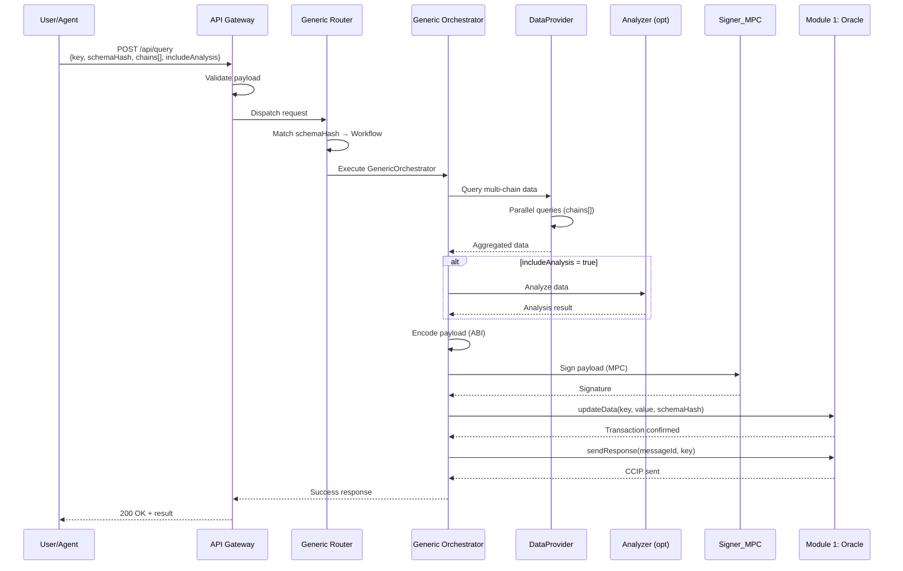
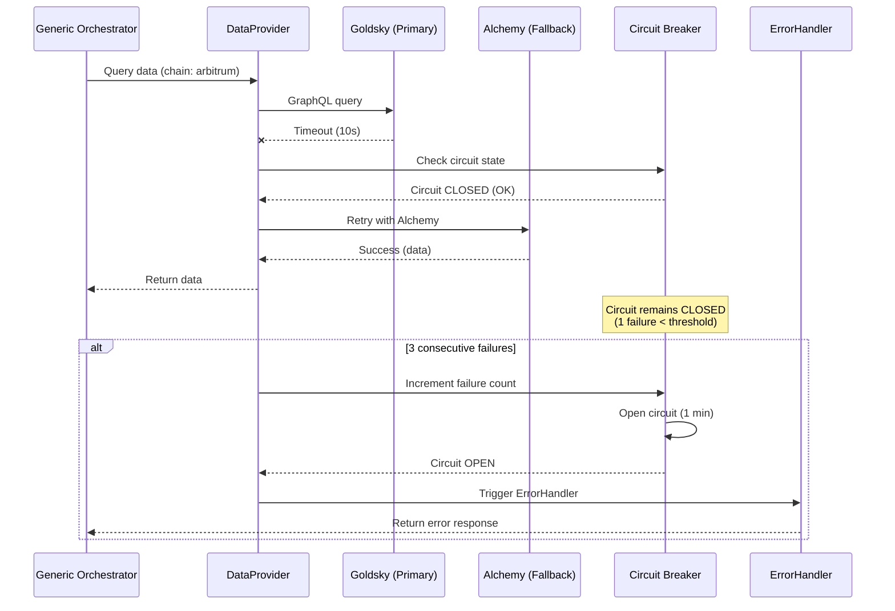
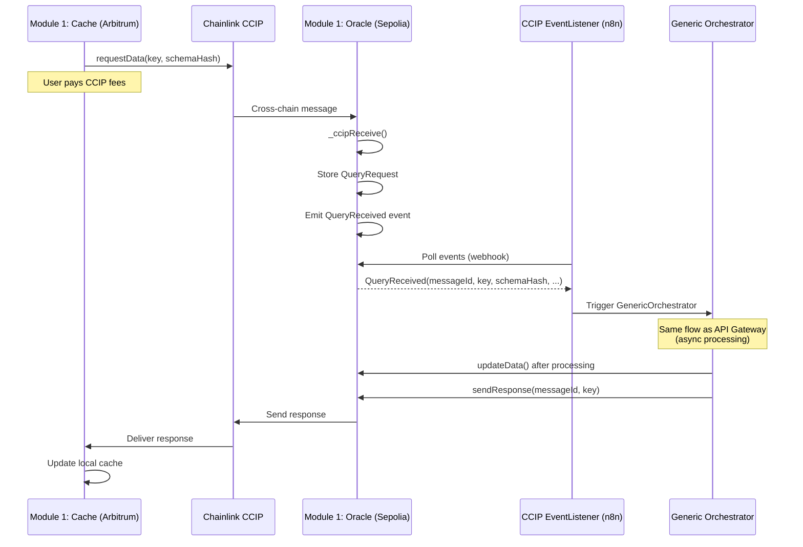

# Module 2 : Orchestration Off-Chain (n8n)
# Spécification Fonctionnelle Détaillée
# Partie 1 : Vue d'Ensemble & Architecture Générique

**Version:** 1.0  
**Date:** 8 février 2026  
**Status:** 📋 Spécification  
**Architecture:** Infrastructure générique d'orchestration

---

## 1. Vue d'Ensemble du Module

### 1.1 Responsabilités

**Ce que fait ce module :**
- Orchestrer les flux entre blockchain (Module 1) et services externes (Modules 3, 4, 5)
- Écouter événements blockchain et webhooks HTTP
- Router les requêtes vers les workflows appropriés selon le schemaHash
- Coordonner appels parallèles vers providers de données
- Gérer retry logic et circuit breakers
- Signer les payloads avant mise à jour blockchain
- Logger les exécutions pour observabilité

**Ce que ce module NE fait PAS :**
- ❌ Stocker les données (fait par Module 1 - Smart Contracts)
- ❌ Analyser les données avec AI (fait par Module 3 - AI Engine)
- ❌ Gérer les clés de signature (fait par Module 4 - Lit Protocol)
- ❌ Indexer les blockchains (fait par Module 5 - Data Layer)
- ❌ Implémenter la logique métier spécifique (fait par sub-workflows pluggables)

**Dépendances externes :**
- Module 1 (Smart Contracts) : Events + Contract calls
- Module 3 (AI Engine) : Analyse optionnelle
- Module 4 (Lit Protocol) : Signatures MPC
- Module 5 (Goldsky) : Data providers
- Node.js + ethers.js pour interactions blockchain

---

### 1.2 Analogie SOA/ESB

**Pour comprendre le rôle de n8n dans ChainMesh :**



**Correspondances :**
- **n8n** = TIBCO BusinessWorks (Process Orchestrator)
- **Workflows n8n** = Process Definitions (.process files)
- **Sub-Workflows** = Shared Resources / Sub-Processes
- **Webhooks** = Service Endpoints (SOAP/REST)
- **Event Listener** = Message-Driven Bean (MDB)

---

### 1.3 Architecture Générique

**Concept clé :** Module 2 est une **infrastructure d'orchestration réutilisable**, pas une application spécifique.



**Hiérarchie des Workflows :**

1. **Entry Points** : Déclencheurs (API, Events)
2. **Generic Layer** : Routage et orchestration (agnostique du schemaHash)
3. **Pluggable Layer** : Sub-workflows adaptables par type de données
4. **Integration Layer** : Appels vers Modules 1, 3, 4, 5

---

### 1.4 Contraintes Non-Fonctionnelles

| Contrainte | Target | Justification |
|------------|--------|---------------|
| **Latency (off-chain)** | < 3 minutes | UX acceptable pour cache miss |
| **Availability** | 99% uptime | n8n self-hosted (VPS) |
| **Retry Policy** | 3× avec backoff | Résilience network errors |
| **Circuit Breaker** | 3 failures → 1 min cooldown | Protection cascade failures |
| **Logging** | Structured JSON | Observabilité + debugging |
| **Rate Limiting** | Aligné Module 1 (1/hour/key) | Éviter DoS sur keys populaires |

---

## 2. Prérequis Techniques

### 2.1 Infrastructure

**Installation nécessaire :**
- n8n (self-hosted via Docker ou npm global)
- Node.js 18+ LTS
- PostgreSQL 14+ (persistence workflow executions)
- Redis (optionnel, pour caching sub-workflow)

### 2.2 Dépendances Node.js

**Librairies critiques :**
- `ethers` v6 (interactions blockchain)
- `@alchemy-sdk/node` (fallback data provider)
- `axios` (HTTP calls vers APIs externes)
- `dotenv` (configuration)

### 2.3 APIs Externes

**Accès requis :**
- Alchemy API key (data provider fallback)
- Claude API key (si analyzer avec AI - Module 3)
- Lit Protocol PKP (signature MPC - Module 4)
- Goldsky endpoint (data indexing - Module 5)
- RPC endpoints (Sepolia, Arbitrum, Base, etc.)

### 2.4 Configuration Minimale

**Variables d'environnement (exemple) :**
- `N8N_ENCRYPTION_KEY` : Encryption workflow credentials
- `POSTGRES_HOST`, `POSTGRES_DB` : DB connection
- `ORACLE_ADDRESS_SEPOLIA` : Module 1 Oracle contract
- `CACHE_ADDRESS_ARBITRUM` : Module 1 Cache contract
- `ALCHEMY_API_KEY` : Fallback provider
- `GOLDSKY_ENDPOINT` : Primary data provider
- `LIT_PKP_PUBLIC_KEY` : MPC signing identity

---

## 3. Architecture Générique des Workflows

### 3.1 Hiérarchie à 3 Niveaux

**Pattern de conception :**



**Séparation des responsabilités :**
- **Level 1** : Recevoir inputs (HTTP ou Blockchain)
- **Level 2** : Orchestrer de manière générique (agnostique du type de données)
- **Level 3** : Exécuter tâches spécialisées (data, AI, signing)

---

### 3.2 Principe de Généricité

**Design Pattern : Strategy Pattern**

Le Generic Orchestrator ne connaît **pas** la structure des données. Il manipule uniquement :
- `key` (bytes32) : Identifiant unique
- `schemaHash` (bytes32) : Type de données
- `chains[]` (string[]) : Blockchains à scanner
- `includeAnalysis` (boolean) : Flag pour analyse AI

**Routing dynamique :**



**Avantage :** Ajouter un nouveau type de données = créer un nouveau sub-workflow, **sans modifier** le Generic Orchestrator.

---

### 3.3 Réutilisabilité des Sub-Workflows

**Pattern de composition :**

Chaque sub-workflow est **indépendant** et **réutilisable** par plusieurs workflows métier.



**Exemple concret :**
- **ReputationWorkflow** utilise : DataProvider + Analyzer (AI) + Signer + Logger
- **PriceWorkflow** utilise : DataProvider + Signer + Logger (pas d'AI)
- **CustomWorkflow** utilise : DataProvider + Analyzer (custom) + Signer + ErrorHandler + Logger

---

## 4. Flux de Données Génériques

### 4.1 Séquence Normale (Happy Path)



**Temps d'exécution estimé :** 2-3 minutes
- DataProvider queries : 800ms
- Analyzer (AI) : 20-30s (si activé)
- Signer MPC : 300-500ms
- Oracle transactions : 30-60s (testnet)

---

### 4.2 Séquence avec Erreur (Error Handling)



**Retry Policy :**
- Attempt 1 : Primary provider (Goldsky)
- Attempt 2 : Fallback 1 (Alchemy)
- Attempt 3 : Fallback 2 (Public RPC)
- Si 3 échecs : Circuit Breaker ouvre (cooldown 1 min)

---

### 4.3 Séquence CCIP Event Trigger



**Différence vs API Gateway :**
- API Gateway : Réponse HTTP synchrone
- Event Listener : Processing asynchrone (pas de réponse HTTP attendue)

---

## 5. Isolation et Interfaces

### 5.1 Principe d'Isolation Modulaire

**Règle absolue :** Module 2 ne connaît **pas** l'implémentation interne des autres modules.

Module 2 manipule uniquement des **interfaces** :

```mermaid
graph TB
    subgraph "Module 2: n8n Orchestration"
        N8N[Generic Orchestrator<br/>Logique coordination]
    end
    
    subgraph "Module 1: Smart Contracts - Interface"
        I1_Update[updateData<br/>key, value, schemaHash]
        I1_Send[sendResponse<br/>messageId, key]
        I1_Event[Event: QueryReceived<br/>messageId, key, schemaHash, ...]
    end
    
    subgraph "Module 3: AI Engine - Interface"
        I3_Analyze[analyze<br/>data → result]
    end
    
    subgraph "Module 4: Lit Protocol - Interface"
        I4_Sign[signPayload<br/>payload → signature]
    end
    
    subgraph "Module 5: Data Layer - Interface"
        I5_Query[queryWallet<br/>address, chains[] → data]
    end
    
    N8N -->|Contract ABI| I1_Update
    N8N -->|Contract ABI| I1_Send
    I1_Event -->|Webhook| N8N
    
    N8N -->|HTTP POST| I3_Analyze
    N8N -->|SDK Call| I4_Sign
    N8N -->|GraphQL| I5_Query
    
    style N8N fill:#87CEEB
    style I1_Update fill:#FFD700
    style I1_Send fill:#FFD700
    style I1_Event fill:#FFD700
```

**Contrats d'interface stricts :**
- Module 2 ne lit **jamais** le code source des autres modules
- Module 2 consomme uniquement : ABIs, APIs REST, Webhooks, SDKs
- Changement d'implémentation dans Module X ≠ impact sur Module 2 (si interface stable)

---

### 5.2 Interfaces Consommées

#### Interface Module 1 (Smart Contracts)

**Input (n8n → Module 1) :**
```typescript
// Via ethers.js Contract call
oracle.updateData(
  key: bytes32,
  value: bytes,  // ABI encoded
  schemaHash: bytes32
): Promise<TransactionReceipt>

oracle.sendResponse(
  messageId: bytes32,
  key: bytes32
): Promise<TransactionReceipt>
```

**Output (Module 1 → n8n) :**
```typescript
// Event écouté via webhook
event QueryReceived(
  bytes32 indexed messageId,
  bytes32 indexed key,
  bytes32 schemaHash,
  uint64 sourceChain,
  address requester
)
```

#### Interface Module 5 (Data Layer)

**Input (n8n → Module 5) :**
```graphql
# GraphQL query vers Goldsky
query GetWalletData($address: String!, $chains: [String!]!) {
  # Structure dépend du schemaHash
  # Exemple pour Reputation :
  transactions(where: {wallet: $address, chains: $chains}) {
    hash, from, to, value, timestamp
  }
}
```

**Output (Module 5 → n8n) :**
```json
{
  "data": {
    "transactions": [...]
  }
}
```

#### Interface Module 3 (AI Engine)

**Input (n8n → Module 3) :**
```typescript
POST /analyze
{
  "data": {...},  // Données brutes
  "schemaHash": "0x123...",
  "includeReasoning": true
}
```

**Output (Module 3 → n8n) :**
```json
{
  "result": {...},  // Format dépend du schemaHash
  "confidence": 0.85,
  "reasoning": "..."
}
```

#### Interface Module 4 (Lit Protocol)

**Input (n8n → Module 4) :**
```typescript
import { signPayload } from '@lit-protocol/sdk'

signPayload(
  payload: string,  // ABI encoded
  pkpPublicKey: string
): Promise<{signature: string}>
```

---

**Fin de la Partie 1**

**Suite dans :** `SPEC_Module2_Part2_Workflows_SubWorkflows.md`
