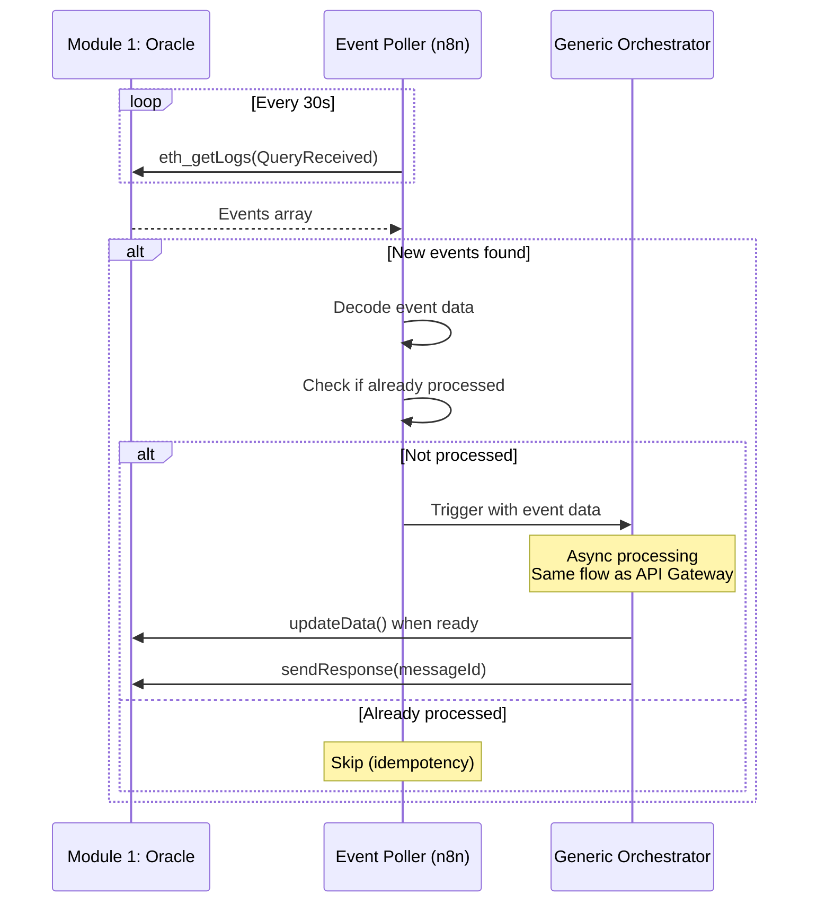

# Module 2 : Orchestration Off-Chain (n8n)
# Spécification Fonctionnelle Détaillée
# Partie 2 : Entry Points & Generic Workflows

**Version:** 1.0  
**Date:** 8 février 2026  
**Status:** 📋 Spécification  
**Suite de:** SPEC_Module2_Part1_Vue_Architecture.md

---

## 6. Entry Points (Triggers)

### 6.1 API Gateway (HTTP Webhook)

#### 6.1.1 Rôle et Responsabilités

**Ce que fait l'API Gateway :**
- Exposer endpoint HTTP pour requêtes externes
- Valider format et contenu du payload entrant
- Router vers le Generic Orchestrator
- Retourner réponse HTTP standardisée

**Ce que ne fait PAS l'API Gateway :**
- ❌ Traiter la logique métier (fait par Generic Orchestrator)
- ❌ Appeler directement les services externes (délégué aux sub-workflows)

---

#### 6.1.2 Interface d'Entrée

**Endpoint :**
```
POST /api/query
Content-Type: application/json
```

**Payload générique :**
```json
{
  "key": "0x742d35Cc6634C0532925a3b844Bc9e7595f0bEb",
  "schemaHash": "0x1234567890abcdef...",
  "chains": ["sepolia", "arbitrum", "base"],
  "includeAnalysis": true,
  "options": {
    "timeoutMs": 180000,
    "fallbackProviders": true
  }
}
```

**Champs obligatoires :**
- `key` (string) : Identifiant unique (ex: wallet address, token symbol)
- `schemaHash` (string) : Type de données (bytes32 hex format)
- `chains` (string[]) : Liste des blockchains à scanner

**Champs optionnels :**
- `includeAnalysis` (boolean, default: true) : Activer analyse AI/Rules
- `options.timeoutMs` (number, default: 180000) : Timeout global
- `options.fallbackProviders` (boolean, default: true) : Activer fallbacks

---

#### 6.1.3 Validation du Payload

**Règles de validation :**

```mermaid
graph TD
    Start[Payload reçu] --> V1{key non vide?}
    V1 -->|Non| E1[400 Bad Request<br/>Missing key]
    V1 -->|Oui| V2{schemaHash valide?}
    
    V2 -->|Non| E2[400 Bad Request<br/>Invalid schemaHash]
    V2 -->|Oui| V3{chains[] non vide?}
    
    V3 -->|Non| E3[400 Bad Request<br/>Empty chains array]
    V3 -->|Oui| V4{chains[] reconnus?}
    
    V4 -->|Non| E4[400 Bad Request<br/>Unknown chain]
    V4 -->|Oui| Valid[✅ Payload valide]
    
    Valid --> Router[Router vers<br/>Generic Orchestrator]
    
    style Valid fill:#90EE90
    style E1 fill:#FF6B6B
    style E2 fill:#FF6B6B
    style E3 fill:#FF6B6B
    style E4 fill:#FF6B6B
```

**Chaînes supportées (exemples) :**
- `sepolia` : Ethereum Sepolia testnet
- `arbitrum` : Arbitrum Sepolia testnet
- `base` : Base Sepolia testnet
- `optimism` : Optimism Sepolia testnet

**Note :** Liste extensible via configuration (pas hardcodée dans workflow)

---

#### 6.1.4 Réponses HTTP

**Succès (200 OK) :**
```json
{
  "statusCode": 200,
  "data": {
    "key": "0x742d35Cc...",
    "schemaHash": "0x1234...",
    "executionId": "exec_abc123...",
    "result": {
      "isFromCache": false,
      "timestamp": "2026-02-08T10:00:00Z"
    }
  }
}
```

**Erreur Validation (400 Bad Request) :**
```json
{
  "statusCode": 400,
  "error": {
    "type": "VALIDATION_ERROR",
    "message": "Invalid schemaHash format",
    "field": "schemaHash"
  }
}
```

**Erreur Serveur (500 Internal Server Error) :**
```json
{
  "statusCode": 500,
  "error": {
    "type": "EXECUTION_ERROR",
    "message": "Failed to execute workflow",
    "executionId": "exec_abc123..."
  }
}
```

---

### 6.2 CCIP Event Listener (Blockchain Events)

#### 6.2.1 Rôle et Responsabilités

**Ce que fait l'Event Listener :**
- Écouter événements `QueryReceived` du contrat Oracle (Module 1)
- Décoder les données de l'événement
- Déclencher le Generic Orchestrator automatiquement
- Pas de réponse HTTP (processing asynchrone)

**Ce que ne fait PAS l'Event Listener :**
- ❌ Traiter directement la requête (délégué au Generic Orchestrator)
- ❌ Appeler les smart contracts (fait par Generic Orchestrator)

---

#### 6.2.2 Configuration du Listener

**Méthode d'écoute (options) :**

**Option 1 : Polling Events**
- Poll le contrat Oracle toutes les N secondes (ex: 30s)
- Requête RPC : `eth_getLogs` avec filter sur `QueryReceived`
- Avantage : Simple, pas de dépendance externe
- Inconvénient : Latence max = N secondes

**Option 2 : Webhook via Service Externe**
- Utiliser un service comme Alchemy Notify ou Goldsky webhooks
- Configuration : URL webhook n8n + event signature
- Avantage : Push instantané
- Inconvénient : Dépendance service tiers

**Recommandation MVP :** Option 1 (polling 30s) pour simplicité

---

#### 6.2.3 Event Schema

**Event écouté :**
```solidity
event QueryReceived(
    bytes32 indexed messageId,
    bytes32 indexed key,
    bytes32 schemaHash,
    uint64 sourceChain,
    address requester
);
```

**Décodage dans n8n :**
```typescript
// Pseudo-code conceptuel (pas d'implémentation réelle)
const eventData = {
  messageId: event.topics[1],  // indexed
  key: event.topics[2],        // indexed
  schemaHash: decoded.schemaHash,  // non-indexed
  sourceChain: decoded.sourceChain,
  requester: decoded.requester
};
```

---

#### 6.2.4 Flow de Traitement



**Idempotency :**
- Stocker `messageId` traités dans une table PostgreSQL
- Check avant déclenchement : `SELECT COUNT(*) WHERE messageId = ?`
- Évite double-processing si redémarrage n8n

---

## 7. Generic Orchestrator Workflow

### 7.1 Vue d'Ensemble

**Concept :** Workflow "chef d'orchestre" générique qui coordonne tous les autres workflows.

**Caractéristiques :**
- Agnostique du type de données (fonctionne avec tout schemaHash)
- Coordination séquentielle + parallèle selon besoin
- Gestion d'erreurs centralisée
- Logging structuré

---

### 7.2 Architecture du Workflow

```mermaid
graph TB
    Start[Input: key + schemaHash + chains[]]
    
    Start --> Init[Initialiser Context<br/>executionId, timestamp]
    Init --> Route[Router<br/>Déterminer sub-workflows]
    
    Route --> DataCall[Call: DataProvider_MultiChain]
    DataCall --> DataCheck{Data valide?}
    
    DataCheck -->|Non| ErrorPath[ErrorHandler]
    DataCheck -->|Oui| AnalyzeDecision{includeAnalysis?}
    
    AnalyzeDecision -->|Oui| Analyze[Call: Analyzer]
    AnalyzeDecision -->|Non| SkipAnalyze[Skip Analysis]
    
    Analyze --> ValidateAnalysis{Output valide?}
    ValidateAnalysis -->|Non| ErrorPath
    ValidateAnalysis -->|Oui| PreparePayload[Préparer Payload]
    
    SkipAnalyze --> PreparePayload
    
    PreparePayload --> Encode[ABI Encode<br/>selon schemaHash]
    Encode --> Sign[Call: Signer_MPC]
    
    Sign --> SignCheck{Signature valide?}
    SignCheck -->|Non| ErrorPath
    SignCheck -->|Oui| UpdateOracle[Call: Oracle.updateData]
    
    UpdateOracle --> SendResponse[Call: Oracle.sendResponse]
    SendResponse --> Log[Call: Logger<br/>Success]
    
    Log --> End[Return Success]
    
    ErrorPath --> LogError[Call: Logger<br/>Error]
    LogError --> EndError[Return Error]
    
    style Start fill:#87CEEB
    style End fill:#90EE90
    style EndError fill:#FF6B6B
    style ErrorPath fill:#FF6B6B
```

---

### 7.3 Étapes Détaillées

#### Étape 1 : Initialisation du Contexte

**Données créées :**
```json
{
  "executionId": "exec_20260208_abc123",
  "startTime": "2026-02-08T10:00:00.000Z",
  "input": {
    "key": "0x742...",
    "schemaHash": "0x1234...",
    "chains": ["sepolia", "arbitrum"],
    "includeAnalysis": true
  },
  "context": {
    "sourceModule": "API_Gateway",
    "messageId": null
  }
}
```

**Utilité :** Traçabilité end-to-end (logging, debugging)

---

#### Étape 2 : Router (Détermination Sub-Workflows)

**Objectif :** Identifier quels sub-workflows appeler selon le schemaHash.

**Configuration Router (exemple) :**
```json
{
  "routes": [
    {
      "schemaHash": "0x1234abcd...",
      "name": "ReputationV1",
      "dataProvider": "DataProvider_MultiChain",
      "analyzer": "Analyzer_Claude",
      "hybridScoring": true
    },
    {
      "schemaHash": "0x5678ef01...",
      "name": "PriceV1",
      "dataProvider": "DataProvider_DEX",
      "analyzer": null,
      "hybridScoring": false
    },
    {
      "schemaHash": "default",
      "dataProvider": "DataProvider_MultiChain",
      "analyzer": null,
      "hybridScoring": false
    }
  ]
}
```

**Logique de matching :**
1. Chercher schemaHash exact dans routes
2. Si trouvé : utiliser config spécifique
3. Si non trouvé : utiliser route "default"

**Note :** Configuration stockée dans PostgreSQL ou fichier JSON (pas hardcodée)

---

#### Étape 3 : Appel DataProvider

**Input vers DataProvider :**
```json
{
  "key": "0x742...",
  "chains": ["sepolia", "arbitrum"],
  "schemaHash": "0x1234...",
  "options": {
    "parallel": true,
    "timeout": 10000
  }
}
```

**Output attendu (abstrait) :**
```json
{
  "data": {
    // Structure dépend du schemaHash
    // DataProvider normalise les données
  },
  "metadata": {
    "chains": ["sepolia", "arbitrum"],
    "timestamp": "2026-02-08T10:00:01Z",
    "provider": "Goldsky"
  }
}
```

**En cas d'erreur :**
- Retry automatique (géré par DataProvider)
- Si échec final : raise error → ErrorHandler

---

#### Étape 4 : Appel Analyzer (si includeAnalysis = true)

**Input vers Analyzer :**
```json
{
  "data": {...},  // Output de DataProvider
  "schemaHash": "0x1234...",
  "options": {
    "includeReasoning": true,
    "confidenceThreshold": 0.5
  }
}
```

**Output attendu (abstrait) :**
```json
{
  "result": {
    // Structure dépend du schemaHash
  },
  "confidence": 0.85,
  "reasoning": "...",
  "metadata": {
    "model": "claude-sonnet-4",
    "processingTime": 22000
  }
}
```

**Validation de l'output :**
- Vérifier `confidence >= threshold`
- Si confidence faible : logger warning
- Si erreur critique : fallback rules-based (si configuré)

---

#### Étape 5 : Préparation du Payload

**Objectif :** Encoder les données au format attendu par Module 1 (Oracle).

**Logique (pseudo-code conceptuel) :**
```typescript
// Selon schemaHash, utiliser le bon encoder
const encoder = getEncoder(schemaHash);
const encodedValue = encoder.encode(analysisResult);

const payload = {
  key: input.key,
  value: encodedValue,  // bytes
  schemaHash: input.schemaHash
};
```

**Exemple pour ReputationV1 :**
```typescript
// Structure: (uint8 score, bytes32 evidenceHash)
const encodedValue = ethers.utils.defaultAbiCoder.encode(
  ['uint8', 'bytes32'],
  [score, evidenceHash]
);
```

**Note :** Encoders peuvent être des modules séparés (pluggables)

---

#### Étape 6 : Signature MPC

**Input vers Signer_MPC :**
```json
{
  "payload": {
    "key": "0x742...",
    "value": "0xaabbccdd...",
    "schemaHash": "0x1234...",
    "timestamp": 1738234567
  }
}
```

**Output attendu :**
```json
{
  "signature": "0xabcdef123456...",
  "signingTime": 350,
  "pkpPublicKey": "0x04..."
}
```

**Validation signature :**
- Vérifier format (65 bytes hex)
- Optionnel : Vérifier recovery (signer = PKP expected)

---

#### Étape 7 : Mise à Jour Oracle

**Appel Contract :**
```typescript
// Via ethers.js
const tx = await oracle.updateData(
  payload.key,
  payload.value,
  payload.schemaHash
);

const receipt = await tx.wait();
```

**Vérification :**
- Transaction confirmée (receipt.status === 1)
- Event `DataUpdated` émis
- Gas utilisé < threshold (warning si trop élevé)

---

#### Étape 8 : Envoi Réponse CCIP (si messageId présent)

**Condition :** Si input provient d'un CCIP event (messageId non null)

**Appel Contract :**
```typescript
const tx = await oracle.sendResponse(
  messageId,
  payload.key
);

const receipt = await tx.wait();
```

**Vérification :**
- Transaction confirmée
- Event `ResponseSent` émis

**Note :** Si input = API Gateway, cette étape est skippée

---

### 7.4 Gestion du Contexte

**Context Object (persisté pendant l'exécution) :**

```json
{
  "executionId": "exec_abc123",
  "startTime": "2026-02-08T10:00:00Z",
  "input": {...},
  "steps": {
    "dataProvider": {
      "status": "success",
      "duration": 850,
      "provider": "Goldsky"
    },
    "analyzer": {
      "status": "success",
      "duration": 22000,
      "confidence": 0.85
    },
    "signer": {
      "status": "success",
      "duration": 350
    },
    "oracleUpdate": {
      "status": "success",
      "txHash": "0xabc...",
      "gasUsed": 171234
    }
  },
  "endTime": "2026-02-08T10:02:30Z",
  "totalDuration": 150000
}
```

**Utilité :**
- Debugging (identifier quelle étape a échoué)
- Monitoring (latency breakdown)
- Audit trail

---

## 8. Contrats de Données (Interfaces)

### 8.1 INPUT : Generic Query Request

**Format unifié pour API Gateway et CCIP Event :**

```json
{
  "key": "string (bytes32 hex)",
  "schemaHash": "string (bytes32 hex)",
  "chains": ["string"],
  "includeAnalysis": "boolean (optional, default: true)",
  "options": {
    "timeoutMs": "number (optional)",
    "fallbackProviders": "boolean (optional)",
    "customConfig": "object (optional, schema-specific)"
  },
  "metadata": {
    "messageId": "string (bytes32 hex, si CCIP)",
    "sourceChain": "string (si CCIP)",
    "requester": "string (address, si CCIP)"
  }
}
```

**Validation JSON Schema :**
```json
{
  "$schema": "http://json-schema.org/draft-07/schema#",
  "type": "object",
  "required": ["key", "schemaHash", "chains"],
  "properties": {
    "key": {
      "type": "string",
      "pattern": "^0x[a-fA-F0-9]{64}$"
    },
    "schemaHash": {
      "type": "string",
      "pattern": "^0x[a-fA-F0-9]{64}$"
    },
    "chains": {
      "type": "array",
      "minItems": 1,
      "items": {
        "type": "string",
        "enum": ["sepolia", "arbitrum", "base", "optimism"]
      }
    },
    "includeAnalysis": {
      "type": "boolean",
      "default": true
    }
  }
}
```

---

### 8.2 INTERMEDIATE : DataProvider Output

**Format abstrait (dépend du schemaHash) :**

```json
{
  "data": {
    // Structure libre, définie par le schemaHash
    // Exemples ci-dessous
  },
  "metadata": {
    "chains": ["sepolia", "arbitrum"],
    "timestamp": "2026-02-08T10:00:01Z",
    "provider": "Goldsky",
    "queryDuration": 850
  }
}
```

**Exemple pour ReputationV1 :**
```json
{
  "data": {
    "wallet": {
      "address": "0x742...",
      "ens": "alice.eth"
    },
    "activity": {
      "chains": [
        {
          "name": "sepolia",
          "firstSeen": "2023-01-15T00:00:00Z",
          "lastActive": "2026-02-08T09:00:00Z",
          "transactionCount": 1247
        }
      ]
    },
    "defi": {
      "protocols": [...]
    }
  },
  "metadata": {...}
}
```

**Exemple pour PriceV1 :**
```json
{
  "data": {
    "symbol": "ETH",
    "prices": [
      {
        "dex": "Uniswap",
        "chain": "arbitrum",
        "price": "2450.50",
        "decimals": 18
      }
    ]
  },
  "metadata": {...}
}
```

---

### 8.3 INTERMEDIATE : Analyzer Output

**Format abstrait (dépend du schemaHash) :**

```json
{
  "result": {
    // Structure libre, définie par le schemaHash
  },
  "confidence": 0.85,
  "reasoning": "Detailed explanation...",
  "metadata": {
    "model": "claude-sonnet-4",
    "processingTime": 22000,
    "tokensUsed": 15430
  }
}
```

**Exemple pour ReputationV1 :**
```json
{
  "result": {
    "score": 87,
    "tier": "prime",
    "patterns": {
      "isBot": false,
      "botConfidence": 0.1,
      "washTrading": false
    },
    "riskFlags": []
  },
  "confidence": 0.85,
  "reasoning": "Wallet shows consistent human behavior..."
}
```

---

### 8.4 OUTPUT : Oracle Update Command

**Format final pour appel Module 1 :**

```typescript
// Paramètres fonction updateData()
{
  key: bytes32,           // 0x742d35Cc...
  value: bytes,           // ABI encoded (dépend du schemaHash)
  schemaHash: bytes32     // 0x1234abcd...
}
```

**Exemple encodé pour ReputationV1 :**
```typescript
const value = ethers.utils.defaultAbiCoder.encode(
  ['uint8', 'bytes32'],
  [87, '0xbafybeigdyrzt5sfp7udm7hu76uh7y26nf3efuylqabf3oclgtqy55fbzdi']
);
// value = 0x0000000000000000000000000000000000000000000000000000000000000057...
```

---

**Fin de la Partie 2**

**Suite dans :** `SPEC_Module2_Part3_SubWorkflows_ErrorHandling.md`
