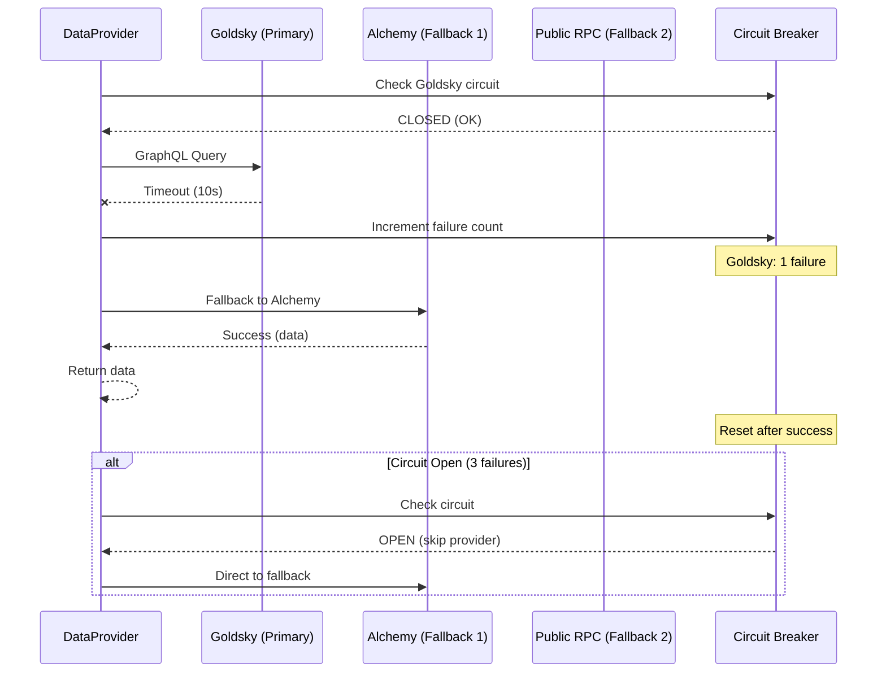
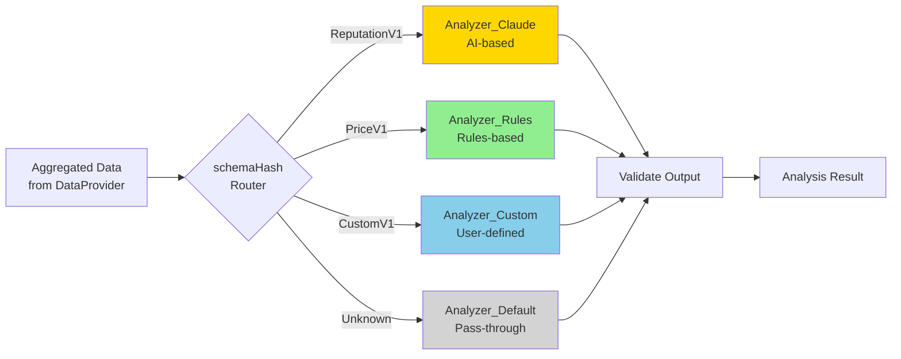
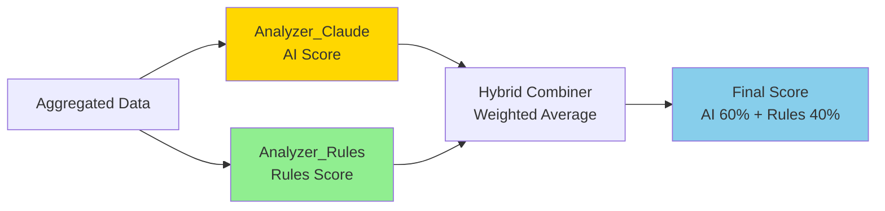
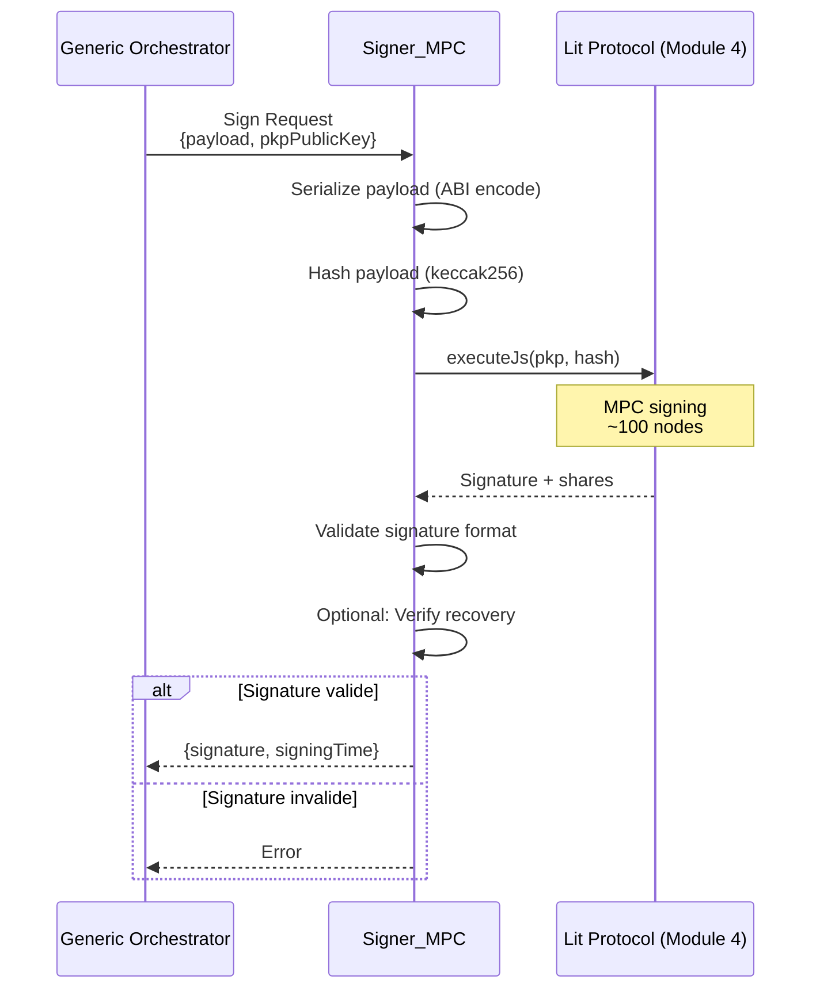
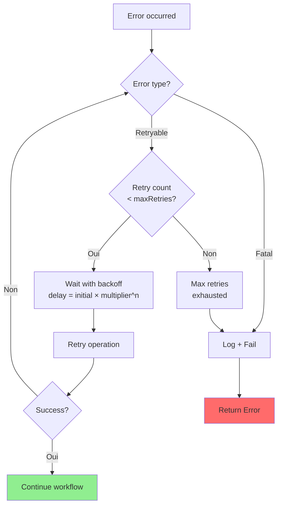
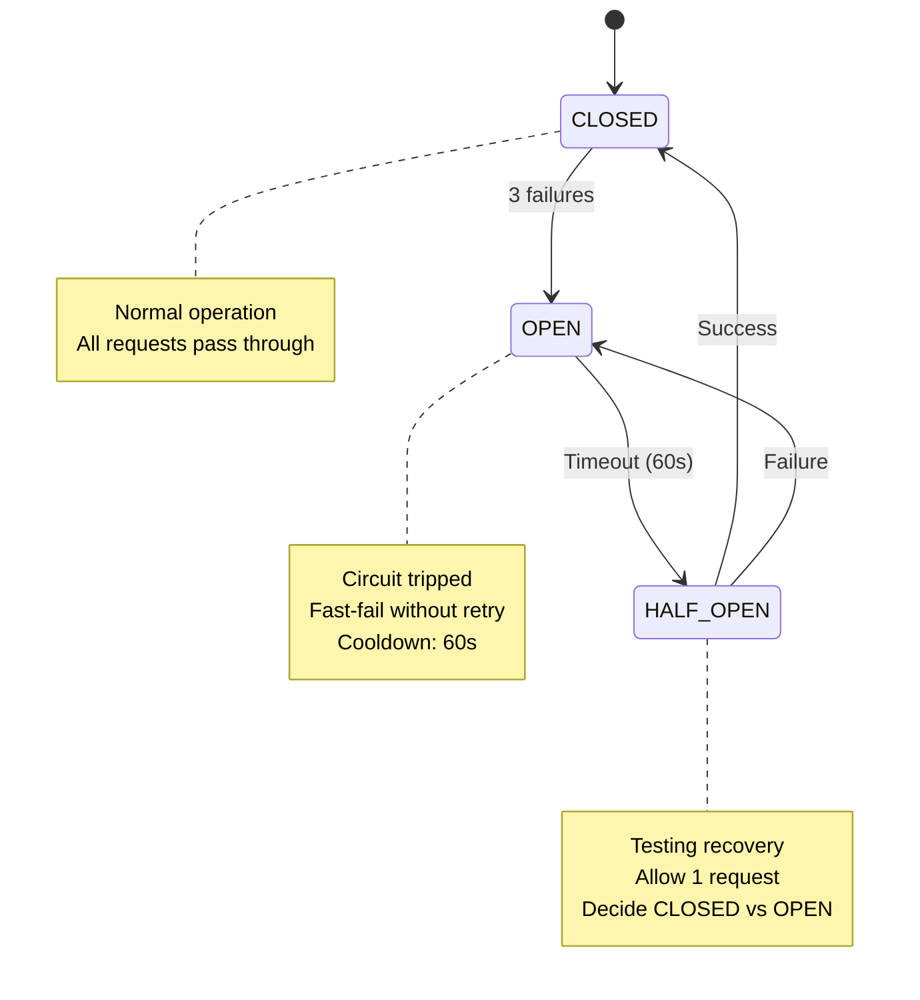
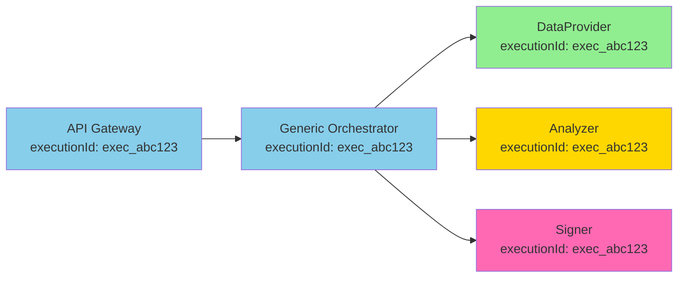
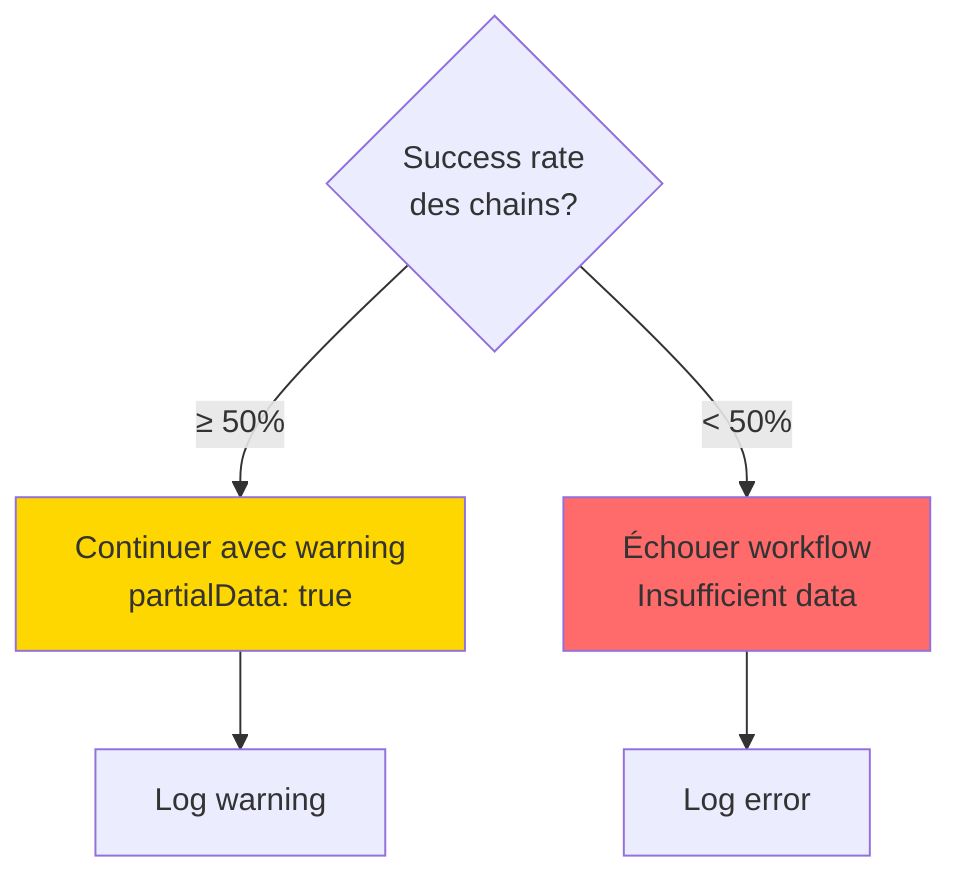

# Module 2 : Orchestration Off-Chain (n8n)
# Spécification Fonctionnelle Détaillée
# Partie 3 : Sub-Workflows & Error Handling

**Version:** 1.0  
**Date:** 8 février 2026  
**Status:** 📋 Spécification  
**Suite de:** SPEC_Module2_Part2_EntryPoints_Workflows.md

---

## 9. Sub-Workflows Réutilisables

### 9.1 DataProvider_MultiChain

#### 9.1.1 Rôle et Responsabilités

**Ce que fait DataProvider :**
- Requêter plusieurs blockchains en parallèle
- Normaliser les données selon un format unifié
- Gérer fallback automatique entre providers (Goldsky → Alchemy → Public RPC)
- Agréger résultats multi-chain

**Ce que ne fait PAS DataProvider :**
- ❌ Analyser ou interpréter les données (fait par Analyzer)
- ❌ Encoder les données pour blockchain (fait par Generic Orchestrator)

---

#### 9.1.2 Architecture de Requêtage Parallèle

```mermaid
graph TB
    Input[Input: key + chains[] + schemaHash]
    
    Input --> Split[Split par Chain]
    
    Split --> Q1[Query Chain 1<br/>Sepolia]
    Split --> Q2[Query Chain 2<br/>Arbitrum]
    Split --> Q3[Query Chain 3<br/>Base]
    
    Q1 --> Provider1[Goldsky Provider]
    Q2 --> Provider2[Goldsky Provider]
    Q3 --> Provider3[Goldsky Provider]
    
    Provider1 -->|Success| M1[Normalize Data]
    Provider2 -->|Success| M2[Normalize Data]
    Provider3 -->|Success| M3[Normalize Data]
    
    Provider1 -->|Timeout/Error| F1[Fallback Alchemy]
    Provider2 -->|Timeout/Error| F2[Fallback Alchemy]
    Provider3 -->|Timeout/Error| F3[Fallback Alchemy]
    
    F1 --> M1
    F2 --> M2
    F3 --> M3
    
    M1 --> Merge[Merge Results]
    M2 --> Merge
    M3 --> Merge
    
    Merge --> Validate{All chains OK?}
    Validate -->|Oui| Success[Return Aggregated Data]
    Validate -->|Non| PartialSuccess[Return Partial Data + Warning]
    
    style Success fill:#90EE90
    style PartialSuccess fill:#FFD700
```

**Parallélisation :**
- Requêtes lancées simultanément (pas séquentielles)
- Timeout individuel : 10 secondes par chain
- Timeout global : 30 secondes pour toutes les chains

---

#### 9.1.3 Provider Fallback Strategy

**Cascade de Providers :**



**Circuit Breaker Config :**
- Threshold : 3 failures consécutives
- Cooldown : 60 secondes
- Reset : 1 succès après cooldown

---

#### 9.1.4 Normalisation des Données

**Objectif :** Convertir données brutes (GraphQL, REST) en format ChainMesh unifié.

**Input brut (exemple Goldsky) :**
```graphql
{
  transactions(where: {wallet: "0x742..."}) {
    hash
    from
    to
    value
    timestamp
    blockNumber
  }
}
```

**Output normalisé :**
```json
{
  "chain": "sepolia",
  "transactions": [
    {
      "hash": "0xabc...",
      "from": "0x742...",
      "to": "0xdef...",
      "value": "1000000000000000000",
      "timestamp": "2026-02-08T09:00:00Z",
      "blockNumber": 12345678
    }
  ]
}
```

**Règles de normalisation :**
- Timestamps : Convertir en ISO 8601 (UTC)
- Addresses : Format EIP-55 checksum
- Values : String format (éviter float precision loss)
- Null values : Remplacer par defaults (ex: `value: "0"`)

---

#### 9.1.5 Gestion des Données Partielles

**Scénario :** Une ou plusieurs chains échouent, mais d'autres réussissent.

**Décision :**
- Si ≥ 50% des chains OK → Continuer avec warning
- Si < 50% des chains OK → Error

**Output avec warning :**
```json
{
  "data": {
    "chains": [
      {"name": "sepolia", "status": "success", "transactions": [...]},
      {"name": "arbitrum", "status": "success", "transactions": [...]},
      {"name": "base", "status": "error", "error": "Provider timeout"}
    ]
  },
  "metadata": {
    "partialData": true,
    "successRate": 0.67,
    "warnings": ["base chain data unavailable"]
  }
}
```

---

### 9.2 Analyzer (Optional)

#### 9.2.1 Rôle et Responsabilités

**Ce que fait Analyzer :**
- Analyser les données agrégées (AI ou rules-based)
- Extraire patterns comportementaux
- Calculer métriques/scores
- Fournir reasoning et confidence

**Ce que ne fait PAS Analyzer :**
- ❌ Collecter les données (fait par DataProvider)
- ❌ Encoder le résultat (fait par Generic Orchestrator)

---

#### 9.2.2 Architecture Pluggable



**Principe :** Chaque schemaHash peut avoir son propre analyzer (ou aucun).

---

#### 9.2.3 Analyzer_Claude (Exemple AI)

**Input :**
```json
{
  "data": {
    // Aggregated multi-chain data
  },
  "schemaHash": "0x1234...",
  "options": {
    "includeReasoning": true,
    "confidenceThreshold": 0.5
  }
}
```

**Process :**
1. Construire prompt contextuel (données + instructions)
2. Appeler Claude API (Module 3)
3. Parser réponse (JSON extraction)
4. Valider format et contraintes
5. Calculer confidence

**Output :**
```json
{
  "result": {
    "score": 87,
    "tier": "prime",
    "patterns": {
      "isBot": false,
      "botConfidence": 0.1
    }
  },
  "confidence": 0.85,
  "reasoning": "Wallet shows consistent human behavior...",
  "metadata": {
    "model": "claude-sonnet-4",
    "processingTime": 22000,
    "tokensUsed": 15430
  }
}
```

**Validation Anti-Hallucination :**
- Vérifier cohérence : `isBot=false` ≠ `botConfidence=0.9`
- Cross-check patterns avec raw data
- Si confidence < threshold → flag pour review

---

#### 9.2.4 Analyzer_Rules (Exemple Rules-Based)

**Input :** Même format que Analyzer_Claude

**Process (logique heuristique) :**
```typescript
// Pseudo-code conceptuel
function calculateScore(data) {
  let score = 50; // Base score
  
  // Rule 1: Wallet age
  if (walletAge > 2 years) score += 10;
  
  // Rule 2: Transaction count
  if (txCount > 100) score += 10;
  if (txCount > 1000) score += 10;
  
  // Rule 3: DeFi usage
  if (defiProtocols.length > 3) score += 15;
  
  // Rule 4: Liquidations
  if (liquidations > 0) score -= 20;
  
  return Math.min(Math.max(score, 0), 100);
}
```

**Output :**
```json
{
  "result": {
    "score": 75,
    "tier": "standard",
    "appliedRules": [
      "wallet_age_bonus: +10",
      "tx_count_bonus: +20",
      "defi_usage_bonus: +15"
    ]
  },
  "confidence": 1.0,
  "reasoning": "Rules-based calculation (deterministic)",
  "metadata": {
    "method": "heuristic",
    "processingTime": 50
  }
}
```

**Avantage :** Déterministe, rapide, pas de coût API

---

#### 9.2.5 Hybrid Scoring (AI + Rules)

**Concept :** Combiner AI analysis et rules-based pour meilleur résultat.



**Formule :**
```typescript
finalScore = (aiScore * 0.6) + (rulesScore * 0.4)
```

**Justification :**
- AI capture patterns complexes (behavioral)
- Rules capture baselines (objective metrics)
- Combinaison réduit biais et hallucinations

---

### 9.3 Signer_MPC

#### 9.3.1 Rôle et Responsabilités

**Ce que fait Signer :**
- Sérialiser payload pour signature (ABI encode)
- Appeler Lit Protocol PKP (Module 4)
- Vérifier signature retournée
- Gérer fallback dev wallet (testnet uniquement)

**Ce que ne fait PAS Signer :**
- ❌ Stocker private keys (fait par Lit Protocol)
- ❌ Construire le payload métier (fait par Generic Orchestrator)

---

#### 9.3.2 Flow de Signature



**Temps d'exécution :** 300-500ms (Lit Protocol MPC)

---

#### 9.3.3 Payload Serialization

**Input (générique) :**
```json
{
  "key": "0x742d35Cc...",
  "value": "0xaabbccdd...",
  "schemaHash": "0x1234abcd...",
  "timestamp": 1738234567
}
```

**Serialization (ABI encode) :**
```typescript
// Pseudo-code
const encoded = ethers.utils.defaultAbiCoder.encode(
  ['bytes32', 'bytes', 'bytes32', 'uint256'],
  [payload.key, payload.value, payload.schemaHash, payload.timestamp]
);

const hash = ethers.utils.keccak256(encoded);
// hash = 0xabcdef123456...
```

**Note :** Structure de sérialisation doit matcher celle attendue par Module 1 (Oracle)

---

#### 9.3.4 Fallback Dev Wallet (Testnet Only)

**Configuration conditionnelle :**

```typescript
// Pseudo-code
if (ENVIRONMENT === 'testnet' && LIT_UNAVAILABLE) {
  // Fallback to dev wallet
  const wallet = new ethers.Wallet(DEV_PRIVATE_KEY);
  const signature = await wallet.signMessage(hash);
} else {
  // Production: Lit Protocol only
  throw new Error('Lit Protocol required in production');
}
```

**⚠️ Sécurité :** Dev wallet **uniquement** pour testnets (Sepolia, etc.)

---

### 9.4 ErrorHandler

#### 9.4.1 Rôle et Responsabilités

**Ce que fait ErrorHandler :**
- Gérer retry logic avec exponential backoff
- Implémenter circuit breaker pattern
- Logger erreurs structurées
- Décider si erreur est fatal ou retryable

**Ce que ne fait PAS ErrorHandler :**
- ❌ Corriger les erreurs automatiquement (délégation aux sub-workflows)
- ❌ Masquer les erreurs (transparence totale)

---

#### 9.4.2 Retry Policy

**Configuration :**
```json
{
  "maxRetries": 3,
  "initialDelay": 1000,
  "multiplier": 2,
  "maxDelay": 10000,
  "retryableErrors": [
    "TIMEOUT",
    "NETWORK_ERROR",
    "RATE_LIMIT",
    "SERVICE_UNAVAILABLE"
  ]
}
```

**Flow :**



**Exemple de backoff :**
- Retry 1 : Wait 1000ms
- Retry 2 : Wait 2000ms
- Retry 3 : Wait 4000ms

---

#### 9.4.3 Circuit Breaker

**États du circuit :**



**Implementation (conceptuel) :**
```typescript
// Pseudo-code
class CircuitBreaker {
  state: 'CLOSED' | 'OPEN' | 'HALF_OPEN';
  failureCount: number;
  lastFailureTime: Date;
  
  canExecute(): boolean {
    if (this.state === 'CLOSED') return true;
    
    if (this.state === 'OPEN') {
      const cooldownElapsed = (Date.now() - this.lastFailureTime) > 60000;
      if (cooldownElapsed) {
        this.state = 'HALF_OPEN';
        return true;
      }
      return false;
    }
    
    if (this.state === 'HALF_OPEN') {
      return true; // Allow test request
    }
  }
  
  recordSuccess() {
    this.state = 'CLOSED';
    this.failureCount = 0;
  }
  
  recordFailure() {
    this.failureCount++;
    if (this.failureCount >= 3) {
      this.state = 'OPEN';
      this.lastFailureTime = new Date();
    }
  }
}
```

---

#### 9.4.4 Error Classification

**Catégories d'erreurs :**

| Type | Retryable? | Action |
|------|-----------|--------|
| `TIMEOUT` | ✅ Oui | Retry avec backoff |
| `NETWORK_ERROR` | ✅ Oui | Retry avec backoff |
| `RATE_LIMIT` | ✅ Oui | Retry après cooldown |
| `SERVICE_UNAVAILABLE` | ✅ Oui | Retry + fallback provider |
| `VALIDATION_ERROR` | ❌ Non | Fail immédiatement |
| `AUTHENTICATION_ERROR` | ❌ Non | Fail + alert admin |
| `INSUFFICIENT_FUNDS` | ❌ Non | Fail + alert admin |
| `CONTRACT_REVERT` | ❌ Non | Fail + log revert reason |

---

### 9.5 Logger

#### 9.5.1 Rôle et Responsabilités

**Ce que fait Logger :**
- Émettre logs structurés (JSON format)
- Tracer requêtes end-to-end (executionId)
- Enregistrer métriques (latency, success rate)
- Faciliter debugging et monitoring

**Ce que ne fait PAS Logger :**
- ❌ Analyser les logs (fait par outils externes)
- ❌ Alerter sur erreurs (fait par monitoring externe)

---

#### 9.5.2 Format de Log Structuré

**Log Success :**
```json
{
  "timestamp": "2026-02-08T10:02:30.123Z",
  "level": "INFO",
  "executionId": "exec_abc123",
  "module": "GenericOrchestrator",
  "event": "EXECUTION_SUCCESS",
  "data": {
    "key": "0x742...",
    "schemaHash": "0x1234...",
    "duration": 150000,
    "steps": {
      "dataProvider": {"duration": 850, "provider": "Goldsky"},
      "analyzer": {"duration": 22000, "confidence": 0.85},
      "signer": {"duration": 350},
      "oracleUpdate": {"txHash": "0xabc...", "gasUsed": 171234}
    }
  }
}
```

**Log Error :**
```json
{
  "timestamp": "2026-02-08T10:01:15.456Z",
  "level": "ERROR",
  "executionId": "exec_xyz789",
  "module": "DataProvider_MultiChain",
  "event": "PROVIDER_TIMEOUT",
  "error": {
    "type": "TIMEOUT",
    "message": "Goldsky query timeout after 10s",
    "chain": "arbitrum",
    "provider": "Goldsky",
    "retryable": true,
    "retryCount": 1
  }
}
```

---

#### 9.5.3 Tracing End-to-End

**Propagation executionId :**



**Avantage :** Pouvoir filtrer tous les logs d'une exécution : `grep exec_abc123 logs/*.json`

---

## 10. Règles Métier Génériques

### 10.1 Validation des Inputs

**Règles :**
1. `key` non nul et format bytes32 valide
2. `schemaHash` non nul et reconnu (ou fallback à "default")
3. `chains[]` non vide et chaînes supportées
4. `options.timeoutMs` entre 10s et 300s
5. `includeAnalysis` booléen (default: true)

**En cas d'invalidité :** Retourner erreur 400 avec détails

---

### 10.2 Rate Limiting

**Stratégie :** Alignée avec Module 1 (per-key)

**Règle :** 1 requête par hour par key

**Implementation (conceptuel) :**
```typescript
// Pseudo-code
const lastRequestTime = await getLastRequestTime(key);
const now = Date.now();
const hourInMs = 3600000;

if (now - lastRequestTime < hourInMs) {
  throw new Error('RATE_LIMIT_EXCEEDED');
}

await setLastRequestTime(key, now);
```

**Storage :** Redis ou PostgreSQL (table `rate_limits`)

---

### 10.3 Timeout Management

**Timeouts à différents niveaux :**

| Niveau | Timeout | Justification |
|--------|---------|---------------|
| Provider query (single) | 10s | Éviter hang sur provider lent |
| DataProvider (total) | 30s | Queries parallèles + fallbacks |
| Analyzer | 60s | Claude API peut prendre 20-40s |
| Signer | 5s | Lit Protocol rapide (~500ms) |
| Oracle transaction | 120s | Confirmation blockchain |
| **Global workflow** | 180s | Total acceptable pour cache miss |

**En cas de timeout :** Déclencher ErrorHandler → Retry ou Fail

---

### 10.4 Gestion des Données Partielles

**Règle de décision :**



**Exemple :**
- 2 chains sur 3 OK → Continue (66% success)
- 1 chain sur 3 OK → Fail (33% success)

---

### 10.5 Fallback Strategies

**Provider Fallback :**
```
Goldsky (primary) → Alchemy (fallback 1) → Public RPC (fallback 2)
```

**Analyzer Fallback (si includeAnalysis = true) :**
```
AI Analyzer → Rules-based Analyzer (si AI fail)
```

**Signer Fallback (testnet only) :**
```
Lit Protocol PKP → Dev Wallet (si Lit unavailable)
```

---

## 11. Observabilité et Monitoring

### 11.1 Métriques Clés

**Métriques à tracker (pour monitoring futur) :**

| Métrique | Type | Unité | Seuil d'alerte |
|----------|------|-------|----------------|
| Workflow Success Rate | % | Pourcentage | < 90% |
| Average Execution Time | Latency | ms | > 200,000ms |
| Provider Timeout Rate | % | Pourcentage | > 20% |
| Analyzer Confidence (avg) | Score | 0-1 | < 0.6 |
| Circuit Breaker Opens | Count | Événements | > 5/hour |
| Rate Limit Hits | Count | Événements | > 100/hour |

---

### 11.2 Logs à Émettre

**Events critiques :**
- `WORKFLOW_START` : Début exécution
- `WORKFLOW_SUCCESS` : Fin succès
- `WORKFLOW_ERROR` : Fin erreur
- `PROVIDER_TIMEOUT` : Timeout provider
- `PROVIDER_FALLBACK` : Switch vers fallback
- `CIRCUIT_BREAKER_OPEN` : Circuit ouvert
- `ANALYZER_LOW_CONFIDENCE` : Confidence < threshold
- `RATE_LIMIT_EXCEEDED` : Requête rejetée

**Format :** JSON structuré (cf. section 9.5.2)

---

### 11.3 Tracing Distribué

**Propagation executionId :**
- Généré à l'Entry Point (API Gateway ou Event Listener)
- Propagé à tous les sub-workflows
- Inclus dans tous les logs
- Inclus dans appels externes (HTTP headers, si possible)

**Exemple header HTTP :**
```
X-Execution-Id: exec_abc123
X-Request-Timestamp: 2026-02-08T10:00:00Z
```

---

## 12. Checklist de Développement

### 12.1 Workflows à Implémenter

**Level 1 - Entry Points :**
- [ ] API_Gateway (HTTP Webhook)
- [ ] CCIP_EventListener (Blockchain Events)

**Level 2 - Generic Orchestrator :**
- [ ] Generic Router (schemaHash dispatch)
- [ ] Generic Orchestrator (coordination)

**Level 3 - Sub-Workflows :**
- [ ] DataProvider_MultiChain
- [ ] Analyzer (pluggable)
- [ ] Signer_MPC
- [ ] ErrorHandler
- [ ] Logger

---

### 12.2 Configurations à Créer

**Database :**
- [ ] Table `rate_limits` (key, lastRequestTime)
- [ ] Table `executions` (executionId, status, startTime, endTime)
- [ ] Table `circuit_breakers` (provider, state, failureCount, lastFailureTime)

**Environment Variables :**
- [ ] Contract addresses (Oracle, Cache per chain)
- [ ] API keys (Alchemy, Goldsky, Claude, Lit)
- [ ] RPC endpoints (Sepolia, Arbitrum, Base, etc.)
- [ ] Timeouts et thresholds

**Router Config :**
- [ ] Mapping schemaHash → sub-workflows

---

### 12.3 Tests à Effectuer

**Unit Tests (par sub-workflow) :**
- [ ] DataProvider : queries parallèles, fallbacks
- [ ] Analyzer : validation outputs, confidence
- [ ] Signer : signature valide, error handling
- [ ] ErrorHandler : retry logic, circuit breaker

**Integration Tests :**
- [ ] API Gateway → Orchestrator → Oracle (end-to-end)
- [ ] Event Listener → Orchestrator → sendResponse (CCIP flow)
- [ ] Fallback cascades (provider timeouts)

**Load Tests :**
- [ ] Rate limiting (1 req/hour/key)
- [ ] Concurrent requests (100 simultaneous)

---

**Fin de la Partie 3**

**Documents complets :**
- `SPEC_Module2_Part1_Vue_Architecture.md`
- `SPEC_Module2_Part2_EntryPoints_Workflows.md`
- `SPEC_Module2_Part3_SubWorkflows_ErrorHandling.md`

**Next Step :** Développement avec Claude Code (utiliser ces specs comme référence)
