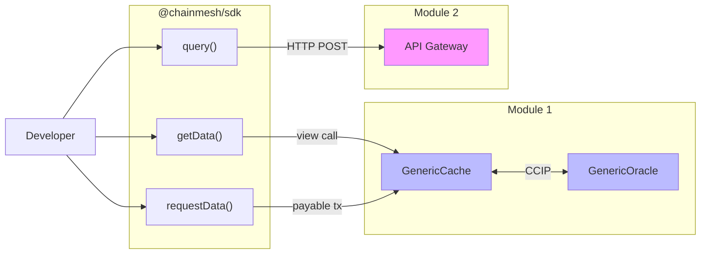
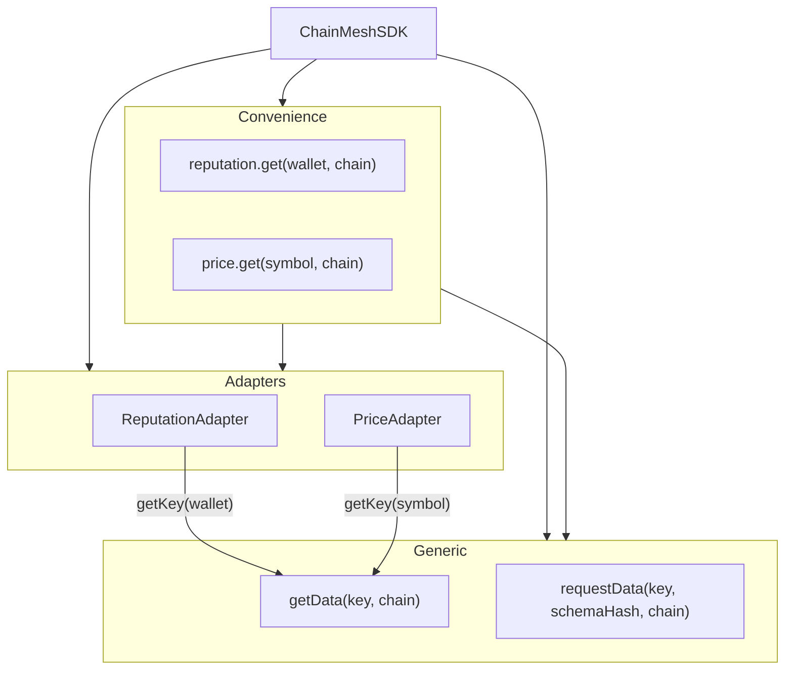
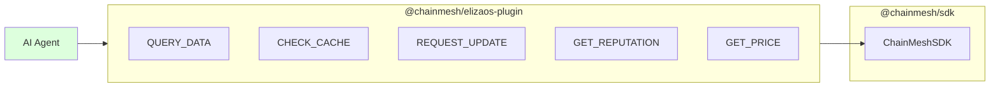

# Module 6 -- SDK & Plugin Architecture

## Overview

Module 6 provides the developer-facing interface to ChainMesh. Two packages: `@chainmesh/sdk` (core) and `@chainmesh/elizaos-plugin` (AI agent wrapper).

The SDK does NOT depend on Module 2 code. It interacts only via contract ABIs (on-chain) and HTTP API (off-chain).

---

## Package Structure

```
module6-sdk/
  packages/
    sdk/                  @chainmesh/sdk
      src/
        ChainMeshSDK.ts   Main class, three access strategies
        types.ts           Config, results, errors, Zod schemas
        adapters/          ReputationAdapter, PriceAdapter
        contracts/         Minimal ABIs (GenericCache, GenericOracle)
        utils/             Validation helpers
      tests/unit/          52 tests (Vitest)
    elizaos-plugin/       @chainmesh/elizaos-plugin
      src/
        index.ts           Plugin factory
        actions.ts         5 ElizaOS actions
        types.ts           ElizaOS framework types
      tests/unit/          14 tests (Vitest)
  docs/                    This file + SPEC
```

---

## Three Access Strategies



| Strategy | Method | Speed | Cost | Freshness |
|---|---|---|---|---|
| Cache-first | `getData()` | Instant | Free | Up to 24h stale |
| CCIP request | `requestData()` | Minutes | ETH (CCIP fees) | Fresh |
| API-first | `query()` | 1-2 min | Free (API) | Fresh |

---

## Adapter Pattern



Adapters mirror on-chain logic:
- Key derivation: `keccak256(solidityPacked(...))`
- Encoding: `AbiCoder.encode(types, values)`
- Decoding: `AbiCoder.decode(types, bytes)`

---

## ElizaOS Plugin



Actions parse natural language messages, extract parameters (key, chain, address, symbol), and delegate to SDK methods.

---

## Error Handling

Three error types, all extending `ChainMeshError`:
- `ConfigError` -- invalid or missing configuration
- `ContractError` -- on-chain call failure
- `ApiError` -- API Gateway failure

---

## Dependencies

| Dependency | Purpose |
|---|---|
| ethers v6 | Contract interaction, ABI encoding |
| zod v4 | Configuration validation |
| axios | API Gateway HTTP calls |

No dependency on Module 2 source code.
